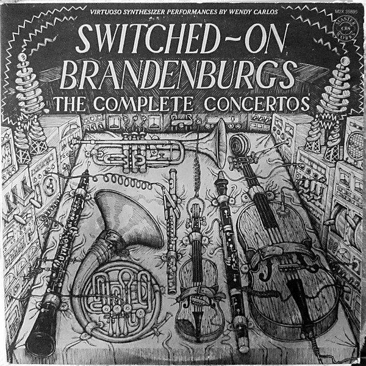

# Switched-On Brandenburgs

By **Wendy Carlos**

## Album Data

- **Catalog:** Beets
- **Format:** Digital, Album
- **Album:** Switched-On Brandenburgs
- **Artist:** Wendy Carlos
- **Albumartist:** Wendy Carlos
- **Genre:** Baroque
- **MusicBrainz Album Artist ID:** 
- **MusicBrainz Album ID:** 
- **MusicBrainz Release Group ID:** 
- **Year:** 1979
- **Catalog #:** 
- **Label:** 
- **Total Tracks:** 19

## Album Tracks

### Track 01 - Brandenburg Concerto No. 1 in F Major

- **Artist:** Wendy Carlos
- **Format:** MP3
- **Genre:** Baroque
- **Length:** 4:08
- **MusicBrainz Track ID:** 
- **Title:** Brandenburg Concerto No. 1 in F Major
- **Track:** 01
- **Year:** 1979

### Track 02 - Brandenburg Concerto No. 1 in F Major

- **Artist:** Wendy Carlos
- **Format:** MP3
- **Genre:** Baroque
- **Length:** 4:05
- **MusicBrainz Track ID:** 
- **Title:** Brandenburg Concerto No. 1 in F Major
- **Track:** 02
- **Year:** 1979

### Track 03 - Brandenburg Concerto No. 1 in F Major

- **Artist:** Wendy Carlos
- **Format:** MP3
- **Genre:** Baroque
- **Length:** 4:21
- **MusicBrainz Track ID:** 
- **Title:** Brandenburg Concerto No. 1 in F Major
- **Track:** 03
- **Year:** 1979

### Track 04 - Brandenburg Concerto No. 1 in F Major

- **Artist:** Wendy Carlos
- **Format:** MP3
- **Genre:** Baroque
- **Length:** 6:47
- **MusicBrainz Track ID:** 
- **Title:** Brandenburg Concerto No. 1 in F Major
- **Track:** 04
- **Year:** 1979

### Track 05 - Brandenburg Concerto No. 2 in F Major

- **Artist:** Wendy Carlos
- **Format:** MP3
- **Genre:** Baroque
- **Length:** 5:45
- **MusicBrainz Track ID:** 
- **Title:** Brandenburg Concerto No. 2 in F Major
- **Track:** 05
- **Year:** 1979

### Track 06 - Brandenburg Concerto No. 2 in F Major

- **Artist:** Wendy Carlos
- **Format:** MP3
- **Genre:** Baroque
- **Length:** 4:23
- **MusicBrainz Track ID:** 
- **Title:** Brandenburg Concerto No. 2 in F Major
- **Track:** 06
- **Year:** 1979

### Track 07 - Brandenburg Concerto No. 2 in F Major

- **Artist:** Wendy Carlos
- **Format:** MP3
- **Genre:** Baroque
- **Length:** 2:58
- **MusicBrainz Track ID:** 
- **Title:** Brandenburg Concerto No. 2 in F Major
- **Track:** 07
- **Year:** 1979

### Track 08 - Brandenburg Concerto No. 3 in G Major

- **Artist:** Wendy Carlos
- **Format:** MP3
- **Genre:** Baroque
- **Length:** 6:23
- **MusicBrainz Track ID:** 
- **Title:** Brandenburg Concerto No. 3 in G Major
- **Track:** 08
- **Year:** 1979

### Track 09 - Brandenburg Concerto No. 3 in G Major

- **Artist:** Wendy Carlos
- **Format:** MP3
- **Genre:** Baroque
- **Length:** 1:05
- **MusicBrainz Track ID:** 
- **Title:** Brandenburg Concerto No. 3 in G Major
- **Track:** 09
- **Year:** 1979

### Track 10 - Brandenburg Concerto No. 3 in G Major

- **Artist:** Wendy Carlos
- **Format:** MP3
- **Genre:** Baroque
- **Length:** 5:07
- **MusicBrainz Track ID:** 
- **Title:** Brandenburg Concerto No. 3 in G Major
- **Track:** 10
- **Year:** 1979

### Track 11 - Brandenburg Concerto No. 4 in G Major

- **Artist:** Wendy Carlos
- **Format:** MP3
- **Genre:** Baroque
- **Length:** 8:01
- **MusicBrainz Track ID:** 
- **Title:** Brandenburg Concerto No. 4 in G Major
- **Track:** 11
- **Year:** 1979

### Track 12 - Brandenburg Concerto No. 4 in G Major

- **Artist:** Wendy Carlos
- **Format:** MP3
- **Genre:** Baroque
- **Length:** 3:34
- **MusicBrainz Track ID:** 
- **Title:** Brandenburg Concerto No. 4 in G Major
- **Track:** 12
- **Year:** 1979

### Track 13 - Brandenburg Concerto No. 4 in G Major

- **Artist:** Wendy Carlos
- **Format:** MP3
- **Genre:** Baroque
- **Length:** 4:39
- **MusicBrainz Track ID:** 
- **Title:** Brandenburg Concerto No. 4 in G Major
- **Track:** 13
- **Year:** 1979

### Track 14 - Brandenburg Concerto No. 5 in D Major

- **Artist:** Wendy Carlos
- **Format:** MP3
- **Genre:** Baroque
- **Length:** 10:40
- **MusicBrainz Track ID:** 
- **Title:** Brandenburg Concerto No. 5 in D Major
- **Track:** 14
- **Year:** 1979

### Track 15 - Brandenburg Concerto No. 5 in D Major

- **Artist:** Wendy Carlos
- **Format:** MP3
- **Genre:** Baroque
- **Length:** 5:29
- **MusicBrainz Track ID:** 
- **Title:** Brandenburg Concerto No. 5 in D Major
- **Track:** 15
- **Year:** 1979

### Track 16 - Brandenburg Concerto No. 5 in D Major

- **Artist:** Wendy Carlos
- **Format:** MP3
- **Genre:** Baroque
- **Length:** 4:45
- **MusicBrainz Track ID:** 
- **Title:** Brandenburg Concerto No. 5 in D Major
- **Track:** 16
- **Year:** 1979

### Track 17 - Brandenburg Concerto No. 6 in B-Flat Major

- **Artist:** Wendy Carlos
- **Format:** MP3
- **Genre:** Baroque
- **Length:** 6:52
- **MusicBrainz Track ID:** 
- **Title:** Brandenburg Concerto No. 6 in B-Flat Major
- **Track:** 17
- **Year:** 1979

### Track 18 - Brandenburg Concerto No. 6 in B-Flat Major

- **Artist:** Wendy Carlos
- **Format:** MP3
- **Genre:** Baroque
- **Length:** 4:37
- **MusicBrainz Track ID:** 
- **Title:** Brandenburg Concerto No. 6 in B-Flat Major
- **Track:** 18
- **Year:** 1979

### Track 19 - Brandenburg Concerto No. 6 in B-Flat Major

- **Artist:** Wendy Carlos
- **Format:** MP3
- **Genre:** Baroque
- **Length:** 5:29
- **MusicBrainz Track ID:** 
- **Title:** Brandenburg Concerto No. 6 in B-Flat Major
- **Track:** 19
- **Year:** 1979

## See also

- [Roon: Clockwork Orange [Complete Original Score]](../../Roon/Wendy_Carlos/Clockwork_Orange_[Complete_Original_Score].md)
- [Roon: Switched-On Brandenburgs](../../Roon/Wendy_Carlos/Switched-On_Brandenburgs.md)
- [Vinyl: Switched-On Brandenburgs (The Complete Concertos)](../../Vinyl/Wendy_Carlos/Switched-On_Brandenburgs_The_Complete_Concertos.md)
- [Vinyl: ](../../Vinyl/Wendy_Carlos/Wendy_Carlos.md)
- [Vinyl: Wendy Carlos's Clockwork Orange (Complete Original Score)](../../Vinyl/Wendy_Carlos/Wendy_Carloss_Clockwork_Orange_Complete_Original_Score.md)
