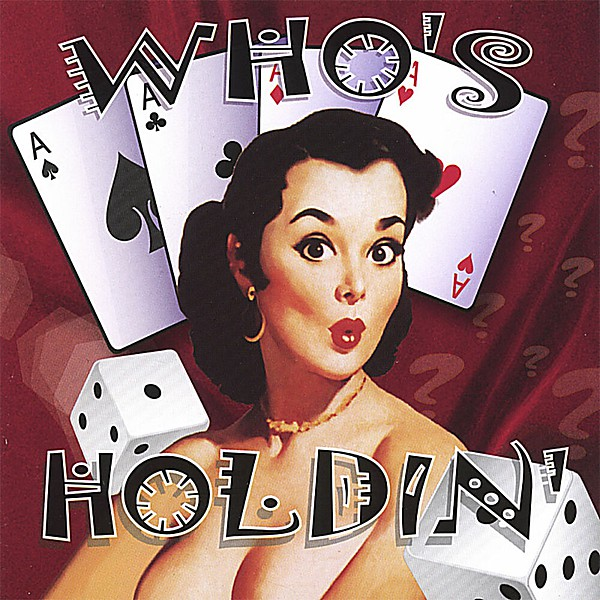

# Rollin' On

By **Who's Holdin'**

## Album Data

- **Catalog:** Beets
- **Format:** Digital, Album
- **Album:** Rollin' On
- **Artist:** Who's Holdin'
- **Albumartist:** Who's Holdin'
- **Genre:** Punk Rock
- **MusicBrainz Album Artist ID:** 
- **MusicBrainz Album ID:** 
- **MusicBrainz Release Group ID:** 
- **Year:** 2006
- **Catalog #:** 
- **Label:** 
- **Total Tracks:** 14

## Album Tracks

### Track 01 - March To Follow

- **Artist:** Who's Holdin'
- **Format:** ALAC
- **Genre:** Punk Rock
- **Length:** 3:54
- **MusicBrainz Track ID:** 
- **Title:** March To Follow
- **Track:** 01
- **Year:** 2006

### Track 02 - Rollin' On

- **Artist:** Who's Holdin'
- **Format:** ALAC
- **Genre:** Punk Rock
- **Length:** 3:44
- **MusicBrainz Track ID:** 
- **Title:** Rollin' On
- **Track:** 02
- **Year:** 2006

### Track 03 - El Cholo

- **Artist:** Who's Holdin'
- **Format:** ALAC
- **Genre:** Punk Rock
- **Length:** 2:14
- **MusicBrainz Track ID:** 
- **Title:** El Cholo
- **Track:** 03
- **Year:** 2006

### Track 04 - Left Too High

- **Artist:** Who's Holdin'
- **Format:** ALAC
- **Genre:** Punk Rock
- **Length:** 3:40
- **MusicBrainz Track ID:** 
- **Title:** Left Too High
- **Track:** 04
- **Year:** 2006

### Track 05 - Big Day Out

- **Artist:** Who's Holdin'
- **Format:** ALAC
- **Genre:** Punk Rock
- **Length:** 4:31
- **MusicBrainz Track ID:** 
- **Title:** Big Day Out
- **Track:** 05
- **Year:** 2006

### Track 06 - Drunken The Same

- **Artist:** Who's Holdin'
- **Format:** ALAC
- **Genre:** Punk Rock
- **Length:** 2:36
- **MusicBrainz Track ID:** 
- **Title:** Drunken The Same
- **Track:** 06
- **Year:** 2006

### Track 07 - Watch & Wait

- **Artist:** Who's Holdin'
- **Format:** ALAC
- **Genre:** Punk Rock
- **Length:** 2:47
- **MusicBrainz Track ID:** 
- **Title:** Watch & Wait
- **Track:** 07
- **Year:** 2006

### Track 08 - Listen To Me

- **Artist:** Who's Holdin'
- **Format:** ALAC
- **Genre:** Punk Rock
- **Length:** 4:03
- **MusicBrainz Track ID:** 
- **Title:** Listen To Me
- **Track:** 08
- **Year:** 2006

### Track 09 - Life Offers Up No Easy Way

- **Artist:** Who's Holdin'
- **Format:** ALAC
- **Genre:** Punk Rock
- **Length:** 2:54
- **MusicBrainz Track ID:** 
- **Title:** Life Offers Up No Easy Way
- **Track:** 09
- **Year:** 2006

### Track 10 - Never Loved Me Anyway

- **Artist:** Who's Holdin'
- **Format:** ALAC
- **Genre:** Punk Rock
- **Length:** 3:06
- **MusicBrainz Track ID:** 
- **Title:** Never Loved Me Anyway
- **Track:** 10
- **Year:** 2006

### Track 11 - Too Slow

- **Artist:** Who's Holdin'
- **Format:** ALAC
- **Genre:** Punk Rock
- **Length:** 2:13
- **MusicBrainz Track ID:** 
- **Title:** Too Slow
- **Track:** 11
- **Year:** 2006

### Track 12 - Trailer Love

- **Artist:** Who's Holdin'
- **Format:** ALAC
- **Genre:** Punk Rock
- **Length:** 4:02
- **MusicBrainz Track ID:** 
- **Title:** Trailer Love
- **Track:** 12
- **Year:** 2006

### Track 13 - Free Drinks

- **Artist:** Who's Holdin'
- **Format:** ALAC
- **Genre:** Punk Rock
- **Length:** 2:30
- **MusicBrainz Track ID:** 
- **Title:** Free Drinks
- **Track:** 13
- **Year:** 2006

### Track 14 - Who's Holdin'

- **Artist:** Who's Holdin'
- **Format:** ALAC
- **Genre:** Punk Rock
- **Length:** 2:48
- **MusicBrainz Track ID:** 
- **Title:** Who's Holdin'
- **Track:** 14
- **Year:** 2006

