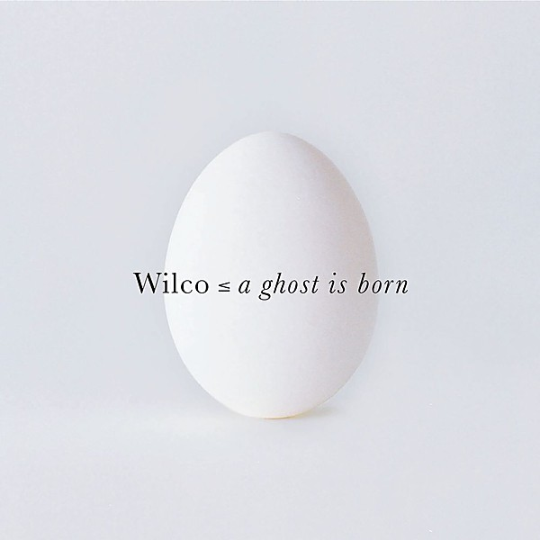

# A Ghost Is Born

By **Wilco**

## Album Data

- **Catalog:** Beets
- **Format:** Digital, Album
- **Album:** A Ghost Is Born
- **Artist:** Wilco
- **Albumartist:** Wilco
- **Genre:** Indie Rock
- **MusicBrainz Album Artist ID:** [https](https://musicbrainz.org/artist/https)
- **MusicBrainz Album ID:** [https](https://musicbrainz.org/release/https)
- **MusicBrainz Release Group ID:** 
- **Year:** 2004
- **Catalog #:** 9 45857-2
- **Label:** Sire Records
- **Total Tracks:** 13

## Album Tracks

### Track 01 - I Must Be High

- **Artist:** Wilco
- **Format:** ALAC
- **Genre:** Indie Rock
- **Length:** 2:59
- **MusicBrainz Track ID:** [1527a7a6-e805-41f0-b815-8952687ac674](https://musicbrainz.org/recording/1527a7a6-e805-41f0-b815-8952687ac674)
- **Title:** I Must Be High
- **Track:** 01
- **Year:** 1995

### Track 02 - Casino Queen

- **Artist:** Wilco
- **Format:** ALAC
- **Genre:** Alternative Country
- **Length:** 2:44
- **MusicBrainz Track ID:** [259e5d97-d554-4ad7-81cf-53ff7001a8c9](https://musicbrainz.org/recording/259e5d97-d554-4ad7-81cf-53ff7001a8c9)
- **Title:** Casino Queen
- **Track:** 02
- **Year:** 1995

### Track 03 - Box Full of Letters

- **Artist:** Wilco
- **Format:** ALAC
- **Genre:** Acid Jazz
- **Length:** 3:06
- **MusicBrainz Track ID:** [91c31983-8523-4b88-b959-ca019c5b2ab1](https://musicbrainz.org/recording/91c31983-8523-4b88-b959-ca019c5b2ab1)
- **Title:** Box Full of Letters
- **Track:** 03
- **Year:** 1995

### Track 04 - Shouldn’t Be Ashamed

- **Artist:** Wilco
- **Format:** ALAC
- **Genre:** Indie Rock
- **Length:** 3:29
- **MusicBrainz Track ID:** [60a164a9-1a31-4b29-a8ac-2f9e40644582](https://musicbrainz.org/recording/60a164a9-1a31-4b29-a8ac-2f9e40644582)
- **Title:** Shouldn’t Be Ashamed
- **Track:** 04
- **Year:** 1995

### Track 05 - Pick Up the Change

- **Artist:** Wilco
- **Format:** ALAC
- **Genre:** Country Rock
- **Length:** 2:55
- **MusicBrainz Track ID:** [4f8c7866-095d-4bda-8edb-21d26f3f5d1a](https://musicbrainz.org/recording/4f8c7866-095d-4bda-8edb-21d26f3f5d1a)
- **Title:** Pick Up the Change
- **Track:** 05
- **Year:** 1995

### Track 06 - I Thought I Held You

- **Artist:** Wilco
- **Format:** ALAC
- **Genre:** Alternative Country
- **Length:** 3:49
- **MusicBrainz Track ID:** [5d188a70-3aa5-41ab-b542-fbb5c3ba78bf](https://musicbrainz.org/recording/5d188a70-3aa5-41ab-b542-fbb5c3ba78bf)
- **Title:** I Thought I Held You
- **Track:** 06
- **Year:** 1995

### Track 07 - That’s Not the Issue

- **Artist:** Wilco
- **Format:** ALAC
- **Genre:** Indie Rock
- **Length:** 3:21
- **MusicBrainz Track ID:** [409e7b18-6357-46e5-b63c-3689d3194b46](https://musicbrainz.org/recording/409e7b18-6357-46e5-b63c-3689d3194b46)
- **Title:** That’s Not the Issue
- **Track:** 07
- **Year:** 1995

### Track 08 - It’s Just That Simple

- **Artist:** Wilco
- **Format:** ALAC
- **Genre:** Indie Rock
- **Length:** 3:46
- **MusicBrainz Track ID:** [42ef5340-94a5-4a9e-b559-0736b5b20313](https://musicbrainz.org/recording/42ef5340-94a5-4a9e-b559-0736b5b20313)
- **Title:** It’s Just That Simple
- **Track:** 08
- **Year:** 1995

### Track 09 - Should’ve Been in Love

- **Artist:** Wilco
- **Format:** ALAC
- **Genre:** Indie Rock
- **Length:** 3:36
- **MusicBrainz Track ID:** [e791e14b-775d-4ae2-b02b-bb3b82d08803](https://musicbrainz.org/recording/e791e14b-775d-4ae2-b02b-bb3b82d08803)
- **Title:** Should’ve Been in Love
- **Track:** 09
- **Year:** 1995

### Track 10 - Passenger Side

- **Artist:** Wilco
- **Format:** ALAC
- **Genre:** Indie Rock
- **Length:** 3:34
- **MusicBrainz Track ID:** [04f1109e-7611-4f07-83fa-edd60666aaf5](https://musicbrainz.org/recording/04f1109e-7611-4f07-83fa-edd60666aaf5)
- **Title:** Passenger Side
- **Track:** 10
- **Year:** 1995

### Track 11 - Dash 7

- **Artist:** Wilco
- **Format:** ALAC
- **Genre:** Hard Rock
- **Length:** 3:29
- **MusicBrainz Track ID:** [44b2ae7c-c220-4249-9ef6-f57bc6a9ad1a](https://musicbrainz.org/recording/44b2ae7c-c220-4249-9ef6-f57bc6a9ad1a)
- **Title:** Dash 7
- **Track:** 11
- **Year:** 1995

### Track 12 - Blue Eyed Soul

- **Artist:** Wilco
- **Format:** ALAC
- **Genre:** Experimental Rock
- **Length:** 4:05
- **MusicBrainz Track ID:** [d4efba55-b6ff-4fb1-b69d-f4313ffe9cb6](https://musicbrainz.org/recording/d4efba55-b6ff-4fb1-b69d-f4313ffe9cb6)
- **Title:** Blue Eyed Soul
- **Track:** 12
- **Year:** 1995

### Track 13 - Too Far Apart

- **Artist:** Wilco
- **Format:** ALAC
- **Genre:** Folk Rock
- **Length:** 3:44
- **MusicBrainz Track ID:** [e2b70519-d6c1-42e1-a9c0-af734365f607](https://musicbrainz.org/recording/e2b70519-d6c1-42e1-a9c0-af734365f607)
- **Title:** Too Far Apart
- **Track:** 13
- **Year:** 1995

## See also

- [A.M.](AM.md)
- [Star Wars](Star_Wars.md)
