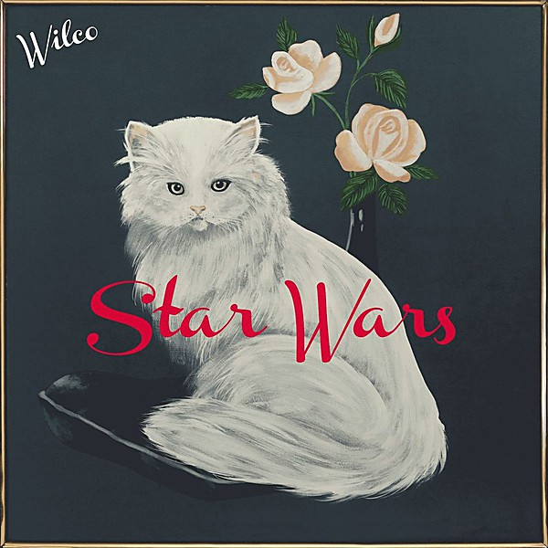

# Star Wars

By **Wilco**

## Album Data

- **Catalog:** Beets
- **Format:** Digital, Album
- **Album:** Star Wars
- **Artist:** Wilco
- **Albumartist:** Wilco
- **Genre:** Space Rock
- **MusicBrainz Album Artist ID:** [9e53f84d-ef44-4c16-9677-5fd4d78cbd7d](https://musicbrainz.org/artist/9e53f84d-ef44-4c16-9677-5fd4d78cbd7d)
- **MusicBrainz Album ID:** [c8dfb4be-98ee-4678-91bd-a00c0988ecfa](https://musicbrainz.org/release/c8dfb4be-98ee-4678-91bd-a00c0988ecfa)
- **MusicBrainz Release Group ID:** [c4391e76-d64b-4cf8-8a6f-77874438430c](https://musicbrainz.org/release-group/c4391e76-d64b-4cf8-8a6f-77874438430c)
- **Year:** 2015
- **Catalog #:** WIL760-D
- **Label:** dBpm Records
- **Total Tracks:** 11

## Album Tracks

### Track 01 - EKG

- **Artist:** Wilco
- **Format:** MP3
- **Genre:** Space Rock
- **Length:** 1:15
- **MusicBrainz Track ID:** [66baebda-8ddb-45f3-9cb1-df3202bc777f](https://musicbrainz.org/recording/66baebda-8ddb-45f3-9cb1-df3202bc777f)
- **Title:** EKG
- **Track:** 01
- **Year:** 2015

### Track 02 - More…

- **Artist:** Wilco
- **Format:** MP3
- **Genre:** Space Rock
- **Length:** 2:43
- **MusicBrainz Track ID:** [2871ba5d-8f03-4460-b930-e327fce90edb](https://musicbrainz.org/recording/2871ba5d-8f03-4460-b930-e327fce90edb)
- **Title:** More…
- **Track:** 02
- **Year:** 2015

### Track 03 - Random Name Generator

- **Artist:** Wilco
- **Format:** MP3
- **Genre:** Space Rock
- **Length:** 3:49
- **MusicBrainz Track ID:** [b61f9647-4ee4-4013-983d-48bf5006ac20](https://musicbrainz.org/recording/b61f9647-4ee4-4013-983d-48bf5006ac20)
- **Title:** Random Name Generator
- **Track:** 03
- **Year:** 2015

### Track 04 - The Joke Explained

- **Artist:** Wilco
- **Format:** MP3
- **Genre:** Rock
- **Length:** 2:33
- **MusicBrainz Track ID:** [6f97c04e-8c93-492c-be0f-27a934fd4c69](https://musicbrainz.org/recording/6f97c04e-8c93-492c-be0f-27a934fd4c69)
- **Title:** The Joke Explained
- **Track:** 04
- **Year:** 2015

### Track 05 - You Satellite

- **Artist:** Wilco
- **Format:** MP3
- **Genre:** Space Rock
- **Length:** 5:16
- **MusicBrainz Track ID:** [70177005-0723-40e9-a7df-cafc08b5fb2a](https://musicbrainz.org/recording/70177005-0723-40e9-a7df-cafc08b5fb2a)
- **Title:** You Satellite
- **Track:** 05
- **Year:** 2015

### Track 06 - Taste the Ceiling

- **Artist:** Wilco
- **Format:** MP3
- **Genre:** Space Rock
- **Length:** 3:15
- **MusicBrainz Track ID:** [c4fb6e49-e587-407f-bf5d-30b2ff727379](https://musicbrainz.org/recording/c4fb6e49-e587-407f-bf5d-30b2ff727379)
- **Title:** Taste the Ceiling
- **Track:** 06
- **Year:** 2015

### Track 07 - Pickled Ginger

- **Artist:** Wilco
- **Format:** MP3
- **Genre:** Space Rock
- **Length:** 2:29
- **MusicBrainz Track ID:** [8e669a95-de6a-4d6f-a0be-5f808d2492d5](https://musicbrainz.org/recording/8e669a95-de6a-4d6f-a0be-5f808d2492d5)
- **Title:** Pickled Ginger
- **Track:** 07
- **Year:** 2015

### Track 08 - Where Do I Begin

- **Artist:** Wilco
- **Format:** MP3
- **Genre:** Indie Rock
- **Length:** 2:54
- **MusicBrainz Track ID:** [959bf5b0-5c67-4e59-a5ff-38234c2cc519](https://musicbrainz.org/recording/959bf5b0-5c67-4e59-a5ff-38234c2cc519)
- **Title:** Where Do I Begin
- **Track:** 08
- **Year:** 2015

### Track 09 - Cold Slope

- **Artist:** Wilco
- **Format:** MP3
- **Genre:** Space Rock
- **Length:** 3:11
- **MusicBrainz Track ID:** [3d979c34-37c9-4335-87ac-860cd56abc4c](https://musicbrainz.org/recording/3d979c34-37c9-4335-87ac-860cd56abc4c)
- **Title:** Cold Slope
- **Track:** 09
- **Year:** 2015

### Track 10 - King of You

- **Artist:** Wilco
- **Format:** MP3
- **Genre:** Space Rock
- **Length:** 2:40
- **MusicBrainz Track ID:** [c033123d-ab73-4f9c-8066-80b72d3ee6d4](https://musicbrainz.org/recording/c033123d-ab73-4f9c-8066-80b72d3ee6d4)
- **Title:** King of You
- **Track:** 10
- **Year:** 2015

### Track 11 - Magnetized

- **Artist:** Wilco
- **Format:** MP3
- **Genre:** Space Rock
- **Length:** 3:40
- **MusicBrainz Track ID:** [146743f4-48f4-4a6a-97dc-d5f4429d8c16](https://musicbrainz.org/recording/146743f4-48f4-4a6a-97dc-d5f4429d8c16)
- **Title:** Magnetized
- **Track:** 11
- **Year:** 2015

## See also

- [A Ghost Is Born](A_Ghost_Is_Born.md)
- [A.M.](AM.md)
