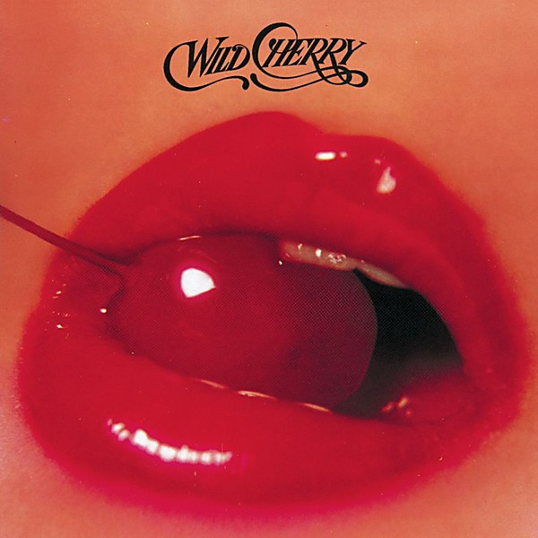

# Wild Cherry

By **Wild Cherry**

## Album Data

- **Catalog:** Beets
- **Format:** Digital, Album
- **Album:** Wild Cherry
- **Artist:** Wild Cherry
- **Albumartist:** Wild Cherry
- **Genre:** Uk Garage
- **MusicBrainz Album Artist ID:** 
- **MusicBrainz Album ID:** 
- **MusicBrainz Release Group ID:** 
- **Year:** 1976
- **Catalog #:** 
- **Label:** 
- **Total Tracks:** 00

## Album Tracks

### Track 01 - Play That Funky Music

- **Artist:** Wild Cherry
- **Format:** MP3
- **Genre:** Uk Garage
- **Length:** 5:02
- **MusicBrainz Track ID:** 
- **Title:** Play That Funky Music
- **Track:** 01
- **Year:** 1976

### Track 02 - The Lady Wants Your Money

- **Artist:** Wild Cherry
- **Format:** MP3
- **Genre:** Uk Garage
- **Length:** 4:13
- **MusicBrainz Track ID:** 
- **Title:** The Lady Wants Your Money
- **Track:** 02
- **Year:** 1976

### Track 03 - 99.5

- **Artist:** Wild Cherry
- **Format:** MP3
- **Genre:** Uk Garage
- **Length:** 3:02
- **MusicBrainz Track ID:** 
- **Title:** 99.5
- **Track:** 03
- **Year:** 1976

### Track 04 - Don't Go Near the Water

- **Artist:** Wild Cherry
- **Format:** MP3
- **Genre:** Acid Jazz
- **Length:** 3:18
- **MusicBrainz Track ID:** 
- **Title:** Don't Go Near the Water
- **Track:** 04
- **Year:** 1976

### Track 05 - Nowhere to Run

- **Artist:** Wild Cherry
- **Format:** MP3
- **Genre:** Funk
- **Length:** 3:06
- **MusicBrainz Track ID:** 
- **Title:** Nowhere to Run
- **Track:** 05
- **Year:** 1976

### Track 06 - I Feel Sanctified

- **Artist:** Wild Cherry
- **Format:** MP3
- **Genre:** Uk Garage
- **Length:** 3:52
- **MusicBrainz Track ID:** 
- **Title:** I Feel Sanctified
- **Track:** 06
- **Year:** 1976

### Track 07 - Hold On

- **Artist:** Wild Cherry
- **Format:** MP3
- **Genre:** Soul
- **Length:** 4:13
- **MusicBrainz Track ID:** 
- **Title:** Hold On
- **Track:** 07
- **Year:** 1976

### Track 08 - Get It Up

- **Artist:** Wild Cherry
- **Format:** MP3
- **Genre:** Uk Garage
- **Length:** 3:00
- **MusicBrainz Track ID:** 
- **Title:** Get It Up
- **Track:** 08
- **Year:** 1976

### Track 09 - What in the Funk Do You See

- **Artist:** Wild Cherry
- **Format:** MP3
- **Genre:** Uk Garage
- **Length:** 3:30
- **MusicBrainz Track ID:** 
- **Title:** What in the Funk Do You See
- **Track:** 09
- **Year:** 1976

## See also

- [Vinyl: ](../../Vinyl/Wild_Cherry/Wild_Cherry_index.md)
- [Vinyl: Wild Cherry](../../Vinyl/Wild_Cherry/Wild_Cherry.md)
