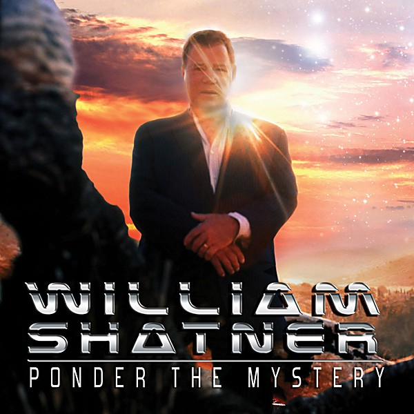

# Ponder the Mystery

By **William Shatner**

## Album Data

- **Catalog:** Beets
- **Format:** Digital, Album
- **Album:** Ponder the Mystery
- **Artist:** William Shatner
- **Albumartist:** William Shatner
- **Genre:** Rock
- **MusicBrainz Album Artist ID:** [a406a684-7c88-442b-836d-3b9b67bbc91d](https://musicbrainz.org/artist/a406a684-7c88-442b-836d-3b9b67bbc91d)
- **MusicBrainz Album ID:** [4a646433-be8b-4afb-a64a-d96d075e4f4f](https://musicbrainz.org/release/4a646433-be8b-4afb-a64a-d96d075e4f4f)
- **MusicBrainz Release Group ID:** [0f8a9224-b44e-41d7-b395-c7f8b3b55296](https://musicbrainz.org/release-group/0f8a9224-b44e-41d7-b395-c7f8b3b55296)
- **Year:** 2013
- **Catalog #:** 
- **Label:** Cleopatra Records
- **Total Tracks:** 15

## Album Tracks

### Track 12 - Deep Down

- **Artist:** William Shatner & Robby Krieger feat. Billy Sherwood
- **Format:** ALAC
- **Genre:** Rock
- **Length:** 4:48
- **MusicBrainz Track ID:** [1043d403-6fbe-44a1-92ee-85e8e6720628](https://musicbrainz.org/recording/1043d403-6fbe-44a1-92ee-85e8e6720628)
- **Title:** Deep Down
- **Track:** 12
- **Year:** 2013

### Track 05 - So Am I

- **Artist:** William Shatner feat. Al Di Meola & Billy Sherwood
- **Format:** ALAC
- **Genre:** Rock
- **Length:** 4:15
- **MusicBrainz Track ID:** [338b9377-66df-4182-b8f1-29a49d455b8b](https://musicbrainz.org/recording/338b9377-66df-4182-b8f1-29a49d455b8b)
- **Title:** So Am I
- **Track:** 05
- **Year:** 2013

### Track 14 - Where Does Time Go?

- **Artist:** William Shatner feat. George Duke & Billy Sherwood
- **Format:** ALAC
- **Genre:** Rock
- **Length:** 6:40
- **MusicBrainz Track ID:** [356a3f40-e5e7-40bc-836d-7ad0f04196d4](https://musicbrainz.org/recording/356a3f40-e5e7-40bc-836d-7ad0f04196d4)
- **Title:** Where Does Time Go?
- **Track:** 14
- **Year:** 2013

### Track 11 - Do You See?

- **Artist:** William Shatner feat. Edgar Froese & Billy Sherwood
- **Format:** ALAC
- **Genre:** Rock
- **Length:** 4:40
- **MusicBrainz Track ID:** [ed404812-75ad-43b0-8784-b1193534cc3c](https://musicbrainz.org/recording/ed404812-75ad-43b0-8784-b1193534cc3c)
- **Title:** Do You See?
- **Track:** 11
- **Year:** 2013

### Track 10 - Imagine Things

- **Artist:** William Shatner feat. Vince Gill & Billy Sherwood
- **Format:** ALAC
- **Genre:** Rock
- **Length:** 3:44
- **MusicBrainz Track ID:** [a2d0c895-5b72-4e61-ae90-882d27d963ad](https://musicbrainz.org/recording/a2d0c895-5b72-4e61-ae90-882d27d963ad)
- **Title:** Imagine Things
- **Track:** 10
- **Year:** 2013

### Track 03 - Manhunt

- **Artist:** William Shatner feat. Simon House & Billy Sherwood
- **Format:** ALAC
- **Genre:** Rock
- **Length:** 2:54
- **MusicBrainz Track ID:** [feb01029-4878-40be-8063-7fe20c38cdb3](https://musicbrainz.org/recording/feb01029-4878-40be-8063-7fe20c38cdb3)
- **Title:** Manhunt
- **Track:** 03
- **Year:** 2013

### Track 02 - Where It’s Gone…I Don’t Know

- **Artist:** William Shatner feat. Mick Jones & Billy Sherwood
- **Format:** ALAC
- **Genre:** Rock
- **Length:** 5:29
- **MusicBrainz Track ID:** [6121cf4c-8092-4671-8f68-59e2794c9c83](https://musicbrainz.org/recording/6121cf4c-8092-4671-8f68-59e2794c9c83)
- **Title:** Where It’s Gone…I Don’t Know
- **Track:** 02
- **Year:** 2013

### Track 13 - I’m Alright, I Think

- **Artist:** William Shatner feat. Dave Koz & Billy Sherwood
- **Format:** ALAC
- **Genre:** Rock
- **Length:** 4:28
- **MusicBrainz Track ID:** [5fe7452c-a54e-46ca-b850-ae9276ff07ed](https://musicbrainz.org/recording/5fe7452c-a54e-46ca-b850-ae9276ff07ed)
- **Title:** I’m Alright, I Think
- **Track:** 13
- **Year:** 2013

### Track 01 - Red Shift

- **Artist:** William Shatner feat. Billy Sherwood
- **Format:** ALAC
- **Genre:** Rock
- **Length:** 1:30
- **MusicBrainz Track ID:** [304eaa0f-fbab-4150-b859-6c808056ac30](https://musicbrainz.org/recording/304eaa0f-fbab-4150-b859-6c808056ac30)
- **Title:** Red Shift
- **Track:** 01
- **Year:** 2013

### Track 09 - Rhythm of the Night

- **Artist:** William Shatner feat. Nik Turner & Billy Sherwood
- **Format:** ALAC
- **Genre:** Rock
- **Length:** 6:06
- **MusicBrainz Track ID:** [9847538b-bac8-4f94-b9db-035f69284cc6](https://musicbrainz.org/recording/9847538b-bac8-4f94-b9db-035f69284cc6)
- **Title:** Rhythm of the Night
- **Track:** 09
- **Year:** 2013

### Track 04 - Ponder the Mystery

- **Artist:** William Shatner feat. Steve Vai & Billy Sherwood
- **Format:** ALAC
- **Genre:** Rock
- **Length:** 5:20
- **MusicBrainz Track ID:** [7c1cd7d7-adcb-44f2-b8b3-559978cf2903](https://musicbrainz.org/recording/7c1cd7d7-adcb-44f2-b8b3-559978cf2903)
- **Title:** Ponder the Mystery
- **Track:** 04
- **Year:** 2013

### Track 07 - Sunset

- **Artist:** William Shatner feat. Joel Vandroogenbroeck & Billy Sherwood
- **Format:** ALAC
- **Genre:** Rock
- **Length:** 4:25
- **MusicBrainz Track ID:** [081bee1f-dec4-46e5-a502-691ba932e1b4](https://musicbrainz.org/recording/081bee1f-dec4-46e5-a502-691ba932e1b4)
- **Title:** Sunset
- **Track:** 07
- **Year:** 2013

### Track 06 - Change

- **Artist:** William Shatner feat. Rick Wakeman & Billy Sherwood
- **Format:** ALAC
- **Genre:** Rock
- **Length:** 4:11
- **MusicBrainz Track ID:** [0cd2fd21-8df6-403b-9a69-783e3f608aee](https://musicbrainz.org/recording/0cd2fd21-8df6-403b-9a69-783e3f608aee)
- **Title:** Change
- **Track:** 06
- **Year:** 2013

### Track 08 - Twilight

- **Artist:** William Shatner feat. Edgar Winter & Billy Sherwood
- **Format:** ALAC
- **Genre:** Rock
- **Length:** 1:58
- **MusicBrainz Track ID:** [4e7378d4-c863-443d-8c10-b9254074ce04](https://musicbrainz.org/recording/4e7378d4-c863-443d-8c10-b9254074ce04)
- **Title:** Twilight
- **Track:** 08
- **Year:** 2013

### Track 15 - Alive

- **Artist:** William Shatner feat. Zoot Horn Rollo & Billy Sherwood
- **Format:** ALAC
- **Genre:** Rock
- **Length:** 4:34
- **MusicBrainz Track ID:** [5a4d6759-aba6-4f38-a6be-4ae59816f4d2](https://musicbrainz.org/recording/5a4d6759-aba6-4f38-a6be-4ae59816f4d2)
- **Title:** Alive
- **Track:** 15
- **Year:** 2013

