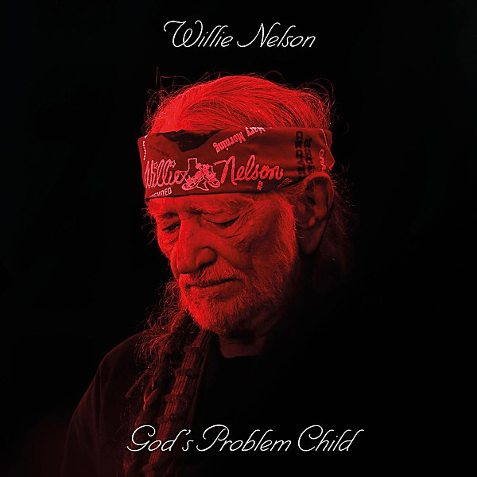

# God’s Problem Child

By **Willie Nelson**

## Album Data

- **Catalog:** Beets
- **Format:** Digital, Album
- **Album:** God’s Problem Child
- **Artist:** Willie Nelson
- **Albumartist:** Willie Nelson
- **Genre:** Outlaw Country
- **MusicBrainz Album Artist ID:** [668fd73c-bf54-4310-a139-305517f05311](https://musicbrainz.org/artist/668fd73c-bf54-4310-a139-305517f05311)
- **MusicBrainz Album ID:** [1a6e1b14-ba43-4139-a405-d68710c543e3](https://musicbrainz.org/release/1a6e1b14-ba43-4139-a405-d68710c543e3)
- **MusicBrainz Release Group ID:** [d80e51a2-601a-4a97-b5f1-8b486971183f](https://musicbrainz.org/release-group/d80e51a2-601a-4a97-b5f1-8b486971183f)
- **Year:** 2017
- **Catalog #:** CK 63589
- **Label:** Legacy
- **Total Tracks:** 19

## Album Tracks

### Track 01 - Time of the Preacher

- **Artist:** Willie Nelson
- **Format:** ALAC
- **Genre:** Classic Country
- **Length:** 2:26
- **MusicBrainz Track ID:** [f086a911-0f5f-4cb2-985f-734b0453a9e0](https://musicbrainz.org/recording/f086a911-0f5f-4cb2-985f-734b0453a9e0)
- **Title:** Time of the Preacher
- **Track:** 01
- **Year:** 2000

### Track 02 - I Couldn’t Believe It Was True

- **Artist:** Willie Nelson
- **Format:** ALAC
- **Genre:** Outlaw Country
- **Length:** 1:32
- **MusicBrainz Track ID:** [31b3eb97-5cee-4d21-aaaa-7bb45f1a8e85](https://musicbrainz.org/recording/31b3eb97-5cee-4d21-aaaa-7bb45f1a8e85)
- **Title:** I Couldn’t Believe It Was True
- **Track:** 02
- **Year:** 2000

### Track 03 - Time of the Preacher Theme

- **Artist:** Willie Nelson
- **Format:** ALAC
- **Genre:** Classic Country
- **Length:** 1:13
- **MusicBrainz Track ID:** [f5c4bf90-ef8c-4299-94c6-f14d09bf35e1](https://musicbrainz.org/recording/f5c4bf90-ef8c-4299-94c6-f14d09bf35e1)
- **Title:** Time of the Preacher Theme
- **Track:** 03
- **Year:** 2000

### Track 04 - Medley

- **Artist:** Willie Nelson
- **Format:** ALAC
- **Genre:** Outlaw Country
- **Length:** 1:36
- **MusicBrainz Track ID:** [91f8872b-cc36-4b9d-a602-76dcd754f0ea](https://musicbrainz.org/recording/91f8872b-cc36-4b9d-a602-76dcd754f0ea)
- **Title:** Medley
- **Track:** 04
- **Year:** 2000

### Track 05 - Blue Eyes Crying in the Rain

- **Artist:** Willie Nelson
- **Format:** ALAC
- **Genre:** Classic Country
- **Length:** 2:21
- **MusicBrainz Track ID:** [1e0ff41e-80bc-4812-a57c-1735bf814d57](https://musicbrainz.org/recording/1e0ff41e-80bc-4812-a57c-1735bf814d57)
- **Title:** Blue Eyes Crying in the Rain
- **Track:** 05
- **Year:** 2000

### Track 06 - Red Headed Stranger

- **Artist:** Willie Nelson
- **Format:** ALAC
- **Genre:** Classic Country
- **Length:** 4:00
- **MusicBrainz Track ID:** [bb71a222-d93a-405a-851b-d5205a366d4a](https://musicbrainz.org/recording/bb71a222-d93a-405a-851b-d5205a366d4a)
- **Title:** Red Headed Stranger
- **Track:** 06
- **Year:** 2000

### Track 07 - Time of the Preacher Theme

- **Artist:** Willie Nelson
- **Format:** ALAC
- **Genre:** Classic Country
- **Length:** 0:26
- **MusicBrainz Track ID:** [af91131c-b896-4183-901f-d986e2d0bf7e](https://musicbrainz.org/recording/af91131c-b896-4183-901f-d986e2d0bf7e)
- **Title:** Time of the Preacher Theme
- **Track:** 07
- **Year:** 2000

### Track 08 - Just as I Am

- **Artist:** Willie Nelson
- **Format:** ALAC
- **Genre:** Country
- **Length:** 1:47
- **MusicBrainz Track ID:** [fdbcfca1-6602-42e4-b0f7-5dc7c43d8828](https://musicbrainz.org/recording/fdbcfca1-6602-42e4-b0f7-5dc7c43d8828)
- **Title:** Just as I Am
- **Track:** 08
- **Year:** 2000

### Track 09 - Denver

- **Artist:** Willie Nelson
- **Format:** ALAC
- **Genre:** Soul
- **Length:** 0:53
- **MusicBrainz Track ID:** [5742c218-f74c-4ed9-bfb3-36185cfebe68](https://musicbrainz.org/recording/5742c218-f74c-4ed9-bfb3-36185cfebe68)
- **Title:** Denver
- **Track:** 09
- **Year:** 2000

### Track 10 - O’er the Waves

- **Artist:** Willie Nelson
- **Format:** ALAC
- **Genre:** Outlaw Country
- **Length:** 0:47
- **MusicBrainz Track ID:** [cf95c40f-d714-4d45-bf74-7a4c40fb43f7](https://musicbrainz.org/recording/cf95c40f-d714-4d45-bf74-7a4c40fb43f7)
- **Title:** O’er the Waves
- **Track:** 10
- **Year:** 2000

### Track 11 - Down Yonder

- **Artist:** Willie Nelson
- **Format:** ALAC
- **Genre:** Outlaw Country
- **Length:** 1:56
- **MusicBrainz Track ID:** [cb797af3-c017-40a6-85cc-60843dd30880](https://musicbrainz.org/recording/cb797af3-c017-40a6-85cc-60843dd30880)
- **Title:** Down Yonder
- **Track:** 11
- **Year:** 2000

### Track 12 - Can I Sleep in Your Arms

- **Artist:** Willie Nelson
- **Format:** ALAC
- **Genre:** Outlaw Country
- **Length:** 5:24
- **MusicBrainz Track ID:** [ec43c53a-981e-4815-8ad3-74681ee417b6](https://musicbrainz.org/recording/ec43c53a-981e-4815-8ad3-74681ee417b6)
- **Title:** Can I Sleep in Your Arms
- **Track:** 12
- **Year:** 2000

### Track 13 - Remember Me

- **Artist:** Willie Nelson
- **Format:** ALAC
- **Genre:** Outlaw Country
- **Length:** 2:52
- **MusicBrainz Track ID:** [d581e18b-5fc1-4089-8b72-3a33b8198376](https://musicbrainz.org/recording/d581e18b-5fc1-4089-8b72-3a33b8198376)
- **Title:** Remember Me
- **Track:** 13
- **Year:** 2000

### Track 14 - Hands on the Wheel

- **Artist:** Willie Nelson
- **Format:** ALAC
- **Genre:** Country
- **Length:** 4:22
- **MusicBrainz Track ID:** [8204c815-d65a-4f17-9156-6489898d27e8](https://musicbrainz.org/recording/8204c815-d65a-4f17-9156-6489898d27e8)
- **Title:** Hands on the Wheel
- **Track:** 14
- **Year:** 2000

### Track 15 - Bandera

- **Artist:** Willie Nelson
- **Format:** ALAC
- **Genre:** Country
- **Length:** 2:19
- **MusicBrainz Track ID:** [ec10f4f0-2009-4f02-b2e9-a524d72a2a92](https://musicbrainz.org/recording/ec10f4f0-2009-4f02-b2e9-a524d72a2a92)
- **Title:** Bandera
- **Track:** 15
- **Year:** 2000

### Track 16 - Bach Minuet in G

- **Artist:** Willie Nelson
- **Format:** ALAC
- **Genre:** Outlaw Country
- **Length:** 0:40
- **MusicBrainz Track ID:** [c8100259-c6a6-4bdf-a1f3-8878e58d222a](https://musicbrainz.org/recording/c8100259-c6a6-4bdf-a1f3-8878e58d222a)
- **Title:** Bach Minuet in G
- **Track:** 16
- **Year:** 2000

### Track 17 - Can’t Help It (If I’m Still in Love With You)

- **Artist:** Willie Nelson
- **Format:** ALAC
- **Genre:** Outlaw Country
- **Length:** 3:32
- **MusicBrainz Track ID:** [cf653297-1c60-4fef-a722-63526c847900](https://musicbrainz.org/recording/cf653297-1c60-4fef-a722-63526c847900)
- **Title:** Can’t Help It (If I’m Still in Love With You)
- **Track:** 17
- **Year:** 2000

### Track 18 - A Maiden’s Prayer

- **Artist:** Willie Nelson
- **Format:** ALAC
- **Genre:** Outlaw Country
- **Length:** 2:16
- **MusicBrainz Track ID:** [b0b369a3-b8cc-4ec1-8496-b2d089f2c7d4](https://musicbrainz.org/recording/b0b369a3-b8cc-4ec1-8496-b2d089f2c7d4)
- **Title:** A Maiden’s Prayer
- **Track:** 18
- **Year:** 2000

### Track 19 - Bonaparte’s Retreat

- **Artist:** Willie Nelson
- **Format:** ALAC
- **Genre:** Outlaw Country
- **Length:** 2:26
- **MusicBrainz Track ID:** [efd4015f-fadb-44e8-89df-a0e34150fe9e](https://musicbrainz.org/recording/efd4015f-fadb-44e8-89df-a0e34150fe9e)
- **Title:** Bonaparte’s Retreat
- **Track:** 19
- **Year:** 2000

## See also

- [16 Biggest Hits](16_Biggest_Hits.md)
- [Red Headed Stranger](Red_Headed_Stranger.md)
- [Teatro](Teatro.md)
- [Roon: Across The Borderline](../../Roon/Willie_Nelson/Across_The_Borderline.md)
- [Roon: God's Problem Child](../../Roon/Willie_Nelson/Gods_Problem_Child.md)
- [Vinyl: God's Problem Child](../../Vinyl/Willie_Nelson/Gods_Problem_Child.md)
- [Vinyl: ](../../Vinyl/Willie_Nelson/Willie_Nelson.md)
