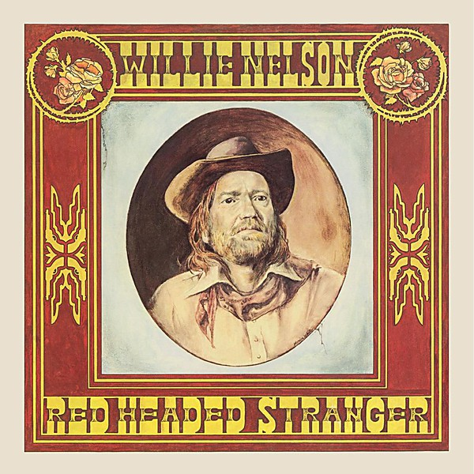

# Red Headed Stranger

By **Willie Nelson**

## Album Data

- **Catalog:** Beets
- **Format:** Digital, Album
- **Album:** Red Headed Stranger
- **Artist:** Willie Nelson
- **Albumartist:** Willie Nelson
- **Genre:** Outlaw Country
- **MusicBrainz Album Artist ID:** [668fd73c-bf54-4310-a139-305517f05311](https://musicbrainz.org/artist/668fd73c-bf54-4310-a139-305517f05311)
- **MusicBrainz Album ID:** [42fb9519-bf49-445c-9fb3-e9c062b7e656](https://musicbrainz.org/release/42fb9519-bf49-445c-9fb3-e9c062b7e656)
- **MusicBrainz Release Group ID:** [b51ba291-2490-3132-a85d-2094de795b63](https://musicbrainz.org/release-group/b51ba291-2490-3132-a85d-2094de795b63)
- **Year:** 2000
- **Catalog #:** 314-524 548-2
- **Label:** Island
- **Total Tracks:** 14

## Album Tracks

### Track 01 - Où es‐tu, mon amour? (Where Are You, My Love?)

- **Artist:** Willie Nelson
- **Format:** MP3
- **Genre:** Americana
- **Length:** 2:42
- **MusicBrainz Track ID:** [1795517a-fea6-4b5b-a1e2-a08462e85284](https://musicbrainz.org/recording/1795517a-fea6-4b5b-a1e2-a08462e85284)
- **Title:** Où es‐tu, mon amour? (Where Are You, My Love?)
- **Track:** 01
- **Year:** 1998

### Track 02 - I Never Cared for You

- **Artist:** Willie Nelson
- **Format:** MP3
- **Genre:** Country
- **Length:** 2:18
- **MusicBrainz Track ID:** [ef2efdf0-dce1-4a0a-a5d5-1cb43d40e752](https://musicbrainz.org/recording/ef2efdf0-dce1-4a0a-a5d5-1cb43d40e752)
- **Title:** I Never Cared for You
- **Track:** 02
- **Year:** 1998

### Track 03 - Everywhere I Go

- **Artist:** Willie Nelson
- **Format:** MP3
- **Genre:** Outlaw Country
- **Length:** 3:49
- **MusicBrainz Track ID:** [2eb70150-c489-4b03-a766-52cd4527809c](https://musicbrainz.org/recording/2eb70150-c489-4b03-a766-52cd4527809c)
- **Title:** Everywhere I Go
- **Track:** 03
- **Year:** 1998

### Track 04 - Darkness on the Face of the Earth

- **Artist:** Willie Nelson
- **Format:** MP3
- **Genre:** Outlaw Country
- **Length:** 2:33
- **MusicBrainz Track ID:** [ee9aaca8-e8c9-483b-b73c-f9bea206373e](https://musicbrainz.org/recording/ee9aaca8-e8c9-483b-b73c-f9bea206373e)
- **Title:** Darkness on the Face of the Earth
- **Track:** 04
- **Year:** 1998

### Track 05 - My Own Peculiar Way

- **Artist:** Willie Nelson
- **Format:** MP3
- **Genre:** Country
- **Length:** 3:37
- **MusicBrainz Track ID:** [49546f09-e59b-4b21-9d06-f2b3a43ec6a3](https://musicbrainz.org/recording/49546f09-e59b-4b21-9d06-f2b3a43ec6a3)
- **Title:** My Own Peculiar Way
- **Track:** 05
- **Year:** 1998

### Track 06 - These Lonely Nights

- **Artist:** Willie Nelson
- **Format:** MP3
- **Genre:** Americana
- **Length:** 3:29
- **MusicBrainz Track ID:** [3c9892e3-e0dd-4484-8c09-70810474d3e6](https://musicbrainz.org/recording/3c9892e3-e0dd-4484-8c09-70810474d3e6)
- **Title:** These Lonely Nights
- **Track:** 06
- **Year:** 1998

### Track 07 - Home Motel

- **Artist:** Willie Nelson
- **Format:** MP3
- **Genre:** Country
- **Length:** 3:15
- **MusicBrainz Track ID:** [bc76f413-298c-4a60-9e61-2aacc54e8b7e](https://musicbrainz.org/recording/bc76f413-298c-4a60-9e61-2aacc54e8b7e)
- **Title:** Home Motel
- **Track:** 07
- **Year:** 1998

### Track 08 - The Maker

- **Artist:** Willie Nelson
- **Format:** MP3
- **Genre:** Country
- **Length:** 5:08
- **MusicBrainz Track ID:** [6d1b4cdf-1e18-44de-9735-86bc026496e7](https://musicbrainz.org/recording/6d1b4cdf-1e18-44de-9735-86bc026496e7)
- **Title:** The Maker
- **Track:** 08
- **Year:** 1998

### Track 09 - I Just Can’t Let You Say Good‐Bye

- **Artist:** Willie Nelson
- **Format:** MP3
- **Genre:** Americana
- **Length:** 4:38
- **MusicBrainz Track ID:** [89334724-c694-4741-bf16-05bef857a2cb](https://musicbrainz.org/recording/89334724-c694-4741-bf16-05bef857a2cb)
- **Title:** I Just Can’t Let You Say Good‐Bye
- **Track:** 09
- **Year:** 1998

### Track 10 - I’ve Just Destroyed the World

- **Artist:** Willie Nelson
- **Format:** MP3
- **Genre:** Americana
- **Length:** 2:52
- **MusicBrainz Track ID:** [cac2ccc3-93ae-4e60-9e3a-412b4b446c07](https://musicbrainz.org/recording/cac2ccc3-93ae-4e60-9e3a-412b4b446c07)
- **Title:** I’ve Just Destroyed the World
- **Track:** 10
- **Year:** 1998

### Track 11 - Somebody Pick Up My Pieces

- **Artist:** Willie Nelson
- **Format:** MP3
- **Genre:** Americana
- **Length:** 4:39
- **MusicBrainz Track ID:** [64085f8e-2fed-4b8c-8242-a597397aa69c](https://musicbrainz.org/recording/64085f8e-2fed-4b8c-8242-a597397aa69c)
- **Title:** Somebody Pick Up My Pieces
- **Track:** 11
- **Year:** 1998

### Track 12 - Three Days

- **Artist:** Willie Nelson
- **Format:** MP3
- **Genre:** Country
- **Length:** 3:06
- **MusicBrainz Track ID:** [7cdc41ab-ef38-4ec2-b20e-f226fa672e0b](https://musicbrainz.org/recording/7cdc41ab-ef38-4ec2-b20e-f226fa672e0b)
- **Title:** Three Days
- **Track:** 12
- **Year:** 1998

### Track 13 - I’ve Loved You All Over the World

- **Artist:** Willie Nelson
- **Format:** MP3
- **Genre:** Americana
- **Length:** 4:17
- **MusicBrainz Track ID:** [c6285d67-c155-4783-ae7a-ae05a77eed8c](https://musicbrainz.org/recording/c6285d67-c155-4783-ae7a-ae05a77eed8c)
- **Title:** I’ve Loved You All Over the World
- **Track:** 13
- **Year:** 1998

### Track 14 - Annie

- **Artist:** Willie Nelson
- **Format:** MP3
- **Genre:** Country
- **Length:** 3:51
- **MusicBrainz Track ID:** [ea98ce2b-b520-478a-90aa-42db17c4a6f0](https://musicbrainz.org/recording/ea98ce2b-b520-478a-90aa-42db17c4a6f0)
- **Title:** Annie
- **Track:** 14
- **Year:** 1998

## See also

- [16 Biggest Hits](16_Biggest_Hits.md)
- [God’s Problem Child](God’s_Problem_Child.md)
- [Teatro](Teatro.md)
- [Roon: Across The Borderline](../../Roon/Willie_Nelson/Across_The_Borderline.md)
- [Roon: God's Problem Child](../../Roon/Willie_Nelson/Gods_Problem_Child.md)
- [Vinyl: God's Problem Child](../../Vinyl/Willie_Nelson/Gods_Problem_Child.md)
- [Vinyl: ](../../Vinyl/Willie_Nelson/Willie_Nelson.md)
