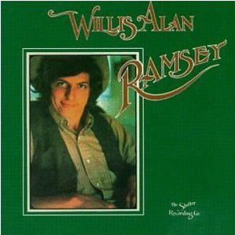

# Willis Alan Ramsey

By **Willis Alan Ramsey**

## Album Data

- **Catalog:** Beets
- **Format:** Digital, Album
- **Album:** Willis Alan Ramsey
- **Artist:** Willis Alan Ramsey
- **Albumartist:** Willis Alan Ramsey
- **Genre:** Country Rock
- **MusicBrainz Album Artist ID:** [a4727878-d27f-43bc-b6ae-15a0da01e192](https://musicbrainz.org/artist/a4727878-d27f-43bc-b6ae-15a0da01e192)
- **MusicBrainz Album ID:** [82cd05e9-331d-48fa-bbdc-7436f0cec8bc](https://musicbrainz.org/release/82cd05e9-331d-48fa-bbdc-7436f0cec8bc)
- **MusicBrainz Release Group ID:** [9441e60f-f899-365d-aaf4-4c5b3c0ed611](https://musicbrainz.org/release-group/9441e60f-f899-365d-aaf4-4c5b3c0ed611)
- **Year:** 1972
- **Catalog #:** 
- **Label:** 
- **Total Tracks:** 11

## Album Tracks

### Track 01 - Ballad of Spider John

- **Artist:** Willis Alan Ramsey
- **Format:** ALAC
- **Genre:** Americana
- **Length:** 4:18
- **MusicBrainz Track ID:** [2dcfbf25-4684-4b31-b9bf-e1e1970ec33e](https://musicbrainz.org/recording/2dcfbf25-4684-4b31-b9bf-e1e1970ec33e)
- **Title:** Ballad of Spider John
- **Track:** 01
- **Year:** 1972

### Track 02 - Muskrat Love (Muskrat Candlelight)

- **Artist:** Willis Alan Ramsey
- **Format:** ALAC
- **Genre:** Country Rock
- **Length:** 3:23
- **MusicBrainz Track ID:** [0507ab97-d30f-4997-a976-7f5f6ef8a6d8](https://musicbrainz.org/recording/0507ab97-d30f-4997-a976-7f5f6ef8a6d8)
- **Title:** Muskrat Love (Muskrat Candlelight)
- **Track:** 02
- **Year:** 1972

### Track 03 - Geraldine and the Honeybee

- **Artist:** Willis Alan Ramsey
- **Format:** ALAC
- **Genre:** Country Rock
- **Length:** 2:19
- **MusicBrainz Track ID:** [13fbf74f-7062-4964-945c-507460b6a282](https://musicbrainz.org/recording/13fbf74f-7062-4964-945c-507460b6a282)
- **Title:** Geraldine and the Honeybee
- **Track:** 03
- **Year:** 1972

### Track 04 - Wishbone

- **Artist:** Willis Alan Ramsey
- **Format:** ALAC
- **Genre:** Country Rock
- **Length:** 2:46
- **MusicBrainz Track ID:** [ad526140-bfee-47d6-8ee5-e61bde74e277](https://musicbrainz.org/recording/ad526140-bfee-47d6-8ee5-e61bde74e277)
- **Title:** Wishbone
- **Track:** 04
- **Year:** 1972

### Track 05 - Satin Sheets

- **Artist:** Willis Alan Ramsey
- **Format:** ALAC
- **Genre:** Country Rock
- **Length:** 2:39
- **MusicBrainz Track ID:** [f36bd6c2-5ef5-40be-94b7-7fb3c5b5d8ec](https://musicbrainz.org/recording/f36bd6c2-5ef5-40be-94b7-7fb3c5b5d8ec)
- **Title:** Satin Sheets
- **Track:** 05
- **Year:** 1972

### Track 06 - Goodbye Old Missoula

- **Artist:** Willis Alan Ramsey
- **Format:** ALAC
- **Genre:** Country Rock
- **Length:** 5:03
- **MusicBrainz Track ID:** [2366fb51-1b6a-4be5-9fcb-610fb77b3d7c](https://musicbrainz.org/recording/2366fb51-1b6a-4be5-9fcb-610fb77b3d7c)
- **Title:** Goodbye Old Missoula
- **Track:** 06
- **Year:** 1972

### Track 07 - Painted Lady

- **Artist:** Willis Alan Ramsey
- **Format:** ALAC
- **Genre:** Country Rock
- **Length:** 3:06
- **MusicBrainz Track ID:** [92e608a6-5f5e-4944-925d-167a6e6fc5b6](https://musicbrainz.org/recording/92e608a6-5f5e-4944-925d-167a6e6fc5b6)
- **Title:** Painted Lady
- **Track:** 07
- **Year:** 1972

### Track 08 - Watermelon Man

- **Artist:** Willis Alan Ramsey
- **Format:** ALAC
- **Genre:** Country Rock
- **Length:** 3:26
- **MusicBrainz Track ID:** [5b6131ab-d49a-4875-a25a-414c4e6a16ce](https://musicbrainz.org/recording/5b6131ab-d49a-4875-a25a-414c4e6a16ce)
- **Title:** Watermelon Man
- **Track:** 08
- **Year:** 1972

### Track 09 - Boy From Oklahoma

- **Artist:** Willis Alan Ramsey
- **Format:** ALAC
- **Genre:** Country Rock
- **Length:** 3:54
- **MusicBrainz Track ID:** [c6c6e60c-d49c-4085-ac05-3698d7b12ca0](https://musicbrainz.org/recording/c6c6e60c-d49c-4085-ac05-3698d7b12ca0)
- **Title:** Boy From Oklahoma
- **Track:** 09
- **Year:** 1972

### Track 10 - Angel Eyes

- **Artist:** Willis Alan Ramsey
- **Format:** ALAC
- **Genre:** Country Rock
- **Length:** 3:11
- **MusicBrainz Track ID:** [9d096492-b92b-4177-868c-2b0b0ed933aa](https://musicbrainz.org/recording/9d096492-b92b-4177-868c-2b0b0ed933aa)
- **Title:** Angel Eyes
- **Track:** 10
- **Year:** 1972

### Track 11 - Northeast Texas Women

- **Artist:** Willis Alan Ramsey
- **Format:** ALAC
- **Genre:** Country
- **Length:** 5:51
- **MusicBrainz Track ID:** [ee6c0f7f-3c51-4502-8aef-9ef1f7718fc3](https://musicbrainz.org/recording/ee6c0f7f-3c51-4502-8aef-9ef1f7718fc3)
- **Title:** Northeast Texas Women
- **Track:** 11
- **Year:** 1972

## See also

- [CD: ](../../CD/Willis_Alan_Ramsey/Willis_Alan_Ramsey_index.md)
- [CD: Willis Alan Ramsey](../../CD/Willis_Alan_Ramsey/Willis_Alan_Ramsey.md)
- [Roon: Willis Alan Ramsey](../../Roon/Willis_Alan_Ramsey/Willis_Alan_Ramsey.md)
