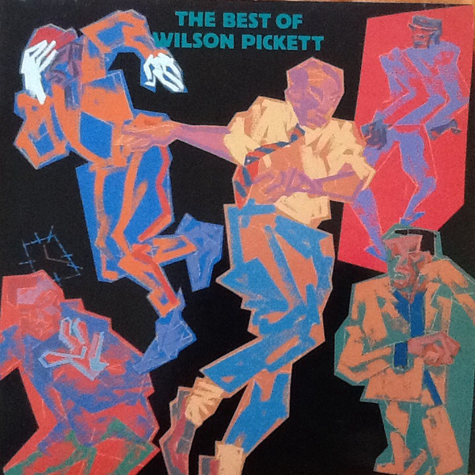

# The Best Of Wilson Pickett

By **Wilson Pickett**

## Album Data

- **Catalog:** Beets
- **Format:** Digital, Album
- **Album:** The Best Of Wilson Pickett
- **Artist:** Wilson Pickett
- **Albumartist:** Wilson Pickett
- **Genre:** Soul
- **MusicBrainz Album Artist ID:** [fc6214b3-6d82-4803-be74-01ece1723e42](https://musicbrainz.org/artist/fc6214b3-6d82-4803-be74-01ece1723e42)
- **MusicBrainz Album ID:** [1ae0ad72-7380-4518-8178-0b2298a26a87](https://musicbrainz.org/release/1ae0ad72-7380-4518-8178-0b2298a26a87)
- **MusicBrainz Release Group ID:** [a6dcbec0-d818-4db7-8791-399e6b5292cf](https://musicbrainz.org/release-group/a6dcbec0-d818-4db7-8791-399e6b5292cf)
- **Year:** 1967
- **Catalog #:** 
- **Label:** 
- **Total Tracks:** 00

## Album Tracks

### Track 10 - Hey Jude - Wilson Pickett

- **Artist:** Wilson Pickett
- **Format:** MP3
- **Genre:** Soul
- **Length:** 4:02
- **MusicBrainz Track ID:** 
- **Title:** Hey Jude - Wilson Pickett
- **Track:** 10
- **Year:** 0000

## See also

- [Roon: In the Midnight Hour](../../Roon/Wilson_Pickett/In_the_Midnight_Hour.md)
- [Roon: It's Too Late](../../Roon/Wilson_Pickett/Its_Too_Late.md)
- [Roon: The Exciting Wilson Pickett (Edition Studio Masters)](../../Roon/Wilson_Pickett/The_Exciting_Wilson_Pickett_Edition_Studio_Masters.md)
- [Roon: The Sound of Wilson Pickett](../../Roon/Wilson_Pickett/The_Sound_of_Wilson_Pickett.md)
- [Roon: The Wicked Pickett](../../Roon/Wilson_Pickett/The_Wicked_Pickett.md)
- [Vinyl: "634-5789 (Soulsville, U.S.A.)"](../../Vinyl/Wilson_Pickett/634-5789_Soulsville__USA.md)
- [Vinyl: The Best Of Wilson Pickett](../../Vinyl/Wilson_Pickett/The_Best_Of_Wilson_Pickett.md)
- [Vinyl: ](../../Vinyl/Wilson_Pickett/Wilson_Pickett.md)
