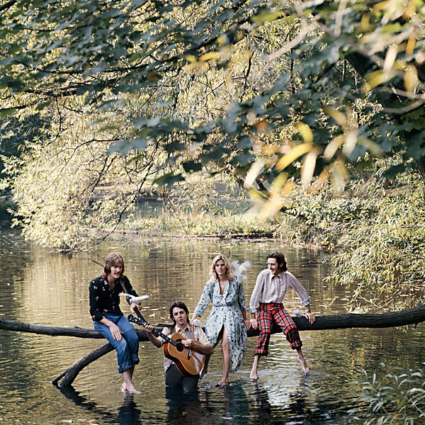

# Wild Life

By **Wings**

## Album Data

- **Catalog:** Beets
- **Format:** Digital, Album
- **Album:** Wild Life
- **Artist:** Wings
- **Albumartist:** Wings
- **Genre:** Pop Rock
- **MusicBrainz Album Artist ID:** 
- **MusicBrainz Album ID:** 
- **MusicBrainz Release Group ID:** 
- **Year:** 0000
- **Catalog #:** 
- **Label:** 
- **Total Tracks:** 00

## Album Tracks

### Track 00 - Bip Bop Link

- **Artist:** Wings
- **Format:** AAC
- **Genre:** Rock
- **Length:** 0:55
- **MusicBrainz Track ID:** 
- **Title:** Bip Bop Link
- **Track:** 00
- **Year:** 0000

### Track 00 - Dear Friend

- **Artist:** Wings
- **Format:** AAC
- **Genre:** Rock
- **Length:** 6:00
- **MusicBrainz Track ID:** 
- **Title:** Dear Friend
- **Track:** 00
- **Year:** 0000

### Track 00 - I Am Your Singer

- **Artist:** Wings
- **Format:** AAC
- **Genre:** Rock
- **Length:** 2:17
- **MusicBrainz Track ID:** 
- **Title:** I Am Your Singer
- **Track:** 00
- **Year:** 0000

### Track 00 - Mumbo Link

- **Artist:** Wings
- **Format:** AAC
- **Genre:** Rock
- **Length:** 1:01
- **MusicBrainz Track ID:** 
- **Title:** Mumbo Link
- **Track:** 00
- **Year:** 0000

### Track 00 - Some People Never Know

- **Artist:** Wings
- **Format:** AAC
- **Genre:** Rock
- **Length:** 6:46
- **MusicBrainz Track ID:** 
- **Title:** Some People Never Know
- **Track:** 00
- **Year:** 0000

### Track 00 - Tomorrow

- **Artist:** Wings
- **Format:** AAC
- **Genre:** Rock
- **Length:** 3:31
- **MusicBrainz Track ID:** 
- **Title:** Tomorrow
- **Track:** 00
- **Year:** 0000

## See also

- [Roon: Band On The Run](../../Roon/Wings/Band_On_The_Run.md)
- [Roon: Wings At The Speed Of Sound (Archive Collection)](../../Roon/Wings/Wings_At_The_Speed_Of_Sound_Archive_Collection.md)
- [Roon: Wings Over America (Live / Remastered)](../../Roon/Wings/Wings_Over_America_Live_-_Remastered.md)
- [Vinyl: Goodnight Tonight](../../Vinyl/Wings/Goodnight_Tonight.md)
- [Vinyl: London Town](../../Vinyl/Wings/London_Town.md)
- [Vinyl: Venus And Mars](../../Vinyl/Wings/Venus_And_Mars.md)
- [Vinyl: Wild Life](../../Vinyl/Wings/Wild_Life.md)
- [Vinyl: ](../../Vinyl/Wings/Wings.md)
- [Vinyl: Wings Over America](../../Vinyl/Wings/Wings_Over_America.md)
