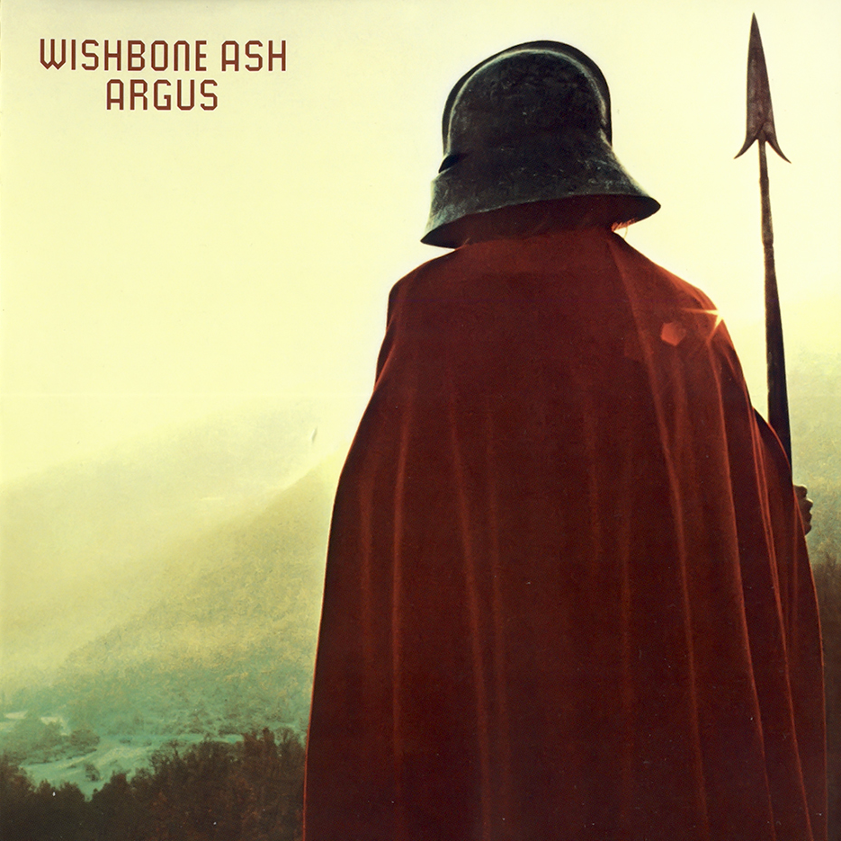

# Argus

By **Wishbone Ash**

## Album Data

- **Catalog:** Beets
- **Format:** Digital, Album
- **Album:** Argus
- **Artist:** Wishbone Ash
- **Albumartist:** Wishbone Ash
- **Genre:** Progressive Rock
- **MusicBrainz Album Artist ID:** [406f1b42-0c9e-4427-aeb7-02f78e188ec4](https://musicbrainz.org/artist/406f1b42-0c9e-4427-aeb7-02f78e188ec4)
- **MusicBrainz Album ID:** [4aff7b6b-1e31-4f28-8737-08445036fdbc](https://musicbrainz.org/release/4aff7b6b-1e31-4f28-8737-08445036fdbc)
- **MusicBrainz Release Group ID:** [ea4308f0-70c1-3ca9-9eac-5d51134ea234](https://musicbrainz.org/release-group/ea4308f0-70c1-3ca9-9eac-5d51134ea234)
- **Year:** 2002
- **Catalog #:** 088 112 816-2
- **Label:** Decca Records
- **Total Tracks:** 10

## Album Tracks

### Track 01 - Time Was

- **Artist:** Wishbone Ash
- **Format:** AAC
- **Genre:** Progressive Rock
- **Length:** 9:42
- **MusicBrainz Track ID:** [8a2a455b-e7cb-498d-a336-ccda191c5f21](https://musicbrainz.org/recording/8a2a455b-e7cb-498d-a336-ccda191c5f21)
- **Title:** Time Was
- **Track:** 01
- **Year:** 2002

### Track 02 - Sometime World

- **Artist:** Wishbone Ash
- **Format:** AAC
- **Genre:** Progressive Rock
- **Length:** 6:52
- **MusicBrainz Track ID:** [fe081511-91c8-4867-a6ec-3904084c99bb](https://musicbrainz.org/recording/fe081511-91c8-4867-a6ec-3904084c99bb)
- **Title:** Sometime World
- **Track:** 02
- **Year:** 2002

### Track 03 - Blowin’ Free

- **Artist:** Wishbone Ash
- **Format:** AAC
- **Genre:** Progressive Rock
- **Length:** 5:19
- **MusicBrainz Track ID:** [7bc5705e-d488-41ac-b332-fcce30c8aeb6](https://musicbrainz.org/recording/7bc5705e-d488-41ac-b332-fcce30c8aeb6)
- **Title:** Blowin’ Free
- **Track:** 03
- **Year:** 2002

### Track 04 - The King Will Come

- **Artist:** Wishbone Ash
- **Format:** AAC
- **Genre:** Progressive Rock
- **Length:** 7:05
- **MusicBrainz Track ID:** [e2cadc5c-f130-4727-ab9f-5478d60f1181](https://musicbrainz.org/recording/e2cadc5c-f130-4727-ab9f-5478d60f1181)
- **Title:** The King Will Come
- **Track:** 04
- **Year:** 2002

### Track 05 - Leaf and Stream

- **Artist:** Wishbone Ash
- **Format:** AAC
- **Genre:** Progressive Rock
- **Length:** 4:06
- **MusicBrainz Track ID:** [fb3436d8-9fd3-45c9-8833-6a56c3e33782](https://musicbrainz.org/recording/fb3436d8-9fd3-45c9-8833-6a56c3e33782)
- **Title:** Leaf and Stream
- **Track:** 05
- **Year:** 2002

### Track 06 - Warrior

- **Artist:** Wishbone Ash
- **Format:** AAC
- **Genre:** Progressive Rock
- **Length:** 5:52
- **MusicBrainz Track ID:** [b5f24dfa-8148-4432-b9f3-572d5e9fc6ea](https://musicbrainz.org/recording/b5f24dfa-8148-4432-b9f3-572d5e9fc6ea)
- **Title:** Warrior
- **Track:** 06
- **Year:** 2002

### Track 07 - Throw Down the Sword

- **Artist:** Wishbone Ash
- **Format:** AAC
- **Genre:** Progressive Rock
- **Length:** 5:55
- **MusicBrainz Track ID:** [4df01f94-fc3c-426b-bc40-70fc1b586e83](https://musicbrainz.org/recording/4df01f94-fc3c-426b-bc40-70fc1b586e83)
- **Title:** Throw Down the Sword
- **Track:** 07
- **Year:** 2002

### Track 08 - Jail Bait (live)

- **Artist:** Wishbone Ash
- **Format:** AAC
- **Genre:** Progressive Rock
- **Length:** 4:57
- **MusicBrainz Track ID:** [bf1acdae-c0b4-4663-9eb7-4c206b0a12be](https://musicbrainz.org/recording/bf1acdae-c0b4-4663-9eb7-4c206b0a12be)
- **Title:** Jail Bait (live)
- **Track:** 08
- **Year:** 2002

### Track 09 - The Pilgrim (live)

- **Artist:** Wishbone Ash
- **Format:** AAC
- **Genre:** Progressive Rock
- **Length:** 10:10
- **MusicBrainz Track ID:** [2f602dec-bf28-4b0f-a6e9-809bb33dcfe7](https://musicbrainz.org/recording/2f602dec-bf28-4b0f-a6e9-809bb33dcfe7)
- **Title:** The Pilgrim (live)
- **Track:** 09
- **Year:** 2002

### Track 10 - Phoenix (live)

- **Artist:** Wishbone Ash
- **Format:** AAC
- **Genre:** Progressive Rock
- **Length:** 17:05
- **MusicBrainz Track ID:** [8852e9cc-c519-4a91-a2e2-cb2d651df0db](https://musicbrainz.org/recording/8852e9cc-c519-4a91-a2e2-cb2d651df0db)
- **Title:** Phoenix (live)
- **Track:** 10
- **Year:** 2002

## See also

- [Roon: Live Dates Volume Two (Live)](../../Roon/Wishbone_Ash/Live_Dates_Volume_Two_Live.md)
- [Roon: Pilgrimage](../../Roon/Wishbone_Ash/Pilgrimage.md)
- [Roon: Time Was (The Live Anthology)](../../Roon/Wishbone_Ash/Time_Was_The_Live_Anthology.md)
