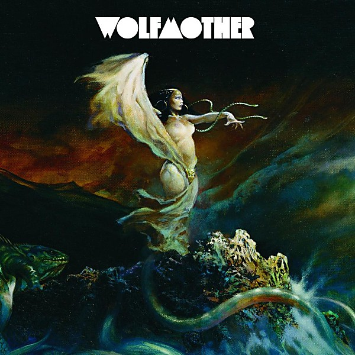

# Wolfmother

By **Wolfmother**

## Album Data

- **Catalog:** Beets
- **Format:** Digital, Album
- **Album:** Wolfmother
- **Artist:** Wolfmother
- **Albumartist:** Wolfmother
- **Genre:** Stoner Rock
- **MusicBrainz Album Artist ID:** 
- **MusicBrainz Album ID:** 
- **MusicBrainz Release Group ID:** 
- **Year:** 2006
- **Catalog #:** 
- **Label:** 
- **Total Tracks:** 17

## Album Tracks

### Track 01 - Dimension

- **Artist:** Wolfmother
- **Format:** AAC
- **Genre:** Stoner Rock
- **Length:** 4:16
- **MusicBrainz Track ID:** 
- **Title:** Dimension
- **Track:** 01
- **Year:** 2006

### Track 02 - White Unicorn

- **Artist:** Wolfmother
- **Format:** AAC
- **Genre:** Stoner Rock
- **Length:** 4:59
- **MusicBrainz Track ID:** 
- **Title:** White Unicorn
- **Track:** 02
- **Year:** 2006

### Track 03 - Woman

- **Artist:** Wolfmother
- **Format:** AAC
- **Genre:** Stoner Rock
- **Length:** 2:53
- **MusicBrainz Track ID:** 
- **Title:** Woman
- **Track:** 03
- **Year:** 2006

### Track 04 - Where Eagles Have Been

- **Artist:** Wolfmother
- **Format:** AAC
- **Genre:** Stoner Rock
- **Length:** 5:29
- **MusicBrainz Track ID:** 
- **Title:** Where Eagles Have Been
- **Track:** 04
- **Year:** 2006

### Track 05 - Apple Tree

- **Artist:** Wolfmother
- **Format:** AAC
- **Genre:** Stoner Rock
- **Length:** 3:26
- **MusicBrainz Track ID:** 
- **Title:** Apple Tree
- **Track:** 05
- **Year:** 2006

### Track 06 - Joker & The Thief

- **Artist:** Wolfmother
- **Format:** AAC
- **Genre:** Stoner Rock
- **Length:** 4:35
- **MusicBrainz Track ID:** 
- **Title:** Joker & The Thief
- **Track:** 06
- **Year:** 2006

### Track 07 - Colossal

- **Artist:** Wolfmother
- **Format:** AAC
- **Genre:** Stoner Rock
- **Length:** 5:00
- **MusicBrainz Track ID:** 
- **Title:** Colossal
- **Track:** 07
- **Year:** 2006

### Track 08 - Mind's Eye

- **Artist:** Wolfmother
- **Format:** AAC
- **Genre:** Stoner Rock
- **Length:** 4:51
- **MusicBrainz Track ID:** 
- **Title:** Mind's Eye
- **Track:** 08
- **Year:** 2006

### Track 09 - Pyramid

- **Artist:** Wolfmother
- **Format:** AAC
- **Genre:** Stoner Rock
- **Length:** 4:35
- **MusicBrainz Track ID:** 
- **Title:** Pyramid
- **Track:** 09
- **Year:** 2006

### Track 10 - Witchcraft

- **Artist:** Wolfmother
- **Format:** AAC
- **Genre:** Stoner Rock
- **Length:** 3:31
- **MusicBrainz Track ID:** 
- **Title:** Witchcraft
- **Track:** 10
- **Year:** 2006

### Track 11 - Tales From The Forest Of Gnomes

- **Artist:** Wolfmother
- **Format:** AAC
- **Genre:** Neo-Psychedelia
- **Length:** 3:42
- **MusicBrainz Track ID:** 
- **Title:** Tales From The Forest Of Gnomes
- **Track:** 11
- **Year:** 2006

### Track 12 - Love Train

- **Artist:** Wolfmother
- **Format:** AAC
- **Genre:** Stoner Rock
- **Length:** 3:06
- **MusicBrainz Track ID:** 
- **Title:** Love Train
- **Track:** 12
- **Year:** 2006

### Track 13 - Vagabond

- **Artist:** Wolfmother
- **Format:** AAC
- **Genre:** Stoner Rock
- **Length:** 3:55
- **MusicBrainz Track ID:** 
- **Title:** Vagabond
- **Track:** 13
- **Year:** 2006

### Track 14 - The Earth's Rotation Around The Sun

- **Artist:** Wolfmother
- **Format:** AAC
- **Genre:** Stoner Rock
- **Length:** 2:49
- **MusicBrainz Track ID:** 
- **Title:** The Earth's Rotation Around The Sun
- **Track:** 14
- **Year:** 0000

### Track 15 - Vagabond (Acoustic Version)

- **Artist:** Wolfmother
- **Format:** AAC
- **Genre:** Stoner Rock
- **Length:** 2:42
- **MusicBrainz Track ID:** 
- **Title:** Vagabond (Acoustic Version)
- **Track:** 15
- **Year:** 0000

### Track 16 - Joker & The Thief (Loving Hands Remix)

- **Artist:** Wolfmother
- **Format:** AAC
- **Genre:** Stoner Rock
- **Length:** 9:24
- **MusicBrainz Track ID:** 
- **Title:** Joker & The Thief (Loving Hands Remix)
- **Track:** 16
- **Year:** 0000

### Track 17 - Woman (Mstrkrft Remix)

- **Artist:** Wolfmother
- **Format:** AAC
- **Genre:** Electroclash
- **Length:** 3:29
- **MusicBrainz Track ID:** 
- **Title:** Woman (Mstrkrft Remix)
- **Track:** 17
- **Year:** 0000

## See also

- [Vinyl: ](../../Vinyl/Wolfmother/Wolfmother_index.md)
- [Vinyl: Wolfmother](../../Vinyl/Wolfmother/Wolfmother.md)
