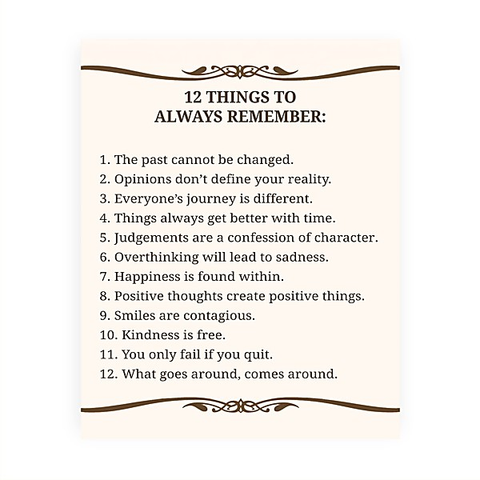

# Mind If We Make Love to You

By **Wondermints**

## Album Data

- **Catalog:** Beets
- **Format:** Digital, Album
- **Album:** Mind If We Make Love to You
- **Artist:** Wondermints
- **Albumartist:** Wondermints
- **Genre:** Pop
- **MusicBrainz Album Artist ID:** [3a115a19-83f9-4f13-90cf-ab10d4fb76e8](https://musicbrainz.org/artist/3a115a19-83f9-4f13-90cf-ab10d4fb76e8)
- **MusicBrainz Album ID:** [7751a9e5-4677-4b6a-bdbb-863a5308300a](https://musicbrainz.org/release/7751a9e5-4677-4b6a-bdbb-863a5308300a)
- **MusicBrainz Release Group ID:** [1f7c1c0f-324c-3021-8d03-0ea86351dbd6](https://musicbrainz.org/release-group/1f7c1c0f-324c-3021-8d03-0ea86351dbd6)
- **Year:** 2002
- **Catalog #:** TFCK 88799
- **Label:** TOY’S FACTORY
- **Total Tracks:** 14

## Album Tracks

### Track 01 - Porpoise Song

- **Artist:** Wondermints
- **Format:** ALAC
- **Genre:** Indie Pop
- **Length:** 3:12
- **MusicBrainz Track ID:** [0a44ec1e-2f5a-479c-91c6-9e5ce3e16edb](https://musicbrainz.org/recording/0a44ec1e-2f5a-479c-91c6-9e5ce3e16edb)
- **Title:** Porpoise Song
- **Track:** 01
- **Year:** 1996

### Track 02 - Guess I'm Dumb

- **Artist:** Wondermints
- **Format:** ALAC
- **Genre:** Indie Pop
- **Length:** 2:52
- **MusicBrainz Track ID:** [9eca308c-7f9e-42d3-baf5-9196c38fa3eb](https://musicbrainz.org/recording/9eca308c-7f9e-42d3-baf5-9196c38fa3eb)
- **Title:** Guess I'm Dumb
- **Track:** 02
- **Year:** 1996

### Track 03 - Louise

- **Artist:** Wondermints
- **Format:** ALAC
- **Genre:** Indie Pop
- **Length:** 2:51
- **MusicBrainz Track ID:** [239eabf4-3bf0-4209-b011-3577c9ece8b8](https://musicbrainz.org/recording/239eabf4-3bf0-4209-b011-3577c9ece8b8)
- **Title:** Louise
- **Track:** 03
- **Year:** 1996

### Track 04 - Don't Go Breaking My Heart

- **Artist:** Wondermints
- **Format:** ALAC
- **Genre:** Pop
- **Length:** 3:07
- **MusicBrainz Track ID:** [5adb7fe7-11e5-4954-a9a8-ef26946a3411](https://musicbrainz.org/recording/5adb7fe7-11e5-4954-a9a8-ef26946a3411)
- **Title:** Don't Go Breaking My Heart
- **Track:** 04
- **Year:** 1996

### Track 05 - My Friend Jack

- **Artist:** Wondermints
- **Format:** ALAC
- **Genre:** Indie Pop
- **Length:** 3:54
- **MusicBrainz Track ID:** [d92d5047-5f3e-4691-be57-cc83fdf0f9ad](https://musicbrainz.org/recording/d92d5047-5f3e-4691-be57-cc83fdf0f9ad)
- **Title:** My Friend Jack
- **Track:** 05
- **Year:** 1996

### Track 06 - Barbarella

- **Artist:** Wondermints
- **Format:** ALAC
- **Genre:** Indie Rock
- **Length:** 4:18
- **MusicBrainz Track ID:** [b8e1d60f-c041-4717-827b-21930530745a](https://musicbrainz.org/recording/b8e1d60f-c041-4717-827b-21930530745a)
- **Title:** Barbarella
- **Track:** 06
- **Year:** 1996

### Track 07 - Ooh Child

- **Artist:** Wondermints
- **Format:** ALAC
- **Genre:** Indie Pop
- **Length:** 3:31
- **MusicBrainz Track ID:** [c1496fcf-fa59-495a-870d-3bd9c3f973a8](https://musicbrainz.org/recording/c1496fcf-fa59-495a-870d-3bd9c3f973a8)
- **Title:** Ooh Child
- **Track:** 07
- **Year:** 1996

### Track 08 - Arnold Layne

- **Artist:** Wondermints
- **Format:** ALAC
- **Genre:** Indie Pop
- **Length:** 3:29
- **MusicBrainz Track ID:** [a48e39b8-158d-4628-b657-3d2cc69c654d](https://musicbrainz.org/recording/a48e39b8-158d-4628-b657-3d2cc69c654d)
- **Title:** Arnold Layne
- **Track:** 08
- **Year:** 1996

### Track 09 - Darling

- **Artist:** Wondermints
- **Format:** ALAC
- **Genre:** Pop
- **Length:** 2:43
- **MusicBrainz Track ID:** [1c000e53-82b4-4d24-8dda-5a01e719321b](https://musicbrainz.org/recording/1c000e53-82b4-4d24-8dda-5a01e719321b)
- **Title:** Darling
- **Track:** 09
- **Year:** 1996

### Track 10 - So You Are a Star

- **Artist:** Wondermints
- **Format:** ALAC
- **Genre:** Indie Pop
- **Length:** 3:41
- **MusicBrainz Track ID:** [8f6b9b11-840f-4fa2-a4d1-ad74d6f0e29a](https://musicbrainz.org/recording/8f6b9b11-840f-4fa2-a4d1-ad74d6f0e29a)
- **Title:** So You Are a Star
- **Track:** 10
- **Year:** 1996

### Track 11 - Skyman

- **Artist:** Wondermints
- **Format:** ALAC
- **Genre:** Indie Pop
- **Length:** 3:03
- **MusicBrainz Track ID:** [e51b732e-2470-4dbb-9cd0-40d4bcd787e9](https://musicbrainz.org/recording/e51b732e-2470-4dbb-9cd0-40d4bcd787e9)
- **Title:** Skyman
- **Track:** 11
- **Year:** 1996

### Track 12 - Knowing Me, Knowing You

- **Artist:** Wondermints
- **Format:** ALAC
- **Genre:** Indie Rock
- **Length:** 4:07
- **MusicBrainz Track ID:** [2e9e230f-bfba-48c6-890a-d7c67617df40](https://musicbrainz.org/recording/2e9e230f-bfba-48c6-890a-d7c67617df40)
- **Title:** Knowing Me, Knowing You
- **Track:** 12
- **Year:** 1996

### Track 13 - Love in the City

- **Artist:** Wondermints
- **Format:** ALAC
- **Genre:** Indie Pop
- **Length:** 3:23
- **MusicBrainz Track ID:** [0f9ef1b6-fc4a-4ea4-8bc1-c6bc8df4224e](https://musicbrainz.org/recording/0f9ef1b6-fc4a-4ea4-8bc1-c6bc8df4224e)
- **Title:** Love in the City
- **Track:** 13
- **Year:** 1996

### Track 14 - Tracy Hide

- **Artist:** Wondermints
- **Format:** ALAC
- **Genre:** Neo-Psychedelia
- **Length:** 4:47
- **MusicBrainz Track ID:** [6af638e2-2450-413c-b246-0a97f2c7f7f8](https://musicbrainz.org/recording/6af638e2-2450-413c-b246-0a97f2c7f7f8)
- **Title:** Tracy Hide
- **Track:** 14
- **Year:** 1996

## See also

- [Bali](Bali.md)
- [Wonderful World of the Wondermints](Wonderful_World_of_the_Wondermints.md)
