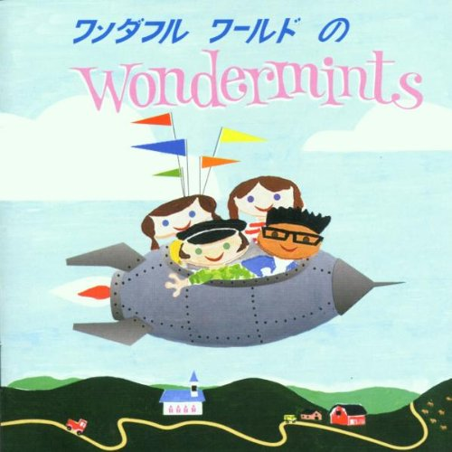

# Wonderful World of the Wondermints

By Wondermints

## Album Data

- Catalog: Beets
- Format: Digital, Album
- Album: Wonderful World of the Wondermints
- Artist: Wondermints
- Albumartist: Wondermints
- Genre: Indie Pop
- MusicBrainz Album Artist ID: 3a115a19-83f9-4f13-90cf-ab10d4fb76e8
- MusicBrainz Album ID: 8af5a20c-1ffa-437c-b21d-46e47bd6335c
- MusicBrainz Release Group ID: 14ed28dd-0176-3cdb-9630-9aee0974b26a
- Year: 1996

