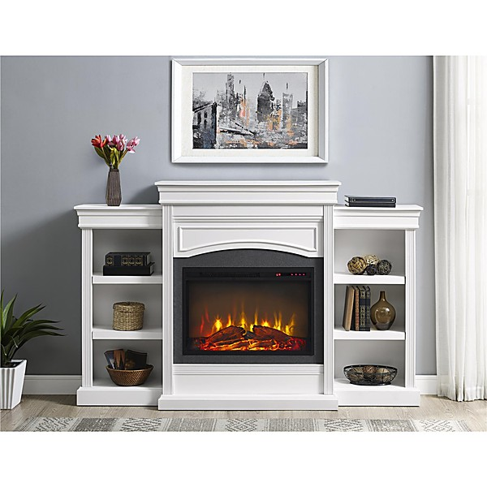

# Televisionary

By **World Entertainment War**

## Album Data

- **Catalog:** Beets
- **Format:** Digital, Album
- **Album:** Televisionary
- **Artist:** World Entertainment War
- **Albumartist:** World Entertainment War
- **Genre:** Humor
- **MusicBrainz Album Artist ID:** 
- **MusicBrainz Album ID:** 
- **MusicBrainz Release Group ID:** 
- **Year:** 0000
- **Catalog #:** MCAD-10137
- **Label:** MCA Records
- **Total Tracks:** 20

## Album Tracks

### Track 01 - Relax

- **Artist:** World Entertainment War
- **Format:** ALAC
- **Genre:** Humor
- **Length:** 0:59
- **MusicBrainz Track ID:** [7159acc8-329f-4e4f-b5ad-a8589df88d34](https://musicbrainz.org/recording/7159acc8-329f-4e4f-b5ad-a8589df88d34)
- **Title:** Relax
- **Track:** 01
- **Year:** 1991

### Track 02 - Dark Ages

- **Artist:** World Entertainment War
- **Format:** ALAC
- **Genre:** Humor
- **Length:** 3:53
- **MusicBrainz Track ID:** [f251e1af-f0e3-4f3b-8399-aa69c7bf1520](https://musicbrainz.org/recording/f251e1af-f0e3-4f3b-8399-aa69c7bf1520)
- **Title:** Dark Ages
- **Track:** 02
- **Year:** 1991

### Track 03 - Apathy and Ignorance

- **Artist:** World Entertainment War
- **Format:** ALAC
- **Genre:** Humor
- **Length:** 3:47
- **MusicBrainz Track ID:** [b9486450-7cf9-4cd8-9bc4-c184ecf99d8a](https://musicbrainz.org/recording/b9486450-7cf9-4cd8-9bc4-c184ecf99d8a)
- **Title:** Apathy and Ignorance
- **Track:** 03
- **Year:** 1991

### Track 04 - Get Outta My Head

- **Artist:** World Entertainment War
- **Format:** ALAC
- **Genre:** Humor
- **Length:** 2:19
- **MusicBrainz Track ID:** [969478c1-eb76-4a0d-9727-9c3669a9b37c](https://musicbrainz.org/recording/969478c1-eb76-4a0d-9727-9c3669a9b37c)
- **Title:** Get Outta My Head
- **Track:** 04
- **Year:** 1991

### Track 05 - Telepathics Anonymous

- **Artist:** World Entertainment War
- **Format:** ALAC
- **Genre:** Humor
- **Length:** 0:41
- **MusicBrainz Track ID:** [d339d1f5-cd20-47c7-8e36-a763532d45ba](https://musicbrainz.org/recording/d339d1f5-cd20-47c7-8e36-a763532d45ba)
- **Title:** Telepathics Anonymous
- **Track:** 05
- **Year:** 1991

### Track 06 - Proud Americans

- **Artist:** World Entertainment War
- **Format:** ALAC
- **Genre:** Humor
- **Length:** 4:24
- **MusicBrainz Track ID:** [8a37bbbd-9139-47ad-8e0d-22e14ef6f695](https://musicbrainz.org/recording/8a37bbbd-9139-47ad-8e0d-22e14ef6f695)
- **Title:** Proud Americans
- **Track:** 06
- **Year:** 1991

### Track 07 - We Have Ways

- **Artist:** World Entertainment War
- **Format:** ALAC
- **Genre:** Humor
- **Length:** 4:58
- **MusicBrainz Track ID:** [ba2ea7c9-136b-4306-b104-485346e0d202](https://musicbrainz.org/recording/ba2ea7c9-136b-4306-b104-485346e0d202)
- **Title:** We Have Ways
- **Track:** 07
- **Year:** 1991

### Track 08 - Kick Your Own Ass

- **Artist:** World Entertainment War
- **Format:** ALAC
- **Genre:** Humor
- **Length:** 4:52
- **MusicBrainz Track ID:** [760075e7-2117-4e8b-8dba-9236d9634a77](https://musicbrainz.org/recording/760075e7-2117-4e8b-8dba-9236d9634a77)
- **Title:** Kick Your Own Ass
- **Track:** 08
- **Year:** 1991

### Track 09 - Prayer

- **Artist:** World Entertainment War
- **Format:** ALAC
- **Genre:** Humor
- **Length:** 1:27
- **MusicBrainz Track ID:** [e422a5b9-5fdb-4a47-81b2-9aefdc9af568](https://musicbrainz.org/recording/e422a5b9-5fdb-4a47-81b2-9aefdc9af568)
- **Title:** Prayer
- **Track:** 09
- **Year:** 1991

### Track 10 - Prayer Wars

- **Artist:** World Entertainment War
- **Format:** ALAC
- **Genre:** Humor
- **Length:** 4:01
- **MusicBrainz Track ID:** [db70070a-e83c-4405-85d6-4e34fc91d816](https://musicbrainz.org/recording/db70070a-e83c-4405-85d6-4e34fc91d816)
- **Title:** Prayer Wars
- **Track:** 10
- **Year:** 1991

### Track 11 - Snake Dance

- **Artist:** World Entertainment War
- **Format:** ALAC
- **Genre:** Humor
- **Length:** 4:42
- **MusicBrainz Track ID:** [7d44eb30-ed06-4369-bc81-2aeed9ad61a3](https://musicbrainz.org/recording/7d44eb30-ed06-4369-bc81-2aeed9ad61a3)
- **Title:** Snake Dance
- **Track:** 11
- **Year:** 1991

### Track 12 - For Your Ears Only

- **Artist:** World Entertainment War
- **Format:** ALAC
- **Genre:** Humor
- **Length:** 0:25
- **MusicBrainz Track ID:** [27b035c1-c20f-4cc7-b31b-189f11e5f127](https://musicbrainz.org/recording/27b035c1-c20f-4cc7-b31b-189f11e5f127)
- **Title:** For Your Ears Only
- **Track:** 12
- **Year:** 1991

### Track 13 - Break the Law

- **Artist:** World Entertainment War
- **Format:** ALAC
- **Genre:** Rock
- **Length:** 3:04
- **MusicBrainz Track ID:** [375f5c43-791e-420d-a287-4feb4395394b](https://musicbrainz.org/recording/375f5c43-791e-420d-a287-4feb4395394b)
- **Title:** Break the Law
- **Track:** 13
- **Year:** 1991

### Track 14 - Kick In

- **Artist:** World Entertainment War
- **Format:** ALAC
- **Genre:** Rock
- **Length:** 3:55
- **MusicBrainz Track ID:** [ef403817-50e7-412f-b98b-6dd2935d98c9](https://musicbrainz.org/recording/ef403817-50e7-412f-b98b-6dd2935d98c9)
- **Title:** Kick In
- **Track:** 14
- **Year:** 1991

### Track 15 - Purity Test

- **Artist:** World Entertainment War
- **Format:** ALAC
- **Genre:** Humor
- **Length:** 0:32
- **MusicBrainz Track ID:** [919641d1-ff60-497c-8b90-67201d91b3b5](https://musicbrainz.org/recording/919641d1-ff60-497c-8b90-67201d91b3b5)
- **Title:** Purity Test
- **Track:** 15
- **Year:** 1991

### Track 16 - Pagan Jake’s Dream Girl

- **Artist:** World Entertainment War
- **Format:** ALAC
- **Genre:** Humor
- **Length:** 3:32
- **MusicBrainz Track ID:** [98bb4b1e-85e7-481b-92d7-4a578619bf8e](https://musicbrainz.org/recording/98bb4b1e-85e7-481b-92d7-4a578619bf8e)
- **Title:** Pagan Jake’s Dream Girl
- **Track:** 16
- **Year:** 1991

### Track 17 - Televisionary

- **Artist:** World Entertainment War
- **Format:** ALAC
- **Genre:** Humor
- **Length:** 5:01
- **MusicBrainz Track ID:** [0cc52576-cc9c-46d7-9a12-0f9474504bde](https://musicbrainz.org/recording/0cc52576-cc9c-46d7-9a12-0f9474504bde)
- **Title:** Televisionary
- **Track:** 17
- **Year:** 1991

### Track 18 - Control Yourself

- **Artist:** World Entertainment War
- **Format:** ALAC
- **Genre:** Humor
- **Length:** 3:04
- **MusicBrainz Track ID:** [995bbd58-68de-42c3-8a91-05115faae9dc](https://musicbrainz.org/recording/995bbd58-68de-42c3-8a91-05115faae9dc)
- **Title:** Control Yourself
- **Track:** 18
- **Year:** 1991

### Track 19 - In a Crisis

- **Artist:** World Entertainment War
- **Format:** ALAC
- **Genre:** Humor
- **Length:** 4:15
- **MusicBrainz Track ID:** [0343afc5-3581-4a30-83c4-378ddba34fba](https://musicbrainz.org/recording/0343afc5-3581-4a30-83c4-378ddba34fba)
- **Title:** In a Crisis
- **Track:** 19
- **Year:** 1991

### Track 20 - Mediapocalypse

- **Artist:** World Entertainment War
- **Format:** ALAC
- **Genre:** Humor
- **Length:** 0:27
- **MusicBrainz Track ID:** [b191a8a7-e99b-4273-aa82-a8efcb324f20](https://musicbrainz.org/recording/b191a8a7-e99b-4273-aa82-a8efcb324f20)
- **Title:** Mediapocalypse
- **Track:** 20
- **Year:** 1991

## See also

- [World Entertainment War](World_Entertainment_War.md)
- [Roon: Televisionary](../../Roon/World_Entertainment_War/Televisionary.md)
- [Vinyl: Televisionary](../../Vinyl/World_Entertainment_War/Televisionary.md)
- [Vinyl: ](../../Vinyl/World_Entertainment_War/World_Entertainment_War.md)
