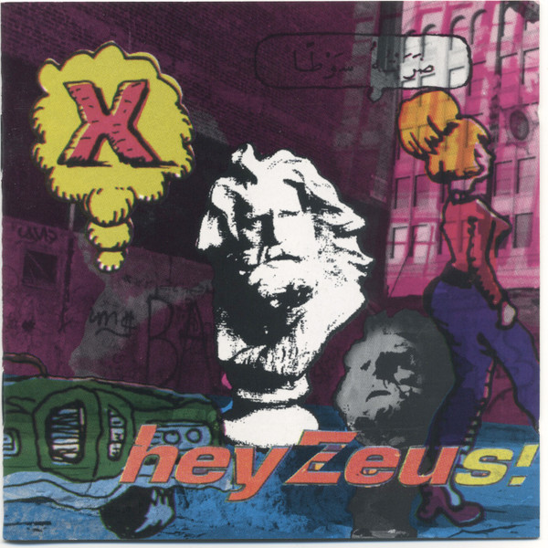

# Hey Zeus!

By **X**

## Album Data

- **Catalog:** Beets
- **Format:** Digital, Album
- **Album:** Hey Zeus!
- **Artist:** X
- **Albumartist:** X
- **Genre:** Punk Rock
- **MusicBrainz Album Artist ID:** [ddd553d4-977e-416c-8f57-e4b72c0fc746](https://musicbrainz.org/artist/ddd553d4-977e-416c-8f57-e4b72c0fc746)
- **MusicBrainz Album ID:** [d7745c7d-f5e8-4187-be2b-5c452c7786fb](https://musicbrainz.org/release/d7745c7d-f5e8-4187-be2b-5c452c7786fb)
- **MusicBrainz Release Group ID:** [f9db7a50-ddb3-3133-8ccd-ef070e214d1c](https://musicbrainz.org/release-group/f9db7a50-ddb3-3133-8ccd-ef070e214d1c)
- **Year:** 2003
- **Catalog #:** 9 25771-2
- **Label:** Slash
- **Total Tracks:** 22

## Album Tracks

### Track 01 - Your Phone's Off the Hook, but You're Not

- **Artist:** X
- **Format:** ALAC
- **Genre:** Punk Rock
- **Length:** 2:25
- **MusicBrainz Track ID:** [95a18e0d-cb4f-43fd-9e8f-aeecd10e297c](https://musicbrainz.org/recording/95a18e0d-cb4f-43fd-9e8f-aeecd10e297c)
- **Title:** Your Phone's Off the Hook, but You're Not
- **Track:** 01
- **Year:** 1988

### Track 02 - Johny Hit and Run Paulene

- **Artist:** X
- **Format:** ALAC
- **Genre:** Rockabilly
- **Length:** 2:50
- **MusicBrainz Track ID:** [f0fbd0b7-3c31-470e-971d-c5e7b72c367a](https://musicbrainz.org/recording/f0fbd0b7-3c31-470e-971d-c5e7b72c367a)
- **Title:** Johny Hit and Run Paulene
- **Track:** 02
- **Year:** 1988

### Track 03 - Soul Kitchen

- **Artist:** X
- **Format:** ALAC
- **Genre:** Punk Rock
- **Length:** 2:25
- **MusicBrainz Track ID:** [04c4b0c0-f2a5-4625-8c56-3354289150dd](https://musicbrainz.org/recording/04c4b0c0-f2a5-4625-8c56-3354289150dd)
- **Title:** Soul Kitchen
- **Track:** 03
- **Year:** 1988

### Track 04 - Nausea

- **Artist:** X
- **Format:** ALAC
- **Genre:** Punk Rock
- **Length:** 3:40
- **MusicBrainz Track ID:** [500a93dc-5c34-4b49-a5b7-b78cf8e259ca](https://musicbrainz.org/recording/500a93dc-5c34-4b49-a5b7-b78cf8e259ca)
- **Title:** Nausea
- **Track:** 04
- **Year:** 1988

### Track 05 - Sugarlight

- **Artist:** X
- **Format:** ALAC
- **Genre:** Punk Rock
- **Length:** 2:24
- **MusicBrainz Track ID:** [90dc64c6-c1ec-4636-aa83-5e45ac0d5643](https://musicbrainz.org/recording/90dc64c6-c1ec-4636-aa83-5e45ac0d5643)
- **Title:** Sugarlight
- **Track:** 05
- **Year:** 1988

### Track 06 - Los Angeles

- **Artist:** X
- **Format:** ALAC
- **Genre:** Punk Rock
- **Length:** 2:24
- **MusicBrainz Track ID:** [05d13522-3129-465c-98b7-4bcd995b4f1a](https://musicbrainz.org/recording/05d13522-3129-465c-98b7-4bcd995b4f1a)
- **Title:** Los Angeles
- **Track:** 06
- **Year:** 1988

### Track 07 - Sex and Dying in High Society

- **Artist:** X
- **Format:** ALAC
- **Genre:** Punk Rock
- **Length:** 2:15
- **MusicBrainz Track ID:** [b840b87e-26f1-4524-9985-3d349a2cff7d](https://musicbrainz.org/recording/b840b87e-26f1-4524-9985-3d349a2cff7d)
- **Title:** Sex and Dying in High Society
- **Track:** 07
- **Year:** 1988

### Track 08 - The Unheard Music

- **Artist:** X
- **Format:** ALAC
- **Genre:** Punk Rock
- **Length:** 4:49
- **MusicBrainz Track ID:** [19749e2e-687c-4c48-999f-913081283f25](https://musicbrainz.org/recording/19749e2e-687c-4c48-999f-913081283f25)
- **Title:** The Unheard Music
- **Track:** 08
- **Year:** 1988

### Track 09 - The World's a Mess, It's in My Kiss

- **Artist:** X
- **Format:** ALAC
- **Genre:** Punk Rock
- **Length:** 4:30
- **MusicBrainz Track ID:** [bfaf55ea-ec2a-4187-b9fc-666655bd2310](https://musicbrainz.org/recording/bfaf55ea-ec2a-4187-b9fc-666655bd2310)
- **Title:** The World's a Mess, It's in My Kiss
- **Track:** 09
- **Year:** 1988

### Track 10 - The Once Over Twice

- **Artist:** X
- **Format:** ALAC
- **Genre:** Punk Rock
- **Length:** 2:30
- **MusicBrainz Track ID:** [2c0e8bba-5562-414d-9357-b3f496ba6470](https://musicbrainz.org/recording/2c0e8bba-5562-414d-9357-b3f496ba6470)
- **Title:** The Once Over Twice
- **Track:** 10
- **Year:** 1988

### Track 11 - We're Desperate

- **Artist:** X
- **Format:** ALAC
- **Genre:** Punk Rock
- **Length:** 2:00
- **MusicBrainz Track ID:** [008a05ac-883c-44f8-88a4-f3e3d6580aad](https://musicbrainz.org/recording/008a05ac-883c-44f8-88a4-f3e3d6580aad)
- **Title:** We're Desperate
- **Track:** 11
- **Year:** 1988

### Track 12 - Adult Books

- **Artist:** X
- **Format:** ALAC
- **Genre:** Punk Rock
- **Length:** 3:19
- **MusicBrainz Track ID:** [c17439ad-5ef3-4436-9ad4-dd0ea9e43b74](https://musicbrainz.org/recording/c17439ad-5ef3-4436-9ad4-dd0ea9e43b74)
- **Title:** Adult Books
- **Track:** 12
- **Year:** 1988

### Track 13 - Universal Corner

- **Artist:** X
- **Format:** ALAC
- **Genre:** Punk Rock
- **Length:** 4:33
- **MusicBrainz Track ID:** [0422dfd2-1916-4c34-a44d-804042ca10dd](https://musicbrainz.org/recording/0422dfd2-1916-4c34-a44d-804042ca10dd)
- **Title:** Universal Corner
- **Track:** 13
- **Year:** 1988

### Track 14 - I'm Coming Over

- **Artist:** X
- **Format:** ALAC
- **Genre:** Rock
- **Length:** 1:14
- **MusicBrainz Track ID:** [55b0e5ef-5e96-4a6b-bd2b-7a61b09cce2e](https://musicbrainz.org/recording/55b0e5ef-5e96-4a6b-bd2b-7a61b09cce2e)
- **Title:** I'm Coming Over
- **Track:** 14
- **Year:** 1988

### Track 15 - It's Who You Know

- **Artist:** X
- **Format:** ALAC
- **Genre:** Rock And Roll
- **Length:** 2:14
- **MusicBrainz Track ID:** [15e6d3c8-3714-473b-96ab-ad7898de2532](https://musicbrainz.org/recording/15e6d3c8-3714-473b-96ab-ad7898de2532)
- **Title:** It's Who You Know
- **Track:** 15
- **Year:** 1988

### Track 16 - In This House That I Call Home

- **Artist:** X
- **Format:** ALAC
- **Genre:** Punk Rock
- **Length:** 3:33
- **MusicBrainz Track ID:** [73439c8f-da2a-4f2a-842e-b5465560b71f](https://musicbrainz.org/recording/73439c8f-da2a-4f2a-842e-b5465560b71f)
- **Title:** In This House That I Call Home
- **Track:** 16
- **Year:** 1988

### Track 17 - Some Other Time

- **Artist:** X
- **Format:** ALAC
- **Genre:** Punk Rock
- **Length:** 2:17
- **MusicBrainz Track ID:** [92e78460-5fbf-458f-9ab0-5ad76be1b406](https://musicbrainz.org/recording/92e78460-5fbf-458f-9ab0-5ad76be1b406)
- **Title:** Some Other Time
- **Track:** 17
- **Year:** 1988

### Track 18 - White Girl

- **Artist:** X
- **Format:** ALAC
- **Genre:** Punk Rock
- **Length:** 3:27
- **MusicBrainz Track ID:** [6e457e52-43c5-4b5d-ae00-44b0f8896af4](https://musicbrainz.org/recording/6e457e52-43c5-4b5d-ae00-44b0f8896af4)
- **Title:** White Girl
- **Track:** 18
- **Year:** 1988

### Track 19 - Beyond and Back

- **Artist:** X
- **Format:** ALAC
- **Genre:** Punk Rock
- **Length:** 2:49
- **MusicBrainz Track ID:** [2589643b-3e32-467d-84f8-06581fe79b05](https://musicbrainz.org/recording/2589643b-3e32-467d-84f8-06581fe79b05)
- **Title:** Beyond and Back
- **Track:** 19
- **Year:** 1988

### Track 20 - Back 2 the Base

- **Artist:** X
- **Format:** ALAC
- **Genre:** Rock And Roll
- **Length:** 1:33
- **MusicBrainz Track ID:** [ab455d5f-3e8c-46f3-8c4c-12dcbba3db56](https://musicbrainz.org/recording/ab455d5f-3e8c-46f3-8c4c-12dcbba3db56)
- **Title:** Back 2 the Base
- **Track:** 20
- **Year:** 1988

### Track 21 - When Our Love Passed Out on the Couch

- **Artist:** X
- **Format:** ALAC
- **Genre:** Rockabilly
- **Length:** 1:05
- **MusicBrainz Track ID:** [5e982d1f-8acd-41e5-8ff3-adbdc5f2b8fa](https://musicbrainz.org/recording/5e982d1f-8acd-41e5-8ff3-adbdc5f2b8fa)
- **Title:** When Our Love Passed Out on the Couch
- **Track:** 21
- **Year:** 1988

### Track 22 - Year 1

- **Artist:** X
- **Format:** ALAC
- **Genre:** Indie Rock
- **Length:** 0:00
- **MusicBrainz Track ID:** [aab1c9ba-5406-4ace-a8f5-4a331f869e4e](https://musicbrainz.org/recording/aab1c9ba-5406-4ace-a8f5-4a331f869e4e)
- **Title:** Year 1
- **Track:** 22
- **Year:** 1988

## See also

- [Los Angeles / Wild Gift](Los_Angeles_-_Wild_Gift.md)
- [True Love, Part II](True_Love__Part_II.md)
- [Roon: Ain't Love Grand](../../Roon/X/Aint_Love_Grand.md)
- [Roon: ALPHABETLAND](../../Roon/X/ALPHABETLAND.md)
- [Roon: Los Angeles (2019 Remaster)](../../Roon/X/Los_Angeles_2019_Remaster.md)
- [Roon: More Fun in the New World](../../Roon/X/More_Fun_in_the_New_World.md)
- [Roon: Under the Big Black Sun](../../Roon/X/Under_the_Big_Black_Sun.md)
- [Roon: Wild Gift (2019 Remaster)](../../Roon/X/Wild_Gift_2019_Remaster.md)
