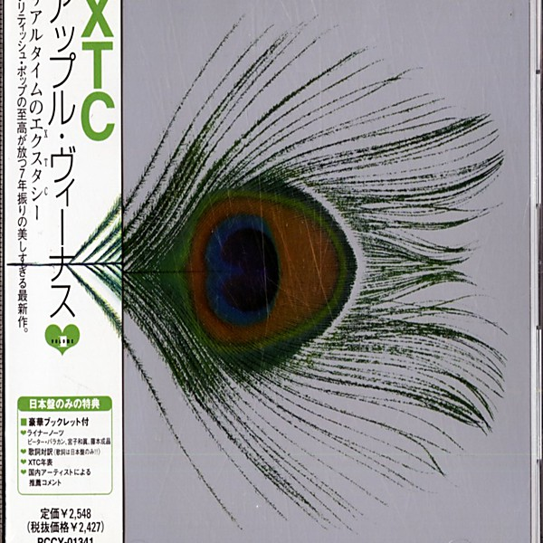

# Apple Venus, Volume 1

By **XTC**

## Album Data

- **Catalog:** Beets
- **Format:** Digital, Album
- **Album:** Apple Venus, Volume 1
- **Artist:** Xtc
- **Albumartist:** XTC
- **Genre:** Post-Punk
- **MusicBrainz Album Artist ID:** [97c86b2c-2765-46a2-aef8-76a7e24c430f](https://musicbrainz.org/artist/97c86b2c-2765-46a2-aef8-76a7e24c430f)
- **MusicBrainz Album ID:** [ea9190fe-d7d9-4b82-a200-5e9874b61090](https://musicbrainz.org/release/ea9190fe-d7d9-4b82-a200-5e9874b61090)
- **MusicBrainz Release Group ID:** [955bc23e-4ae3-3623-a1ea-0f0ee6043055](https://musicbrainz.org/release-group/955bc23e-4ae3-3623-a1ea-0f0ee6043055)
- **Year:** 1999
- **Catalog #:** VJCP-23141
- **Label:** Virgin Japan
- **Total Tracks:** 15

## Album Tracks

### Track 01 - Garden of Earthly Delights

- **Artist:** XTC
- **Format:** ALAC
- **Genre:** Psychedelic Rock
- **Length:** 5:02
- **MusicBrainz Track ID:** [635a200b-314e-445a-9c0e-66d006e5ce59](https://musicbrainz.org/recording/635a200b-314e-445a-9c0e-66d006e5ce59)
- **Title:** Garden of Earthly Delights
- **Track:** 01
- **Year:** 1992

### Track 02 - The Mayor of Simpleton

- **Artist:** XTC
- **Format:** ALAC
- **Genre:** Power Pop
- **Length:** 3:58
- **MusicBrainz Track ID:** [94877f93-745a-4485-8583-52da9dea3e66](https://musicbrainz.org/recording/94877f93-745a-4485-8583-52da9dea3e66)
- **Title:** The Mayor of Simpleton
- **Track:** 02
- **Year:** 1992

### Track 03 - King for a Day

- **Artist:** XTC
- **Format:** ALAC
- **Genre:** Sophisti-Pop
- **Length:** 3:38
- **MusicBrainz Track ID:** [401557f2-d6cc-4fbe-b236-cd2e35698ece](https://musicbrainz.org/recording/401557f2-d6cc-4fbe-b236-cd2e35698ece)
- **Title:** King for a Day
- **Track:** 03
- **Year:** 1992

### Track 04 - Here Comes President Kill Again

- **Artist:** XTC
- **Format:** ALAC
- **Genre:** Neo-Psychedelia
- **Length:** 3:34
- **MusicBrainz Track ID:** [6766e833-93d9-4378-9cbc-87339903b249](https://musicbrainz.org/recording/6766e833-93d9-4378-9cbc-87339903b249)
- **Title:** Here Comes President Kill Again
- **Track:** 04
- **Year:** 1992

### Track 05 - The Loving

- **Artist:** XTC
- **Format:** ALAC
- **Genre:** Neo-Psychedelia
- **Length:** 4:11
- **MusicBrainz Track ID:** [2262ba26-d975-4e28-a423-48e001e210f9](https://musicbrainz.org/recording/2262ba26-d975-4e28-a423-48e001e210f9)
- **Title:** The Loving
- **Track:** 05
- **Year:** 1992

### Track 06 - Poor Skeleton Steps Out

- **Artist:** XTC
- **Format:** ALAC
- **Genre:** Indie Pop
- **Length:** 3:27
- **MusicBrainz Track ID:** [0892c1f4-80da-4deb-90c3-6dbbe869f4be](https://musicbrainz.org/recording/0892c1f4-80da-4deb-90c3-6dbbe869f4be)
- **Title:** Poor Skeleton Steps Out
- **Track:** 06
- **Year:** 1992

### Track 07 - One of the Millions

- **Artist:** XTC
- **Format:** ALAC
- **Genre:** Neo-Psychedelia
- **Length:** 4:42
- **MusicBrainz Track ID:** [80b93f16-1520-4f27-9960-c7279f189653](https://musicbrainz.org/recording/80b93f16-1520-4f27-9960-c7279f189653)
- **Title:** One of the Millions
- **Track:** 07
- **Year:** 1992

### Track 08 - Scarecrow People

- **Artist:** XTC
- **Format:** ALAC
- **Genre:** New Wave
- **Length:** 4:12
- **MusicBrainz Track ID:** [09307682-b3cd-40f6-b206-194fb4eb9d37](https://musicbrainz.org/recording/09307682-b3cd-40f6-b206-194fb4eb9d37)
- **Title:** Scarecrow People
- **Track:** 08
- **Year:** 1992

### Track 09 - Merely a Man

- **Artist:** XTC
- **Format:** ALAC
- **Genre:** Post-Punk
- **Length:** 3:26
- **MusicBrainz Track ID:** [daf596ef-6b08-4f1a-aa3f-afb746d2f109](https://musicbrainz.org/recording/daf596ef-6b08-4f1a-aa3f-afb746d2f109)
- **Title:** Merely a Man
- **Track:** 09
- **Year:** 1992

### Track 10 - Cynical Days

- **Artist:** XTC
- **Format:** ALAC
- **Genre:** New Wave
- **Length:** 3:17
- **MusicBrainz Track ID:** [182b88a9-5253-4d83-b32b-a46529f22311](https://musicbrainz.org/recording/182b88a9-5253-4d83-b32b-a46529f22311)
- **Title:** Cynical Days
- **Track:** 10
- **Year:** 1992

### Track 11 - Across This Antheap

- **Artist:** XTC
- **Format:** ALAC
- **Genre:** New Wave
- **Length:** 4:51
- **MusicBrainz Track ID:** [d48758a4-17ec-4be9-be13-e4f72fdd74c3](https://musicbrainz.org/recording/d48758a4-17ec-4be9-be13-e4f72fdd74c3)
- **Title:** Across This Antheap
- **Track:** 11
- **Year:** 1992

### Track 12 - Hold Me My Daddy

- **Artist:** XTC
- **Format:** ALAC
- **Genre:** Pop Rock
- **Length:** 3:47
- **MusicBrainz Track ID:** [d077476a-6ee9-4625-a3b0-dba325be94c0](https://musicbrainz.org/recording/d077476a-6ee9-4625-a3b0-dba325be94c0)
- **Title:** Hold Me My Daddy
- **Track:** 12
- **Year:** 1992

### Track 13 - Pink Thing

- **Artist:** XTC
- **Format:** ALAC
- **Genre:** Surf Rock
- **Length:** 3:48
- **MusicBrainz Track ID:** [2f625237-abbb-41ca-9d18-7da4ebb34751](https://musicbrainz.org/recording/2f625237-abbb-41ca-9d18-7da4ebb34751)
- **Title:** Pink Thing
- **Track:** 13
- **Year:** 1992

### Track 14 - Miniature Sun

- **Artist:** XTC
- **Format:** ALAC
- **Genre:** New Wave
- **Length:** 3:49
- **MusicBrainz Track ID:** [933c0cc4-2fb2-4da9-a6a6-cb170d2fd367](https://musicbrainz.org/recording/933c0cc4-2fb2-4da9-a6a6-cb170d2fd367)
- **Title:** Miniature Sun
- **Track:** 14
- **Year:** 1992

### Track 15 - Chalkhills and Children

- **Artist:** XTC
- **Format:** ALAC
- **Genre:** New Wave
- **Length:** 4:59
- **MusicBrainz Track ID:** [969247ec-0084-4051-a320-aec03f033eb7](https://musicbrainz.org/recording/969247ec-0084-4051-a320-aec03f033eb7)
- **Title:** Chalkhills and Children
- **Track:** 15
- **Year:** 1992

## See also

- [Oranges & Lemons](Oranges_and_Lemons.md)
- [Rag & Bone Buffet](Rag_and_Bone_Buffet.md)
- [Skylarking](Skylarking.md)
