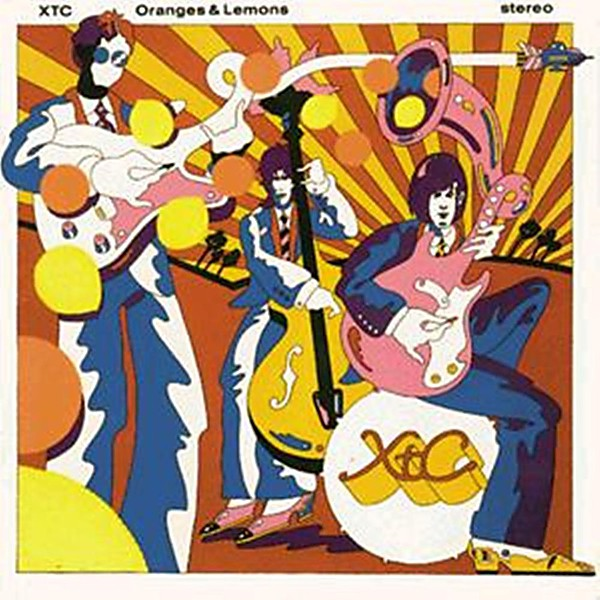

# Oranges & Lemons

By **XTC**

## Album Data

- **Catalog:** Beets
- **Format:** Digital, Album
- **Album:** Oranges & Lemons
- **Artist:** Xtc
- **Albumartist:** XTC
- **Genre:** Neo-Psychedelia
- **MusicBrainz Album Artist ID:** [97c86b2c-2765-46a2-aef8-76a7e24c430f](https://musicbrainz.org/artist/97c86b2c-2765-46a2-aef8-76a7e24c430f)
- **MusicBrainz Album ID:** [e11e2a2a-8efb-3e8c-b51d-de2f3eccf451](https://musicbrainz.org/release/e11e2a2a-8efb-3e8c-b51d-de2f3eccf451)
- **MusicBrainz Release Group ID:** [d61ff3c3-52dc-3211-a8b4-26c4402270db](https://musicbrainz.org/release-group/d61ff3c3-52dc-3211-a8b4-26c4402270db)
- **Year:** 1992
- **Catalog #:** GEFD-24417
- **Label:** Geffen Records
- **Total Tracks:** 24

## Album Tracks

### Track 04 - Too Many Cooks in the Kitchen

- **Artist:** Colin Moulding
- **Format:** MP3
- **Genre:** Rock
- **Length:** 2:46
- **MusicBrainz Track ID:** [83d20bcf-b135-4ce7-b563-da502b0a9b72](https://musicbrainz.org/recording/83d20bcf-b135-4ce7-b563-da502b0a9b72)
- **Title:** Too Many Cooks in the Kitchen
- **Track:** 04
- **Year:** 1991

### Track 13 - I Need Protection

- **Artist:** Colin Moulding
- **Format:** MP3
- **Genre:** Rock
- **Length:** 3:39
- **MusicBrainz Track ID:** [fa450759-bceb-4949-a68b-a91094d9b712](https://musicbrainz.org/recording/fa450759-bceb-4949-a68b-a91094d9b712)
- **Title:** I Need Protection
- **Track:** 13
- **Year:** 1991

### Track 01 - Extrovert

- **Artist:** XTC
- **Format:** MP3
- **Genre:** New Wave
- **Length:** 3:33
- **MusicBrainz Track ID:** [44a47b68-4bd6-42b9-9b3e-59237da71c9d](https://musicbrainz.org/recording/44a47b68-4bd6-42b9-9b3e-59237da71c9d)
- **Title:** Extrovert
- **Track:** 01
- **Year:** 1991

### Track 02 - Ten Feet Tall

- **Artist:** XTC
- **Format:** MP3
- **Genre:** Post-Punk
- **Length:** 3:11
- **MusicBrainz Track ID:** [8a0cd63d-82fa-4b5c-bbfb-6648a2912611](https://musicbrainz.org/recording/8a0cd63d-82fa-4b5c-bbfb-6648a2912611)
- **Title:** Ten Feet Tall
- **Track:** 02
- **Year:** 1991

### Track 03 - Mermaid Smiled

- **Artist:** XTC
- **Format:** MP3
- **Genre:** Psychedelic Rock
- **Length:** 2:25
- **MusicBrainz Track ID:** [be38a64e-050e-44d6-a180-e167726fc397](https://musicbrainz.org/recording/be38a64e-050e-44d6-a180-e167726fc397)
- **Title:** Mermaid Smiled
- **Track:** 03
- **Year:** 1991

### Track 05 - Respectable Street

- **Artist:** XTC
- **Format:** MP3
- **Genre:** New Wave
- **Length:** 3:04
- **MusicBrainz Track ID:** [d7089cd8-e5fe-47ad-aed6-f904f6853ec7](https://musicbrainz.org/recording/d7089cd8-e5fe-47ad-aed6-f904f6853ec7)
- **Title:** Respectable Street
- **Track:** 05
- **Year:** 1991

### Track 06 - Looking for Footprints

- **Artist:** XTC
- **Format:** MP3
- **Genre:** Post-Punk
- **Length:** 3:28
- **MusicBrainz Track ID:** [c2aad34b-ef4b-4f19-89fc-23c065649c48](https://musicbrainz.org/recording/c2aad34b-ef4b-4f19-89fc-23c065649c48)
- **Title:** Looking for Footprints
- **Track:** 06
- **Year:** 1991

### Track 07 - Over Rusty Water

- **Artist:** XTC
- **Format:** MP3
- **Genre:** New Wave
- **Length:** 1:27
- **MusicBrainz Track ID:** [f9725124-4d01-4579-a0d3-cb9a8477c568](https://musicbrainz.org/recording/f9725124-4d01-4579-a0d3-cb9a8477c568)
- **Title:** Over Rusty Water
- **Track:** 07
- **Year:** 1991

### Track 08 - Heaven Is Paved With Broken Glass

- **Artist:** XTC
- **Format:** MP3
- **Genre:** New Wave
- **Length:** 4:20
- **MusicBrainz Track ID:** [847518c7-b338-473f-bf79-8e7eac80e961](https://musicbrainz.org/recording/847518c7-b338-473f-bf79-8e7eac80e961)
- **Title:** Heaven Is Paved With Broken Glass
- **Track:** 08
- **Year:** 1991

### Track 09 - The World Is Full of Angry Young Men

- **Artist:** XTC
- **Format:** MP3
- **Genre:** New Wave
- **Length:** 3:38
- **MusicBrainz Track ID:** [b68dfe9e-c47a-492d-bcd8-29f0c9eb734b](https://musicbrainz.org/recording/b68dfe9e-c47a-492d-bcd8-29f0c9eb734b)
- **Title:** The World Is Full of Angry Young Men
- **Track:** 09
- **Year:** 1991

### Track 10 - Punch and Judy

- **Artist:** XTC
- **Format:** MP3
- **Genre:** New Wave
- **Length:** 2:41
- **MusicBrainz Track ID:** [c38ba2e5-662a-490e-b61e-4b8b3a831ba8](https://musicbrainz.org/recording/c38ba2e5-662a-490e-b61e-4b8b3a831ba8)
- **Title:** Punch and Judy
- **Track:** 10
- **Year:** 1991

### Track 11 - Thanks for Christmas

- **Artist:** XTC
- **Format:** MP3
- **Genre:** Rock
- **Length:** 3:49
- **MusicBrainz Track ID:** [f7c7567f-bc8f-4dee-8ddc-0bb2e519440d](https://musicbrainz.org/recording/f7c7567f-bc8f-4dee-8ddc-0bb2e519440d)
- **Title:** Thanks for Christmas
- **Track:** 11
- **Year:** 1991

### Track 12 - Tissue Tigers (The Arguers)

- **Artist:** XTC
- **Format:** MP3
- **Genre:** New Wave
- **Length:** 3:55
- **MusicBrainz Track ID:** [62aade5c-b7bc-4e99-87c0-8a2b33d7ca7e](https://musicbrainz.org/recording/62aade5c-b7bc-4e99-87c0-8a2b33d7ca7e)
- **Title:** Tissue Tigers (The Arguers)
- **Track:** 12
- **Year:** 1991

### Track 14 - Another Satellite

- **Artist:** XTC
- **Format:** MP3
- **Genre:** Synthpop
- **Length:** 4:19
- **MusicBrainz Track ID:** [b9841ff7-a967-4f72-bc11-9333f4a64be3](https://musicbrainz.org/recording/b9841ff7-a967-4f72-bc11-9333f4a64be3)
- **Title:** Another Satellite
- **Track:** 14
- **Year:** 1991

### Track 15 - Strange Tales, Strange Tails

- **Artist:** XTC
- **Format:** MP3
- **Genre:** New Wave
- **Length:** 2:17
- **MusicBrainz Track ID:** [514dd108-edd6-4f9c-a45e-f5bc4b354b26](https://musicbrainz.org/recording/514dd108-edd6-4f9c-a45e-f5bc4b354b26)
- **Title:** Strange Tales, Strange Tails
- **Track:** 15
- **Year:** 1991

### Track 16 - Officer Blue

- **Artist:** XTC
- **Format:** MP3
- **Genre:** New Wave
- **Length:** 2:39
- **MusicBrainz Track ID:** [e44de85b-b04f-4d6f-babb-0861a0f84b63](https://musicbrainz.org/recording/e44de85b-b04f-4d6f-babb-0861a0f84b63)
- **Title:** Officer Blue
- **Track:** 16
- **Year:** 1991

### Track 17 - Scissor Man

- **Artist:** XTC
- **Format:** MP3
- **Genre:** Ska
- **Length:** 4:21
- **MusicBrainz Track ID:** [40dd7be1-2c35-4d51-8775-601b814031f9](https://musicbrainz.org/recording/40dd7be1-2c35-4d51-8775-601b814031f9)
- **Title:** Scissor Man
- **Track:** 17
- **Year:** 1991

### Track 18 - Cockpit Dance Mixture

- **Artist:** XTC
- **Format:** MP3
- **Genre:** New Wave
- **Length:** 6:01
- **MusicBrainz Track ID:** [f7365e32-6ea2-4560-bf3c-b6a83fa1d7f8](https://musicbrainz.org/recording/f7365e32-6ea2-4560-bf3c-b6a83fa1d7f8)
- **Title:** Cockpit Dance Mixture
- **Track:** 18
- **Year:** 1991

### Track 19 - Pulsing Pulsing

- **Artist:** XTC
- **Format:** MP3
- **Genre:** New Wave
- **Length:** 1:34
- **MusicBrainz Track ID:** [b493eedc-157a-46b1-8df5-5b6a6e9e64e9](https://musicbrainz.org/recording/b493eedc-157a-46b1-8df5-5b6a6e9e64e9)
- **Title:** Pulsing Pulsing
- **Track:** 19
- **Year:** 1991

### Track 20 - Happy Families

- **Artist:** XTC
- **Format:** MP3
- **Genre:** New Wave
- **Length:** 2:45
- **MusicBrainz Track ID:** [9f9ea81f-f0a0-415e-a560-2d248c12a83d](https://musicbrainz.org/recording/9f9ea81f-f0a0-415e-a560-2d248c12a83d)
- **Title:** Happy Families
- **Track:** 20
- **Year:** 1991

### Track 21 - Countdown to Christmas Party Time

- **Artist:** XTC
- **Format:** MP3
- **Genre:** Rock
- **Length:** 4:12
- **MusicBrainz Track ID:** [b5d6ffe5-6893-4b1e-98b5-f8f955828a73](https://musicbrainz.org/recording/b5d6ffe5-6893-4b1e-98b5-f8f955828a73)
- **Title:** Countdown to Christmas Party Time
- **Track:** 21
- **Year:** 1991

### Track 22 - Blame the Weather

- **Artist:** XTC
- **Format:** MP3
- **Genre:** New Wave
- **Length:** 3:37
- **MusicBrainz Track ID:** [373f6464-c746-4981-be9b-8ff1581128db](https://musicbrainz.org/recording/373f6464-c746-4981-be9b-8ff1581128db)
- **Title:** Blame the Weather
- **Track:** 22
- **Year:** 1991

### Track 23 - Take This Town

- **Artist:** XTC
- **Format:** MP3
- **Genre:** New Wave
- **Length:** 4:08
- **MusicBrainz Track ID:** [d3758a4c-855f-4ba4-9fd7-1e8708ae2a52](https://musicbrainz.org/recording/d3758a4c-855f-4ba4-9fd7-1e8708ae2a52)
- **Title:** Take This Town
- **Track:** 23
- **Year:** 1991

### Track 24 - History of Rock ’n’ Roll

- **Artist:** XTC
- **Format:** MP3
- **Genre:** Rock
- **Length:** 0:20
- **MusicBrainz Track ID:** [7030cca3-0e85-47fb-9c9c-e103fb3496ec](https://musicbrainz.org/recording/7030cca3-0e85-47fb-9c9c-e103fb3496ec)
- **Title:** History of Rock ’n’ Roll
- **Track:** 24
- **Year:** 1991

## See also

- [Apple Venus, Volume 1](Apple_Venus__Volume_1.md)
- [Rag & Bone Buffet](Rag_and_Bone_Buffet.md)
- [Skylarking](Skylarking.md)
