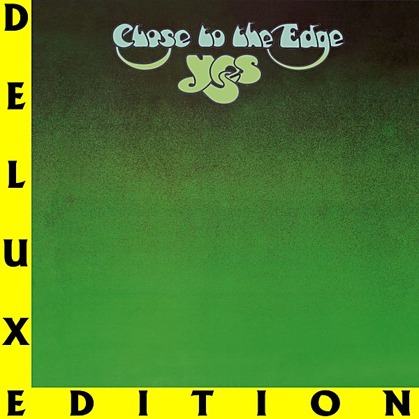

# Close To The Edge

By **YES**

## Album Data

- **Catalog:** Beets
- **Format:** Digital, Album
- **Album:** Close To The Edge
- **Artist:** Yes
- **Albumartist:** YES
- **Genre:** Progressive Rock
- **MusicBrainz Album Artist ID:** 
- **MusicBrainz Album ID:** 
- **MusicBrainz Release Group ID:** 
- **Year:** 1972
- **Catalog #:** 
- **Label:** 
- **Total Tracks:** 05

## Album Tracks

### Track 01 - Close to the Edge

- **Artist:** Yes
- **Format:** ALAC
- **Genre:** Progressive Rock
- **Length:** 18:42
- **MusicBrainz Track ID:** 
- **Title:** Close to the Edge
- **Track:** 01
- **Year:** 1972

### Track 02 - And You and I

- **Artist:** Yes
- **Format:** ALAC
- **Genre:** Progressive Rock
- **Length:** 10:12
- **MusicBrainz Track ID:** 
- **Title:** And You and I
- **Track:** 02
- **Year:** 1972

### Track 03 - Siberian Khatru

- **Artist:** Yes
- **Format:** ALAC
- **Genre:** Progressive Rock
- **Length:** 9:11
- **MusicBrainz Track ID:** 
- **Title:** Siberian Khatru
- **Track:** 03
- **Year:** 1972

### Track 04 - America

- **Artist:** Yes
- **Format:** ALAC
- **Genre:** Progressive Rock
- **Length:** 10:44
- **MusicBrainz Track ID:** 
- **Title:** America
- **Track:** 04
- **Year:** 1972

### Track 05 - Close to the Edge

- **Artist:** Yes
- **Format:** ALAC
- **Genre:** Progressive Rock
- **Length:** 17:42
- **MusicBrainz Track ID:** 
- **Title:** Close to the Edge
- **Track:** 05
- **Year:** 1972

## See also

- [Close to the Edge (2013 Stereo Mixes)](Close_to_the_Edge_2013_Stereo_Mixes.md)
- [Fragile (Deluxe Version)](Fragile_Deluxe_Version.md)
- [Fragile](Fragile.md)
- [The Yes Album [Expanded & Remastered] (US Release)](The_Yes_Album_[Expanded_and_Remastered]_US_Release.md)
- [The Yes Album](The_Yes_Album.md)
- [CD: Close To The Edge (Definitive Edition)](../../CD/Yes/Close_To_The_Edge_Definitive_Edition.md)
- [CD: Fragile](../../CD/Yes/Fragile.md)
- [CD: ](../../CD/Yes/Yes.md)
- [Roon: Close to the Edge](../../Roon/Yes/Close_to_the_Edge.md)
- [Roon: Fragile](../../Roon/Yes/Fragile.md)
- [Roon: The Steven Wilson Remixes](../../Roon/Yes/The_Steven_Wilson_Remixes.md)
- [Roon: The Yes Album](../../Roon/Yes/The_Yes_Album.md)
- [Roon: Yes](../../Roon/Yes/Yes.md)
- [Vinyl: Close To The Edge](../../Vinyl/Yes/Close_To_The_Edge.md)
- [Vinyl: Fragile](../../Vinyl/Yes/Fragile.md)
- [Vinyl: Progeny](../../Vinyl/Yes/Progeny-_Highlights_From_Seventy-Two.md)
- [Vinyl: The Yes Album](../../Vinyl/Yes/The_Yes_Album.md)
- [Vinyl: ](../../Vinyl/Yes/Yes.md)
- [Vinyl: Yessongs](../../Vinyl/Yes/Yessongs.md)
