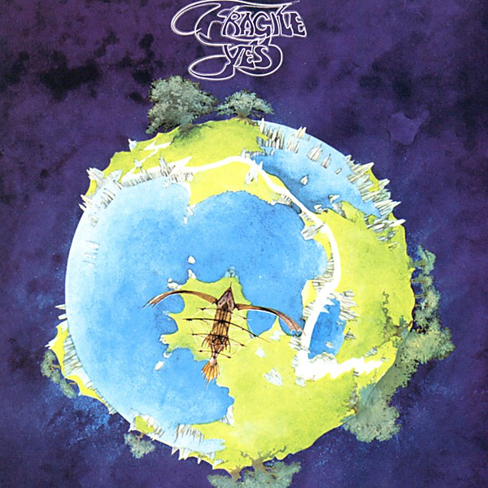

# Fragile

By **Yes**

## Album Data

- **Catalog:** Beets
- **Format:** Digital, Album
- **Album:** Fragile
- **Artist:** Yes
- **Albumartist:** Yes
- **Genre:** Progressive Rock
- **MusicBrainz Album Artist ID:** [c1d4f2ba-cf39-460c-9528-6b827d3417a1](https://musicbrainz.org/artist/c1d4f2ba-cf39-460c-9528-6b827d3417a1)
- **MusicBrainz Album ID:** [dc792622-a22b-3268-8d7f-8bc27b60b907](https://musicbrainz.org/release/dc792622-a22b-3268-8d7f-8bc27b60b907)
- **MusicBrainz Release Group ID:** [b1176e7b-fa2e-3b28-959a-d8f55b5b6ccf](https://musicbrainz.org/release-group/b1176e7b-fa2e-3b28-959a-d8f55b5b6ccf)
- **Year:** 1977
- **Catalog #:** 
- **Label:** 
- **Total Tracks:** 11

## Album Tracks

### Track 01 - Roundabout (Remastered Version)

- **Artist:** Yes
- **Format:** MP3
- **Genre:** Progressive Rock
- **Length:** 8:30
- **MusicBrainz Track ID:** 
- **Title:** Roundabout (Remastered Version)
- **Track:** 01
- **Year:** 2003

### Track 02 - Cans And Brahms (Extracts From Brahms' 4th Symphony In E Minor, Third Movement) [Remastered]

- **Artist:** Yes
- **Format:** MP3
- **Genre:** Progressive Rock
- **Length:** 1:38
- **MusicBrainz Track ID:** 
- **Title:** Cans And Brahms (Extracts From Brahms' 4th Symphony In E Minor, Third Movement) [Remastered]
- **Track:** 02
- **Year:** 2003

### Track 03 - We Have Heaven (Remastered Version)

- **Artist:** Yes
- **Format:** MP3
- **Genre:** Progressive Rock
- **Length:** 1:39
- **MusicBrainz Track ID:** 
- **Title:** We Have Heaven (Remastered Version)
- **Track:** 03
- **Year:** 2003

### Track 04 - South Side Of The Sky (Remastered Version)

- **Artist:** Yes
- **Format:** MP3
- **Genre:** Progressive Rock
- **Length:** 7:58
- **MusicBrainz Track ID:** 
- **Title:** South Side Of The Sky (Remastered Version)
- **Track:** 04
- **Year:** 2003

### Track 05 - Five Per Cent For Nothing (Remastered Version)

- **Artist:** Yes
- **Format:** MP3
- **Genre:** Progressive Rock
- **Length:** 0:35
- **MusicBrainz Track ID:** 
- **Title:** Five Per Cent For Nothing (Remastered Version)
- **Track:** 05
- **Year:** 2003

### Track 06 - Long Distance Runaround (Remastered Version)

- **Artist:** Yes
- **Format:** MP3
- **Genre:** Progressive Rock
- **Length:** 3:30
- **MusicBrainz Track ID:** 
- **Title:** Long Distance Runaround (Remastered Version)
- **Track:** 06
- **Year:** 2003

### Track 07 - The Fish (Schindleria Praemeturus) [Remastered Version]

- **Artist:** Yes
- **Format:** MP3
- **Genre:** Progressive Rock
- **Length:** 2:38
- **MusicBrainz Track ID:** 
- **Title:** The Fish (Schindleria Praemeturus) [Remastered Version]
- **Track:** 07
- **Year:** 2003

### Track 08 - Mood For A Day (Remastered Version)

- **Artist:** Yes
- **Format:** MP3
- **Genre:** Progressive Rock
- **Length:** 3:00
- **MusicBrainz Track ID:** 
- **Title:** Mood For A Day (Remastered Version)
- **Track:** 08
- **Year:** 2003

### Track 09 - Heart Of The Sunrise (Remastered Version)

- **Artist:** Yes
- **Format:** MP3
- **Genre:** Progressive Rock
- **Length:** 10:34
- **MusicBrainz Track ID:** 
- **Title:** Heart Of The Sunrise (Remastered Version)
- **Track:** 09
- **Year:** 2003

### Track 10 - America (Remastered Version )

- **Artist:** Yes
- **Format:** MP3
- **Genre:** Progressive Rock
- **Length:** 10:31
- **MusicBrainz Track ID:** 
- **Title:** America (Remastered Version )
- **Track:** 10
- **Year:** 2003

### Track 11 - Roundabout (Remastered Early Rough Mix)

- **Artist:** Yes
- **Format:** MP3
- **Genre:** Progressive Rock
- **Length:** 8:35
- **MusicBrainz Track ID:** 
- **Title:** Roundabout (Remastered Early Rough Mix)
- **Track:** 11
- **Year:** 2003

## See also

- [Close to the Edge (2013 Stereo Mixes)](Close_to_the_Edge_2013_Stereo_Mixes.md)
- [Close To The Edge](Close_To_The_Edge.md)
- [Fragile (Deluxe Version)](Fragile_Deluxe_Version.md)
- [The Yes Album [Expanded & Remastered] (US Release)](The_Yes_Album_[Expanded_and_Remastered]_US_Release.md)
- [The Yes Album](The_Yes_Album.md)
- [CD: Close To The Edge (Definitive Edition)](../../CD/Yes/Close_To_The_Edge_Definitive_Edition.md)
- [CD: Fragile](../../CD/Yes/Fragile.md)
- [CD: ](../../CD/Yes/Yes.md)
- [Roon: Close to the Edge](../../Roon/Yes/Close_to_the_Edge.md)
- [Roon: Fragile](../../Roon/Yes/Fragile.md)
- [Roon: The Steven Wilson Remixes](../../Roon/Yes/The_Steven_Wilson_Remixes.md)
- [Roon: The Yes Album](../../Roon/Yes/The_Yes_Album.md)
- [Roon: Yes](../../Roon/Yes/Yes.md)
- [Vinyl: Close To The Edge](../../Vinyl/Yes/Close_To_The_Edge.md)
- [Vinyl: Fragile](../../Vinyl/Yes/Fragile.md)
- [Vinyl: Progeny](../../Vinyl/Yes/Progeny-_Highlights_From_Seventy-Two.md)
- [Vinyl: The Yes Album](../../Vinyl/Yes/The_Yes_Album.md)
- [Vinyl: ](../../Vinyl/Yes/Yes.md)
- [Vinyl: Yessongs](../../Vinyl/Yes/Yessongs.md)
