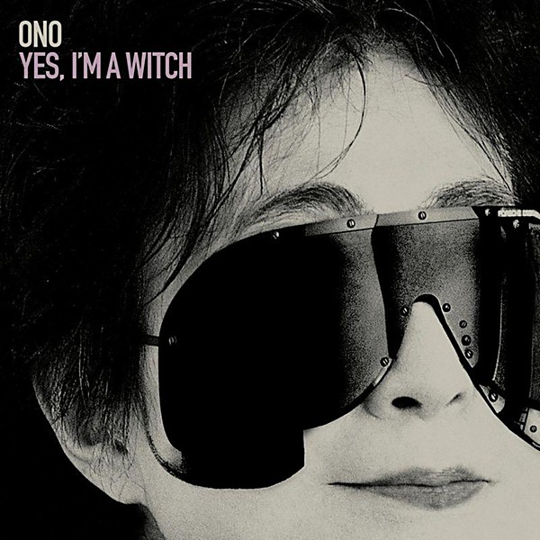

# Yes, I'm a Witch

By **Yoko Ono**

## Album Data

- **Catalog:** Beets
- **Format:** Digital, Album
- **Album:** Yes, I'm a Witch
- **Artist:** Yoko Ono
- **Albumartist:** Yoko Ono
- **Genre:** Electropop
- **MusicBrainz Album Artist ID:** [b0b33754-a664-43b7-ba00-be0dc4ec2396](https://musicbrainz.org/artist/b0b33754-a664-43b7-ba00-be0dc4ec2396)
- **MusicBrainz Album ID:** [c4f90903-1297-48ed-b387-78d8d1a87084](https://musicbrainz.org/release/c4f90903-1297-48ed-b387-78d8d1a87084)
- **MusicBrainz Release Group ID:** [ba7616c0-b3f5-3752-94bd-78fc5057af57](https://musicbrainz.org/release-group/ba7616c0-b3f5-3752-94bd-78fc5057af57)
- **Year:** 2007
- **Catalog #:** 
- **Label:** Astralwerks
- **Total Tracks:** 17

## Album Tracks

### Track 14 - Cambridge 1969/2007

- **Artist:** The Flaming Lips
- **Format:** MP3
- **Genre:** Electropop
- **Length:** 5:37
- **MusicBrainz Track ID:** [4ab610d2-7b8f-4d39-a4e8-673e77c28269](https://musicbrainz.org/recording/4ab610d2-7b8f-4d39-a4e8-673e77c28269)
- **Title:** Cambridge 1969/2007
- **Track:** 14
- **Year:** 2007

### Track 02 - Kiss Kiss Kiss

- **Artist:** Yoko Ono
- **Format:** MP3
- **Genre:** Post-Punk
- **Length:** 3:18
- **MusicBrainz Track ID:** [0bbb138f-09b7-43be-ba07-2da37d29f9a5](https://musicbrainz.org/recording/0bbb138f-09b7-43be-ba07-2da37d29f9a5)
- **Title:** Kiss Kiss Kiss
- **Track:** 02
- **Year:** 2007

### Track 03 - O'Oh

- **Artist:** Yoko Ono
- **Format:** MP3
- **Genre:** Rock
- **Length:** 3:38
- **MusicBrainz Track ID:** [b951136b-c2e9-4b65-9259-302fa98c8fcb](https://musicbrainz.org/recording/b951136b-c2e9-4b65-9259-302fa98c8fcb)
- **Title:** O'Oh
- **Track:** 03
- **Year:** 2007

### Track 09 - Yes, I'm a Witch

- **Artist:** Yoko Ono
- **Format:** MP3
- **Genre:** Uk Garage
- **Length:** 3:48
- **MusicBrainz Track ID:** [d8e7522c-5b49-4935-b67f-b8fcfec24ce6](https://musicbrainz.org/recording/d8e7522c-5b49-4935-b67f-b8fcfec24ce6)
- **Title:** Yes, I'm a Witch
- **Track:** 09
- **Year:** 2007

### Track 15 - I'm Moving On

- **Artist:** Yoko Ono
- **Format:** MP3
- **Genre:** Pop
- **Length:** 4:55
- **MusicBrainz Track ID:** [516ece1e-287d-45c7-b1ab-78379d6118d6](https://musicbrainz.org/recording/516ece1e-287d-45c7-b1ab-78379d6118d6)
- **Title:** I'm Moving On
- **Track:** 15
- **Year:** 2007

### Track 13 - Toyboat

- **Artist:** Yoko Ono & Antony and the Johnsons
- **Format:** MP3
- **Genre:** Electropop
- **Length:** 4:24
- **MusicBrainz Track ID:** [164770a4-ada4-44f1-ac0b-199b55d9ad19](https://musicbrainz.org/recording/164770a4-ada4-44f1-ac0b-199b55d9ad19)
- **Title:** Toyboat
- **Track:** 13
- **Year:** 2007

### Track 08 - Nobody Sees Me Like You Do

- **Artist:** Yoko Ono & The Apples in Stereo
- **Format:** MP3
- **Genre:** Electropop
- **Length:** 3:56
- **MusicBrainz Track ID:** [da98fa0e-73ec-4e0e-93ab-9b5300379d95](https://musicbrainz.org/recording/da98fa0e-73ec-4e0e-93ab-9b5300379d95)
- **Title:** Nobody Sees Me Like You Do
- **Track:** 08
- **Year:** 2007

### Track 17 - Shiranakatta

- **Artist:** Yoko Ono & Craig Armstrong
- **Format:** MP3
- **Genre:** Electropop
- **Length:** 3:09
- **MusicBrainz Track ID:** [da76a33c-ad0d-4124-bbfd-d85766201eb6](https://musicbrainz.org/recording/da76a33c-ad0d-4124-bbfd-d85766201eb6)
- **Title:** Shiranakatta
- **Track:** 17
- **Year:** 2007

### Track 04 - Everyman…Everywoman

- **Artist:** Yoko Ono & Blow–Up
- **Format:** MP3
- **Genre:** Electropop
- **Length:** 4:01
- **MusicBrainz Track ID:** [f11ac7c6-ebca-41aa-9688-c40d90782738](https://musicbrainz.org/recording/f11ac7c6-ebca-41aa-9688-c40d90782738)
- **Title:** Everyman…Everywoman
- **Track:** 04
- **Year:** 2007

### Track 10 - Revelations

- **Artist:** Yoko Ono & Cat Power
- **Format:** MP3
- **Genre:** Electropop
- **Length:** 3:52
- **MusicBrainz Track ID:** [40d4e478-9a9b-473d-852f-15d09f491234](https://musicbrainz.org/recording/40d4e478-9a9b-473d-852f-15d09f491234)
- **Title:** Revelations
- **Track:** 10
- **Year:** 2007

### Track 11 - You and I

- **Artist:** Yoko Ono & The Polyphonic Spree
- **Format:** MP3
- **Genre:** Electropop
- **Length:** 3:26
- **MusicBrainz Track ID:** [5e157f7e-4545-4aa4-8766-958507f901a3](https://musicbrainz.org/recording/5e157f7e-4545-4aa4-8766-958507f901a3)
- **Title:** You and I
- **Track:** 11
- **Year:** 2007

### Track 01 - Witch Shocktronica Intro

- **Artist:** Yoko Ono & Hank Shocklee
- **Format:** MP3
- **Genre:** Pop
- **Length:** 1:47
- **MusicBrainz Track ID:** [c087ec5c-2f2c-4810-9a77-a563d0edf0e1](https://musicbrainz.org/recording/c087ec5c-2f2c-4810-9a77-a563d0edf0e1)
- **Title:** Witch Shocktronica Intro
- **Track:** 01
- **Year:** 2007

### Track 16 - Witch Shocktronica Outro

- **Artist:** Yoko Ono & Hank Shocklee
- **Format:** MP3
- **Genre:** Electropop
- **Length:** 0:30
- **MusicBrainz Track ID:** [c8ade4ef-5155-47fd-88f5-d3b59a09101c](https://musicbrainz.org/recording/c8ade4ef-5155-47fd-88f5-d3b59a09101c)
- **Title:** Witch Shocktronica Outro
- **Track:** 16
- **Year:** 2007

### Track 12 - Walking on Thin Ice

- **Artist:** Yoko Ono & Spiritualized
- **Format:** MP3
- **Genre:** Electropop
- **Length:** 5:07
- **MusicBrainz Track ID:** [22dbe9f7-4f5f-445c-95cb-4992d6a45184](https://musicbrainz.org/recording/22dbe9f7-4f5f-445c-95cb-4992d6a45184)
- **Title:** Walking on Thin Ice
- **Track:** 12
- **Year:** 2007

### Track 07 - Rising

- **Artist:** Yoko Ono & DJ Spooky
- **Format:** MP3
- **Genre:** Electropop
- **Length:** 4:13
- **MusicBrainz Track ID:** [ddab09d9-9bab-421b-978f-1b23da842848](https://musicbrainz.org/recording/ddab09d9-9bab-421b-978f-1b23da842848)
- **Title:** Rising
- **Track:** 07
- **Year:** 2007

### Track 05 - Sisters O Sisters

- **Artist:** Yoko Ono & Le Tigre
- **Format:** MP3
- **Genre:** Electropop
- **Length:** 2:47
- **MusicBrainz Track ID:** [112afefb-a563-4b58-a4f8-c4df6f36fd74](https://musicbrainz.org/recording/112afefb-a563-4b58-a4f8-c4df6f36fd74)
- **Title:** Sisters O Sisters
- **Track:** 05
- **Year:** 2007

### Track 06 - Death of Samantha

- **Artist:** Porcupine Tree
- **Format:** MP3
- **Genre:** Electropop
- **Length:** 4:35
- **MusicBrainz Track ID:** [3d7d3ecc-ec25-47a6-bc19-44815696b506](https://musicbrainz.org/recording/3d7d3ecc-ec25-47a6-bc19-44815696b506)
- **Title:** Death of Samantha
- **Track:** 06
- **Year:** 2007

## See also

- [Roon: Double Fantasy](../../Roon/Yoko_Ono/Double_Fantasy.md)
- [Roon: Double Fantasy Stripped Down (Stripped Down)](../../Roon/Yoko_Ono/Double_Fantasy_Stripped_Down_Stripped_Down.md)
