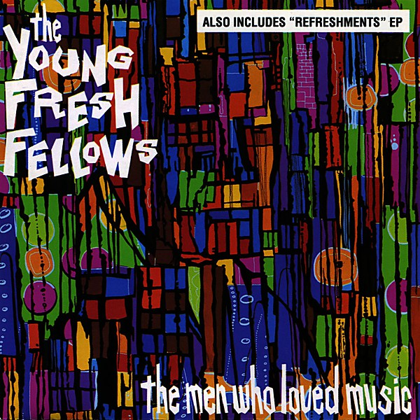

# The Men Who Loved Music

By **Young Fresh Fellows**

## Album Data

- **Catalog:** Beets
- **Format:** Digital, Album
- **Album:** The Men Who Loved Music
- **Artist:** Young Fresh Fellows
- **Albumartist:** Young Fresh Fellows
- **Genre:** alternative rock
- **MusicBrainz Album Artist ID:** [https](https://musicbrainz.org/artist/https)
- **MusicBrainz Album ID:** [https](https://musicbrainz.org/release/https)
- **MusicBrainz Release Group ID:** 
- **Year:** 1987
- **Catalog #:** 
- **Label:** Frontier Records
- **Total Tracks:** 22

## Album Tracks

### Track 01 - Just Sit

- **Artist:** Young Fresh Fellows
- **Format:** ALAC
- **Genre:** alternative rock
- **Length:** 2:44
- **MusicBrainz Track ID:** [https](https://musicbrainz.org/recording/https)
- **Title:** Just Sit
- **Track:** 01
- **Year:** 1987

### Track 02 - TV Dream

- **Artist:** Young Fresh Fellows
- **Format:** ALAC
- **Genre:** alternative rock
- **Length:** 2:12
- **MusicBrainz Track ID:** [https](https://musicbrainz.org/recording/https)
- **Title:** TV Dream
- **Track:** 02
- **Year:** 1987

### Track 03 - Get Outta My Cave

- **Artist:** Young Fresh Fellows
- **Format:** ALAC
- **Genre:** alternative rock
- **Length:** 3:24
- **MusicBrainz Track ID:** [https](https://musicbrainz.org/recording/https)
- **Title:** Get Outta My Cave
- **Track:** 03
- **Year:** 1987

### Track 04 - Why I Oughta

- **Artist:** Young Fresh Fellows
- **Format:** ALAC
- **Genre:** alternative rock
- **Length:** 1:18
- **MusicBrainz Track ID:** [https](https://musicbrainz.org/recording/https)
- **Title:** Why I Oughta
- **Track:** 04
- **Year:** 1987

### Track 05 - Unimaginable Zero Summer

- **Artist:** Young Fresh Fellows
- **Format:** ALAC
- **Genre:** alternative rock
- **Length:** 2:53
- **MusicBrainz Track ID:** [https](https://musicbrainz.org/recording/https)
- **Title:** Unimaginable Zero Summer
- **Track:** 05
- **Year:** 1987

### Track 06 - When the Girls Get Here

- **Artist:** Young Fresh Fellows
- **Format:** ALAC
- **Genre:** alternative rock
- **Length:** 2:40
- **MusicBrainz Track ID:** [https](https://musicbrainz.org/recording/https)
- **Title:** When the Girls Get Here
- **Track:** 06
- **Year:** 1987

### Track 07 - Amy Grant

- **Artist:** Young Fresh Fellows
- **Format:** ALAC
- **Genre:** alternative rock
- **Length:** 2:59
- **MusicBrainz Track ID:** [https](https://musicbrainz.org/recording/https)
- **Title:** Amy Grant
- **Track:** 07
- **Year:** 1987

### Track 08 - Hank, Karen and Elvis

- **Artist:** Young Fresh Fellows
- **Format:** ALAC
- **Genre:** alternative rock
- **Length:** 1:59
- **MusicBrainz Track ID:** [https](https://musicbrainz.org/recording/https)
- **Title:** Hank, Karen and Elvis
- **Track:** 08
- **Year:** 1987

### Track 09 - My Friend Ringo

- **Artist:** Young Fresh Fellows
- **Format:** ALAC
- **Genre:** alternative rock
- **Length:** 4:03
- **MusicBrainz Track ID:** [https](https://musicbrainz.org/recording/https)
- **Title:** My Friend Ringo
- **Track:** 09
- **Year:** 1987

### Track 10 - Two Brothers

- **Artist:** Young Fresh Fellows
- **Format:** ALAC
- **Genre:** alternative rock
- **Length:** 1:49
- **MusicBrainz Track ID:** [https](https://musicbrainz.org/recording/https)
- **Title:** Two Brothers
- **Track:** 10
- **Year:** 1987

### Track 11 - I Got My Mojo Working (And I Thought You'd Like to Know)

- **Artist:** Young Fresh Fellows
- **Format:** ALAC
- **Genre:** alternative rock
- **Length:** 2:16
- **MusicBrainz Track ID:** [https](https://musicbrainz.org/recording/https)
- **Title:** I Got My Mojo Working (And I Thought You'd Like to Know)
- **Track:** 11
- **Year:** 1987

### Track 12 - I Don't Let the Little Things Get Me Down

- **Artist:** Young Fresh Fellows
- **Format:** ALAC
- **Genre:** alternative rock
- **Length:** 1:54
- **MusicBrainz Track ID:** [https](https://musicbrainz.org/recording/https)
- **Title:** I Don't Let the Little Things Get Me Down
- **Track:** 12
- **Year:** 1987

### Track 13 - Ant Farm

- **Artist:** Young Fresh Fellows
- **Format:** ALAC
- **Genre:** alternative rock
- **Length:** 2:13
- **MusicBrainz Track ID:** [https](https://musicbrainz.org/recording/https)
- **Title:** Ant Farm
- **Track:** 13
- **Year:** 1987

### Track 14 - Where the Hell Did They Go?

- **Artist:** Young Fresh Fellows
- **Format:** ALAC
- **Genre:** alternative rock
- **Length:** 2:13
- **MusicBrainz Track ID:** [https](https://musicbrainz.org/recording/https)
- **Title:** Where the Hell Did They Go?
- **Track:** 14
- **Year:** 1987

### Track 15 - Happy Death Theme

- **Artist:** Young Fresh Fellows
- **Format:** ALAC
- **Genre:** alternative rock
- **Length:** 2:06
- **MusicBrainz Track ID:** [https](https://musicbrainz.org/recording/https)
- **Title:** Happy Death Theme
- **Track:** 15
- **Year:** 1987

### Track 16 - Beer Money

- **Artist:** Young Fresh Fellows
- **Format:** ALAC
- **Genre:** alternative rock
- **Length:** 2:13
- **MusicBrainz Track ID:** [https](https://musicbrainz.org/recording/https)
- **Title:** Beer Money
- **Track:** 16
- **Year:** 1987

### Track 17 - Aurora Bridge

- **Artist:** Young Fresh Fellows
- **Format:** ALAC
- **Genre:** alternative rock
- **Length:** 2:49
- **MusicBrainz Track ID:** [https](https://musicbrainz.org/recording/https)
- **Title:** Aurora Bridge
- **Track:** 17
- **Year:** 1987

### Track 18 - Broken Basket

- **Artist:** Young Fresh Fellows
- **Format:** ALAC
- **Genre:** alternative rock
- **Length:** 1:45
- **MusicBrainz Track ID:** [https](https://musicbrainz.org/recording/https)
- **Title:** Broken Basket
- **Track:** 18
- **Year:** 1987

### Track 19 - Three Sides to This Story

- **Artist:** Young Fresh Fellows
- **Format:** ALAC
- **Genre:** alternative rock
- **Length:** 2:25
- **MusicBrainz Track ID:** [https](https://musicbrainz.org/recording/https)
- **Title:** Three Sides to This Story
- **Track:** 19
- **Year:** 1987

### Track 20 - Young Fresh Fellows Update Theme

- **Artist:** Young Fresh Fellows
- **Format:** ALAC
- **Genre:** alternative rock
- **Length:** 3:55
- **MusicBrainz Track ID:** [https](https://musicbrainz.org/recording/https)
- **Title:** Young Fresh Fellows Update Theme
- **Track:** 20
- **Year:** 1987

### Track 21 - Back Room of the Bar

- **Artist:** Young Fresh Fellows
- **Format:** ALAC
- **Genre:** alternative rock
- **Length:** 3:26
- **MusicBrainz Track ID:** [https](https://musicbrainz.org/recording/https)
- **Title:** Back Room of the Bar
- **Track:** 21
- **Year:** 1987

### Track 22 - Do The Fonzie

- **Artist:** Young Fresh Fellows
- **Format:** ALAC
- **Genre:** alternative rock
- **Length:** 1:20
- **MusicBrainz Track ID:** [https](https://musicbrainz.org/recording/https)
- **Title:** Do The Fonzie
- **Track:** 22
- **Year:** 1987

