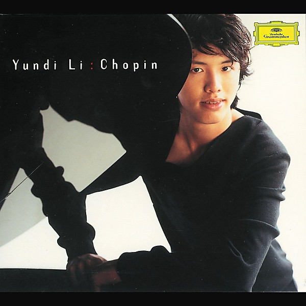

# Chopin Recital

By **Yundi Li**

## Album Data

- **Catalog:** Beets
- **Format:** Digital, Album
- **Album:** Chopin Recital
- **Artist:** Yundi Li
- **Albumartist:** Yundi Li
- **Genre:** Classical
- **MusicBrainz Album Artist ID:** 
- **MusicBrainz Album ID:** 
- **MusicBrainz Release Group ID:** 
- **Year:** 2001
- **Catalog #:** 
- **Label:** 
- **Total Tracks:** 13

## Album Tracks

### Track 01 - Chopin

- **Artist:** Yundi Li
- **Format:** AAC
- **Genre:** Classical
- **Length:** 9:14
- **MusicBrainz Track ID:** 
- **Title:** Chopin
- **Track:** 01
- **Year:** 2001

### Track 02 - Chopin

- **Artist:** Yundi Li
- **Format:** MP3
- **Genre:** Classical
- **Length:** 2:57
- **MusicBrainz Track ID:** 
- **Title:** Chopin
- **Track:** 02
- **Year:** 2001

### Track 03 - Chopin

- **Artist:** Yundi Li
- **Format:** AAC
- **Genre:** Classical
- **Length:** 9:32
- **MusicBrainz Track ID:** 
- **Title:** Chopin
- **Track:** 03
- **Year:** 2001

### Track 04 - Chopin

- **Artist:** Yundi Li
- **Format:** AAC
- **Genre:** Classical
- **Length:** 5:10
- **MusicBrainz Track ID:** 
- **Title:** Chopin
- **Track:** 04
- **Year:** 2001

### Track 05 - Chopin

- **Artist:** Yundi Li
- **Format:** AAC
- **Genre:** Classical
- **Length:** 4:59
- **MusicBrainz Track ID:** 
- **Title:** Chopin
- **Track:** 05
- **Year:** 2001

### Track 06 - Chopin

- **Artist:** Yundi Li
- **Format:** AAC
- **Genre:** Classical
- **Length:** 9:29
- **MusicBrainz Track ID:** 
- **Title:** Chopin
- **Track:** 06
- **Year:** 2001

### Track 07 - Chopin

- **Artist:** Yundi Li
- **Format:** AAC
- **Genre:** Classical
- **Length:** 1:25
- **MusicBrainz Track ID:** 
- **Title:** Chopin
- **Track:** 07
- **Year:** 2001

### Track 08 - Chopin

- **Artist:** Yundi Li
- **Format:** AAC
- **Genre:** Classical
- **Length:** 1:40
- **MusicBrainz Track ID:** 
- **Title:** Chopin
- **Track:** 08
- **Year:** 2001

### Track 09 - Chopin

- **Artist:** Yundi Li
- **Format:** AAC
- **Genre:** Classical
- **Length:** 3:40
- **MusicBrainz Track ID:** 
- **Title:** Chopin
- **Track:** 09
- **Year:** 2001

### Track 10 - Chopin

- **Artist:** Yundi Li
- **Format:** AAC
- **Genre:** Classical
- **Length:** 5:46
- **MusicBrainz Track ID:** 
- **Title:** Chopin
- **Track:** 10
- **Year:** 2001

### Track 11 - Chopin

- **Artist:** Yundi Li
- **Format:** AAC
- **Genre:** Classical
- **Length:** 4:23
- **MusicBrainz Track ID:** 
- **Title:** Chopin
- **Track:** 11
- **Year:** 2001

### Track 12 - Chopin

- **Artist:** Yundi Li
- **Format:** AAC
- **Genre:** Classical
- **Length:** 3:33
- **MusicBrainz Track ID:** 
- **Title:** Chopin
- **Track:** 12
- **Year:** 2001

### Track 13 - Chopin

- **Artist:** Yundi Li
- **Format:** AAC
- **Genre:** Classical
- **Length:** 4:58
- **MusicBrainz Track ID:** 
- **Title:** Chopin
- **Track:** 13
- **Year:** 2001

## See also

- [Roon: Chopin](../../Roon/Yundi_Li/Chopin-_Scherzi;_Impromtus.md)
- [Roon: Emperor / Fantasy (Beethoven & Schumann)](../../Roon/Yundi_Li/Emperor_-_Fantasy_Beethoven_and_Schumann.md)
- [Roon: Liszt](../../Roon/Yundi_Li/Liszt-_Piano_Works.md)
