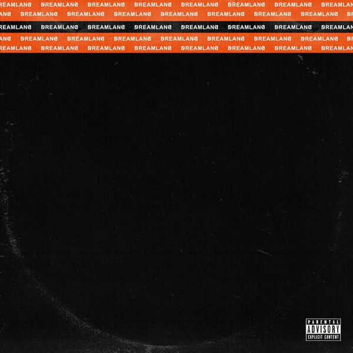

# DREAMLAND (DELUXE)

By **ZHU**

## Album Data

- **Catalog:** Beets
- **Format:** Digital, Album
- **Album:** DREAMLAND (DELUXE)
- **Artist:** Zhu
- **Albumartist:** ZHU
- **Genre:** Deep House
- **MusicBrainz Album Artist ID:** 
- **MusicBrainz Album ID:** 
- **MusicBrainz Release Group ID:** 
- **Year:** 2021
- **Catalog #:** 
- **Label:** Astralwerks
- **Total Tracks:** 07

## Album Tracks

### Track 01 - The Fall

- **Artist:** ZHU
- **Format:** MP3
- **Genre:** Deep House
- **Length:** 5:48
- **MusicBrainz Track ID:** [9fd18ccd-c03a-44fd-9701-f516a1fe6785](https://musicbrainz.org/recording/9fd18ccd-c03a-44fd-9701-f516a1fe6785)
- **Title:** The Fall
- **Track:** 01
- **Year:** 2022

### Track 02 - I Wonder

- **Artist:** ZHU
- **Format:** MP3
- **Genre:** Deep House
- **Length:** 4:01
- **MusicBrainz Track ID:** [542b20af-1316-438d-b487-cc01415a60d7](https://musicbrainz.org/recording/542b20af-1316-438d-b487-cc01415a60d7)
- **Title:** I Wonder
- **Track:** 02
- **Year:** 2022

### Track 03 - Psycho

- **Artist:** ZHU
- **Format:** MP3
- **Genre:** Deep House
- **Length:** 4:49
- **MusicBrainz Track ID:** [4f657389-f2cb-48c8-bd9b-4d93d3c90eda](https://musicbrainz.org/recording/4f657389-f2cb-48c8-bd9b-4d93d3c90eda)
- **Title:** Psycho
- **Track:** 03
- **Year:** 2022

### Track 05 - The Job

- **Artist:** ZHU
- **Format:** MP3
- **Genre:** Deep House
- **Length:** 4:13
- **MusicBrainz Track ID:** [861cc6c2-e1ca-49d5-b3d8-fbbcf3e452ab](https://musicbrainz.org/recording/861cc6c2-e1ca-49d5-b3d8-fbbcf3e452ab)
- **Title:** The Job
- **Track:** 05
- **Year:** 2022

### Track 06 - VISA

- **Artist:** ZHU
- **Format:** MP3
- **Genre:** Deep House
- **Length:** 2:57
- **MusicBrainz Track ID:** [e39a6590-4c53-4f10-8485-954eb5f5e3c3](https://musicbrainz.org/recording/e39a6590-4c53-4f10-8485-954eb5f5e3c3)
- **Title:** VISA
- **Track:** 06
- **Year:** 2022

### Track 07 - Wet

- **Artist:** ZHU
- **Format:** MP3
- **Genre:** Deep House
- **Length:** 4:01
- **MusicBrainz Track ID:** [5210486a-3956-4511-a994-7c03f22d090d](https://musicbrainz.org/recording/5210486a-3956-4511-a994-7c03f22d090d)
- **Title:** Wet
- **Track:** 07
- **Year:** 2022

### Track 04 - Unbothered

- **Artist:** ZHU & Elderbrook
- **Format:** MP3
- **Genre:** Deep House
- **Length:** 4:49
- **MusicBrainz Track ID:** [f9b69a79-5835-411d-a698-0e96a5a90383](https://musicbrainz.org/recording/f9b69a79-5835-411d-a698-0e96a5a90383)
- **Title:** Unbothered
- **Track:** 04
- **Year:** 2022

## See also

- [Musical Chairs Mixtape, Vol. 1](Musical_Chairs_Mixtape__Vol_1.md)
- [RINGOS DESERT](RINGOS_DESERT.md)
- [stardustexhalemarrakechdreams](stardustexhalemarrakechdreams.md)
- [Zhudio54 (Remixes)](Zhudio54_Remixes.md)
