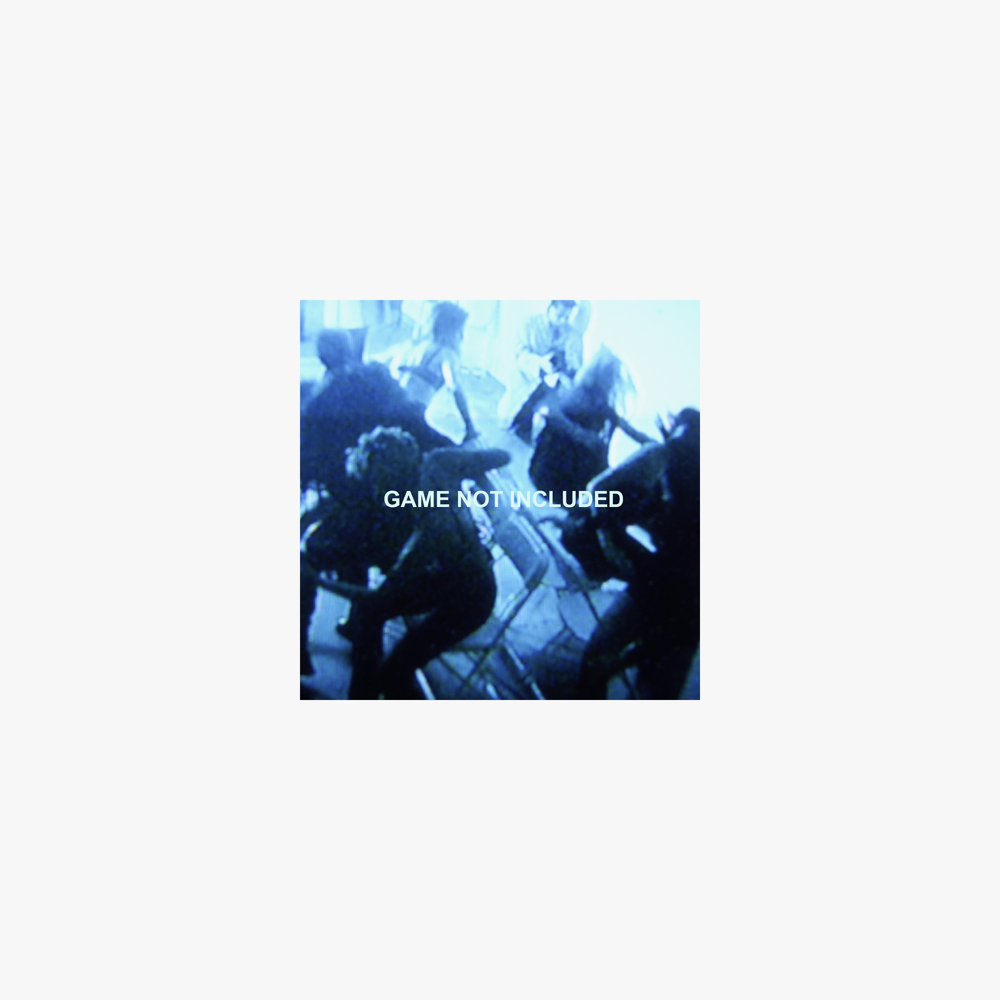

# Musical Chairs Mixtape, Vol. 1

By **ZHU**

## Album Data

- **Catalog:** Beets
- **Format:** Digital, Album
- **Album:** Musical Chairs Mixtape, Vol. 1
- **Artist:** Zhu
- **Albumartist:** ZHU
- **Genre:** Deep House
- **MusicBrainz Album Artist ID:** [eca0569c-877e-4d72-a280-90581c2adfd5](https://musicbrainz.org/artist/eca0569c-877e-4d72-a280-90581c2adfd5)
- **MusicBrainz Album ID:** [769a0401-f633-4b0a-aace-e0df5a777196](https://musicbrainz.org/release/769a0401-f633-4b0a-aace-e0df5a777196)
- **MusicBrainz Release Group ID:** [4fb86da6-193c-4b22-94d3-426c2d271987](https://musicbrainz.org/release-group/4fb86da6-193c-4b22-94d3-426c2d271987)
- **Year:** 2022
- **Catalog #:** ZH008
- **Label:** Mind of a Genius
- **Total Tracks:** 14

## Album Tracks

### Track 03 - Guilty Love

- **Artist:** ZHU
- **Format:** MP3
- **Genre:** Deep House
- **Length:** 4:33
- **MusicBrainz Track ID:** [8ba2e6be-39d5-4d04-8fac-be479fc67e02](https://musicbrainz.org/recording/8ba2e6be-39d5-4d04-8fac-be479fc67e02)
- **Title:** Guilty Love
- **Track:** 03
- **Year:** 2018

### Track 04 - Desert Woman

- **Artist:** ZHU
- **Format:** MP3
- **Genre:** Progressive House
- **Length:** 6:14
- **MusicBrainz Track ID:** [032464aa-daba-49c8-a524-c4faf2392ccf](https://musicbrainz.org/recording/032464aa-daba-49c8-a524-c4faf2392ccf)
- **Title:** Desert Woman
- **Track:** 04
- **Year:** 2018

### Track 05 - Provocateur

- **Artist:** ZHU
- **Format:** MP3
- **Genre:** Deep House
- **Length:** 4:11
- **MusicBrainz Track ID:** [9702f0ac-330f-484b-85c5-6694b6af8d3b](https://musicbrainz.org/recording/9702f0ac-330f-484b-85c5-6694b6af8d3b)
- **Title:** Provocateur
- **Track:** 05
- **Year:** 2018

### Track 08 - Ghost in My Bed

- **Artist:** ZHU
- **Format:** MP3
- **Genre:** Electronic
- **Length:** 4:59
- **MusicBrainz Track ID:** [3bff63a2-278f-427e-a281-ec32fa008eec](https://musicbrainz.org/recording/3bff63a2-278f-427e-a281-ec32fa008eec)
- **Title:** Ghost in My Bed
- **Track:** 08
- **Year:** 2018

### Track 11 - Drowning

- **Artist:** ZHU
- **Format:** MP3
- **Genre:** Electronic
- **Length:** 3:07
- **MusicBrainz Track ID:** [ac9daf7a-4d86-4381-b2ca-89b21ea4c5a7](https://musicbrainz.org/recording/ac9daf7a-4d86-4381-b2ca-89b21ea4c5a7)
- **Title:** Drowning
- **Track:** 11
- **Year:** 2018

### Track 13 - Waters of Monaco

- **Artist:** ZHU
- **Format:** MP3
- **Genre:** Electronic
- **Length:** 5:27
- **MusicBrainz Track ID:** [83453858-5b7c-432b-a951-0f472c24e57b](https://musicbrainz.org/recording/83453858-5b7c-432b-a951-0f472c24e57b)
- **Title:** Waters of Monaco
- **Track:** 13
- **Year:** 2018

### Track 02 - Still Want U

- **Artist:** ZHU & Karnaval Blues
- **Format:** MP3
- **Genre:** Electronic
- **Length:** 3:33
- **MusicBrainz Track ID:** [128ad6d3-80ce-4616-9e07-dd9226886cf5](https://musicbrainz.org/recording/128ad6d3-80ce-4616-9e07-dd9226886cf5)
- **Title:** Still Want U
- **Track:** 02
- **Year:** 2018

### Track 07 - Save Me

- **Artist:** ZHU feat. Herizen
- **Format:** MP3
- **Genre:** Electronic
- **Length:** 4:54
- **MusicBrainz Track ID:** [d3849a39-ea6f-4a4d-84fd-f70055ceacfc](https://musicbrainz.org/recording/d3849a39-ea6f-4a4d-84fd-f70055ceacfc)
- **Title:** Save Me
- **Track:** 07
- **Year:** 2018

### Track 01 - Stormy Love, NM.

- **Artist:** ZHU feat. JOY.
- **Format:** MP3
- **Genre:** Electronic
- **Length:** 3:47
- **MusicBrainz Track ID:** [6a5e466b-d022-40f0-9477-820ac6881e84](https://musicbrainz.org/recording/6a5e466b-d022-40f0-9477-820ac6881e84)
- **Title:** Stormy Love, NM.
- **Track:** 01
- **Year:** 2018

### Track 09 - Love That Hurts

- **Artist:** ZHU feat. Karnaval Blues
- **Format:** MP3
- **Genre:** Electronic
- **Length:** 3:00
- **MusicBrainz Track ID:** [dc7c1e6b-1e13-4f6b-a1c3-91ec9688bb80](https://musicbrainz.org/recording/dc7c1e6b-1e13-4f6b-a1c3-91ec9688bb80)
- **Title:** Love That Hurts
- **Track:** 09
- **Year:** 2018

### Track 06 - Burn Babylon

- **Artist:** ZHU feat. Keznamdi & Daniel Wilson
- **Format:** MP3
- **Genre:** Electronic
- **Length:** 4:07
- **MusicBrainz Track ID:** [c1a91dbc-a848-4850-bc2d-06aa13b0c81f](https://musicbrainz.org/recording/c1a91dbc-a848-4850-bc2d-06aa13b0c81f)
- **Title:** Burn Babylon
- **Track:** 06
- **Year:** 2018

### Track 12 - Coming Home

- **Artist:** ZHU feat. Majid Jordan
- **Format:** MP3
- **Genre:** Electronic
- **Length:** 3:32
- **MusicBrainz Track ID:** [d3822e08-dd53-48bc-8044-9ac9e58bedd1](https://musicbrainz.org/recording/d3822e08-dd53-48bc-8044-9ac9e58bedd1)
- **Title:** Coming Home
- **Track:** 12
- **Year:** 2018

### Track 14 - My Life

- **Artist:** ZHU feat. Tame Impala
- **Format:** MP3
- **Genre:** Electronic
- **Length:** 4:54
- **MusicBrainz Track ID:** [86ba498e-24dd-4606-b29b-eabe77af15a8](https://musicbrainz.org/recording/86ba498e-24dd-4606-b29b-eabe77af15a8)
- **Title:** My Life
- **Track:** 14
- **Year:** 2018

### Track 10 - Light It Up

- **Artist:** ZHU feat. TOKiMONSTA
- **Format:** MP3
- **Genre:** Electronic
- **Length:** 3:18
- **MusicBrainz Track ID:** [13e9f8bc-6f2c-48f9-974a-b153a18ba2c9](https://musicbrainz.org/recording/13e9f8bc-6f2c-48f9-974a-b153a18ba2c9)
- **Title:** Light It Up
- **Track:** 10
- **Year:** 2018

## See also

- [DREAMLAND (DELUXE)](DREAMLAND_DELUXE.md)
- [RINGOS DESERT](RINGOS_DESERT.md)
- [stardustexhalemarrakechdreams](stardustexhalemarrakechdreams.md)
- [Zhudio54 (Remixes)](Zhudio54_Remixes.md)
