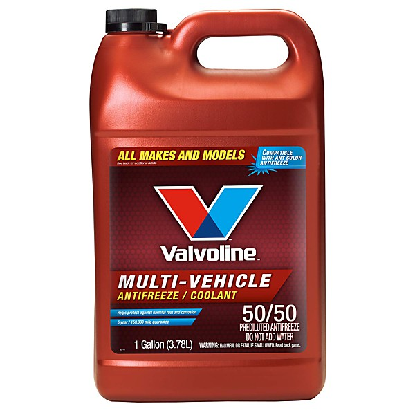

# 2017 Live EP

By **alt-J**

## Album Data

- **Catalog:** Beets
- **Format:** Digital, Album
- **Album:** 2017 Live EP
- **Artist:** Alt-j
- **Albumartist:** alt-J
- **Genre:** Indie Rock
- **MusicBrainz Album Artist ID:** 
- **MusicBrainz Album ID:** 
- **MusicBrainz Release Group ID:** 
- **Year:** 2017
- **Catalog #:** 
- **Label:** 
- **Total Tracks:** 13

## Album Tracks

### Track 05 - Interlude 1

- **Artist:** alt-J
- **Format:** ALAC
- **Genre:** Indie Rock
- **Length:** 1:17
- **MusicBrainz Track ID:** [b4a0f85a-9d2b-420d-9f45-e6a3f8b072c8](https://musicbrainz.org/recording/b4a0f85a-9d2b-420d-9f45-e6a3f8b072c8)
- **Title:** Interlude 1
- **Track:** 05
- **Year:** 2012

### Track 06 - Estocada

- **Artist:** Alt-J
- **Format:** ALAC
- **Genre:** Indie Rock
- **Length:** 3:38
- **MusicBrainz Track ID:** 
- **Title:** Estocada
- **Track:** 06
- **Year:** 2012

### Track 07 - Dissolve Me

- **Artist:** Alt-J
- **Format:** ALAC
- **Genre:** Indie Rock
- **Length:** 3:59
- **MusicBrainz Track ID:** 
- **Title:** Dissolve Me
- **Track:** 07
- **Year:** 2012

### Track 11 - Interlude 3

- **Artist:** Alt-J
- **Format:** ALAC
- **Genre:** Indie Rock
- **Length:** 0:53
- **MusicBrainz Track ID:** 
- **Title:** Interlude 3
- **Track:** 11
- **Year:** 2012

### Track 12 - Blood Flood

- **Artist:** Alt-J
- **Format:** ALAC
- **Genre:** Indie Rock
- **Length:** 4:09
- **MusicBrainz Track ID:** 
- **Title:** Blood Flood
- **Track:** 12
- **Year:** 2012

### Track 13 - Taro / Handmade

- **Artist:** Alt-J
- **Format:** ALAC
- **Genre:** Indie Rock
- **Length:** 12:41
- **MusicBrainz Track ID:** 
- **Title:** Taro / Handmade
- **Track:** 13
- **Year:** 2012

### Track 01 - Intro

- **Artist:** alt‐J
- **Format:** ALAC
- **Genre:** Indie Rock
- **Length:** 2:37
- **MusicBrainz Track ID:** [1915a499-6e16-4fe3-93db-01dca52ce0e6](https://musicbrainz.org/recording/1915a499-6e16-4fe3-93db-01dca52ce0e6)
- **Title:** Intro
- **Track:** 01
- **Year:** 2012

### Track 02 - Interlude 1

- **Artist:** alt‐J
- **Format:** ALAC
- **Genre:** Indie Rock
- **Length:** 1:12
- **MusicBrainz Track ID:** [b4a0f85a-9d2b-420d-9f45-e6a3f8b072c8](https://musicbrainz.org/recording/b4a0f85a-9d2b-420d-9f45-e6a3f8b072c8)
- **Title:** Interlude 1
- **Track:** 02
- **Year:** 2012

### Track 03 - Tessellate

- **Artist:** alt‐J
- **Format:** ALAC
- **Genre:** Trip Hop
- **Length:** 3:02
- **MusicBrainz Track ID:** [8989a145-5c35-444b-ab3d-a663ce13de01](https://musicbrainz.org/recording/8989a145-5c35-444b-ab3d-a663ce13de01)
- **Title:** Tessellate
- **Track:** 03
- **Year:** 2012

### Track 04 - Breezeblocks

- **Artist:** alt‐J
- **Format:** ALAC
- **Genre:** Indie Rock
- **Length:** 3:47
- **MusicBrainz Track ID:** [0a4327d0-44c0-441a-a513-3da87b0f25c1](https://musicbrainz.org/recording/0a4327d0-44c0-441a-a513-3da87b0f25c1)
- **Title:** Breezeblocks
- **Track:** 04
- **Year:** 2012

### Track 08 - Matilda

- **Artist:** alt‐J
- **Format:** ALAC
- **Genre:** Indie Rock
- **Length:** 3:48
- **MusicBrainz Track ID:** [95f54c0d-7650-41d3-b2da-067543846ed1](https://musicbrainz.org/recording/95f54c0d-7650-41d3-b2da-067543846ed1)
- **Title:** Matilda
- **Track:** 08
- **Year:** 2012

### Track 09 - Ms

- **Artist:** alt‐J
- **Format:** ALAC
- **Genre:** Post-Rock
- **Length:** 3:58
- **MusicBrainz Track ID:** [8bc5a878-f15c-4f9d-855a-7bec0f112cbb](https://musicbrainz.org/recording/8bc5a878-f15c-4f9d-855a-7bec0f112cbb)
- **Title:** Ms
- **Track:** 09
- **Year:** 2012

### Track 10 - Fitzpleasure

- **Artist:** alt‐J
- **Format:** ALAC
- **Genre:** Indie Rock
- **Length:** 3:39
- **MusicBrainz Track ID:** [9bde4aef-f6a9-4ec2-a21d-a7be82a7e20c](https://musicbrainz.org/recording/9bde4aef-f6a9-4ec2-a21d-a7be82a7e20c)
- **Title:** Fitzpleasure
- **Track:** 10
- **Year:** 2012

## See also

- [An Awesome Wave](An_Awesome_Wave.md)
- [Relaxer](Relaxer.md)
- [Roon: An Awesome Wave](../../Roon/alt-J/An_Awesome_Wave.md)
- [Roon: Reduxer](../../Roon/alt-J/Reduxer.md)
- [Roon: RELAXER](../../Roon/alt-J/RELAXER.md)
- [Roon: Summer Remix EP](../../Roon/alt-J/Summer_Remix_EP.md)
- [Roon: This Is All Yours](../../Roon/alt-J/This_Is_All_Yours.md)
