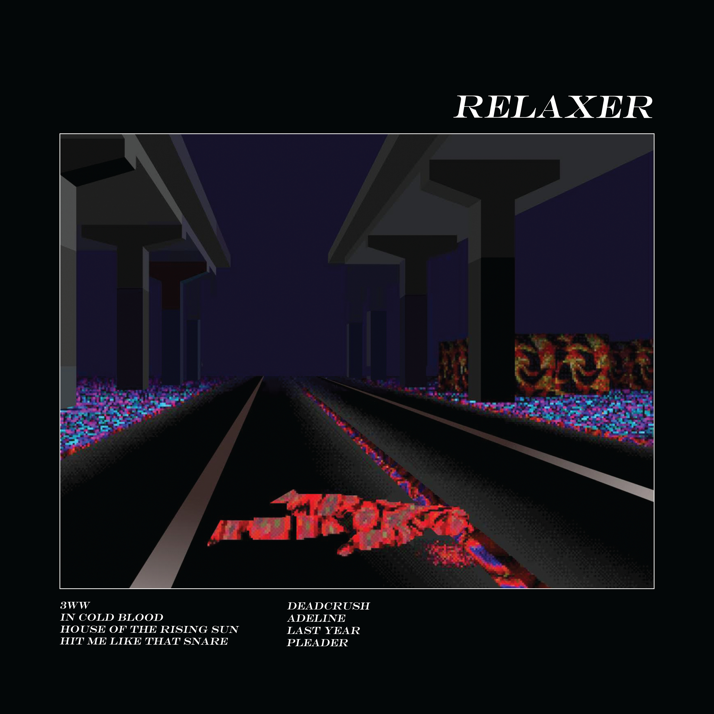

# Relaxer

By **alt-J**

## Album Data

- **Catalog:** Beets
- **Format:** Digital, Album
- **Album:** Relaxer
- **Artist:** Alt-j
- **Albumartist:** alt-J
- **Genre:** Indietronica
- **MusicBrainz Album Artist ID:** [fc7bbf00-fbaa-4736-986b-b3ac0266ca9b](https://musicbrainz.org/artist/fc7bbf00-fbaa-4736-986b-b3ac0266ca9b)
- **MusicBrainz Album ID:** [43b87948-27dd-4719-a6d2-e7ab6619520e](https://musicbrainz.org/release/43b87948-27dd-4719-a6d2-e7ab6619520e)
- **MusicBrainz Release Group ID:** [8a103b36-a632-425f-8980-da934b0c1eb3](https://musicbrainz.org/release-group/8a103b36-a632-425f-8980-da934b0c1eb3)
- **Year:** 2017
- **Catalog #:** 
- **Label:** Infectious Music
- **Total Tracks:** 08

## Album Tracks

### Track 01 - 3WW

- **Artist:** alt-J
- **Format:** MP3
- **Genre:** Soft Rock
- **Length:** 5:00
- **MusicBrainz Track ID:** [4b36572e-11a2-448b-8eb2-c5c9864885a1](https://musicbrainz.org/recording/4b36572e-11a2-448b-8eb2-c5c9864885a1)
- **Title:** 3WW
- **Track:** 01
- **Year:** 2017

### Track 02 - In Cold Blood

- **Artist:** alt-J
- **Format:** MP3
- **Genre:** Indie Rock
- **Length:** 3:26
- **MusicBrainz Track ID:** [0718c87a-a35b-4b8e-9a9e-78e7af6f2ea3](https://musicbrainz.org/recording/0718c87a-a35b-4b8e-9a9e-78e7af6f2ea3)
- **Title:** In Cold Blood
- **Track:** 02
- **Year:** 2017

### Track 03 - House of the Rising Sun

- **Artist:** alt-J
- **Format:** MP3
- **Genre:** Indietronica
- **Length:** 5:20
- **MusicBrainz Track ID:** [0d4cc35e-d785-4e2b-9c5e-419e4d56fdf9](https://musicbrainz.org/recording/0d4cc35e-d785-4e2b-9c5e-419e4d56fdf9)
- **Title:** House of the Rising Sun
- **Track:** 03
- **Year:** 2017

### Track 04 - Hit Me Like That Snare

- **Artist:** alt-J
- **Format:** MP3
- **Genre:** Indietronica
- **Length:** 3:37
- **MusicBrainz Track ID:** [71371c66-a810-46bf-9e9a-af7db7e92bc8](https://musicbrainz.org/recording/71371c66-a810-46bf-9e9a-af7db7e92bc8)
- **Title:** Hit Me Like That Snare
- **Track:** 04
- **Year:** 2017

### Track 05 - Deadcrush

- **Artist:** alt-J
- **Format:** MP3
- **Genre:** Indie Rock
- **Length:** 3:51
- **MusicBrainz Track ID:** [c1e442de-f415-4600-9a6c-9bcf50cf1251](https://musicbrainz.org/recording/c1e442de-f415-4600-9a6c-9bcf50cf1251)
- **Title:** Deadcrush
- **Track:** 05
- **Year:** 2017

### Track 06 - Adeline

- **Artist:** alt-J
- **Format:** MP3
- **Genre:** Ambient
- **Length:** 5:50
- **MusicBrainz Track ID:** [2a5cf3bd-8416-4bb0-858c-d1bb438bf8ac](https://musicbrainz.org/recording/2a5cf3bd-8416-4bb0-858c-d1bb438bf8ac)
- **Title:** Adeline
- **Track:** 06
- **Year:** 2017

### Track 07 - Last Year

- **Artist:** alt-J
- **Format:** MP3
- **Genre:** Indietronica
- **Length:** 6:06
- **MusicBrainz Track ID:** [fb31cb75-bb39-49fd-a17f-a4288e01177d](https://musicbrainz.org/recording/fb31cb75-bb39-49fd-a17f-a4288e01177d)
- **Title:** Last Year
- **Track:** 07
- **Year:** 2017

### Track 08 - Pleader

- **Artist:** alt-J
- **Format:** MP3
- **Genre:** Indietronica
- **Length:** 5:48
- **MusicBrainz Track ID:** [8c991ae6-ffd7-4802-8d12-6247facc9658](https://musicbrainz.org/recording/8c991ae6-ffd7-4802-8d12-6247facc9658)
- **Title:** Pleader
- **Track:** 08
- **Year:** 2017

## See also

- [2017 Live EP](2017_Live_EP.md)
- [An Awesome Wave](An_Awesome_Wave.md)
- [Roon: An Awesome Wave](../../Roon/alt-J/An_Awesome_Wave.md)
- [Roon: Reduxer](../../Roon/alt-J/Reduxer.md)
- [Roon: RELAXER](../../Roon/alt-J/RELAXER.md)
- [Roon: Summer Remix EP](../../Roon/alt-J/Summer_Remix_EP.md)
- [Roon: This Is All Yours](../../Roon/alt-J/This_Is_All_Yours.md)
