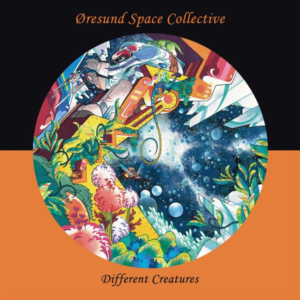

# Different Creatures

By **Øresund Space Collective**

## Album Data

- **Catalog:** Beets
- **Format:** Digital, Album
- **Album:** Different Creatures
- **Artist:** Øresund Space Collective
- **Albumartist:** Øresund Space Collective
- **Genre:** Stoner Rock
- **MusicBrainz Album Artist ID:** [fbddfba4-57fd-404d-ba8d-cfba58e545b9](https://musicbrainz.org/artist/fbddfba4-57fd-404d-ba8d-cfba58e545b9)
- **MusicBrainz Album ID:** [193cb591-32ed-4910-b38c-3e107671e91f](https://musicbrainz.org/release/193cb591-32ed-4910-b38c-3e107671e91f)
- **MusicBrainz Release Group ID:** [ba866adc-43af-4cf6-8205-9b3abe4504f4](https://musicbrainz.org/release-group/ba866adc-43af-4cf6-8205-9b3abe4504f4)
- **Year:** 2015
- **Catalog #:** SRP030
- **Label:** Space Rock Productions
- **Total Tracks:** 07

## Album Tracks

### Track 01 - Ride to Valhalla

- **Artist:** Øresund Space Collective
- **Format:** ALAC
- **Genre:** Stoner Rock
- **Length:** 19:35
- **MusicBrainz Track ID:** [f5190ffb-e3e9-4831-a6d6-1bf4fae09bd5](https://musicbrainz.org/recording/f5190ffb-e3e9-4831-a6d6-1bf4fae09bd5)
- **Title:** Ride to Valhalla
- **Track:** 01
- **Year:** 2015

### Track 02 - Juggle the Juice

- **Artist:** Øresund Space Collective
- **Format:** ALAC
- **Genre:** Electronic
- **Length:** 3:48
- **MusicBrainz Track ID:** [eb6fce6a-f706-40ba-a41d-1f1a7659e658](https://musicbrainz.org/recording/eb6fce6a-f706-40ba-a41d-1f1a7659e658)
- **Title:** Juggle the Juice
- **Track:** 02
- **Year:** 2015

### Track 03 - Digestive Raga

- **Artist:** Øresund Space Collective
- **Format:** ALAC
- **Genre:** Stoner Rock
- **Length:** 30:02
- **MusicBrainz Track ID:** [ad985c37-4f00-4044-a74c-fa52949e0a2f](https://musicbrainz.org/recording/ad985c37-4f00-4044-a74c-fa52949e0a2f)
- **Title:** Digestive Raga
- **Track:** 03
- **Year:** 2015

### Track 04 - The Man From Wales

- **Artist:** Øresund Space Collective
- **Format:** ALAC
- **Genre:** Stoner Rock
- **Length:** 13:23
- **MusicBrainz Track ID:** [ae06fcf1-6232-4ceb-8e1a-4ba183a186dd](https://musicbrainz.org/recording/ae06fcf1-6232-4ceb-8e1a-4ba183a186dd)
- **Title:** The Man From Wales
- **Track:** 04
- **Year:** 2015

### Track 05 - Bon voyage

- **Artist:** Øresund Space Collective
- **Format:** ALAC
- **Genre:** Stoner Rock
- **Length:** 6:11
- **MusicBrainz Track ID:** [0b015fcf-d5c5-40f4-bf44-37a7a9d323b6](https://musicbrainz.org/recording/0b015fcf-d5c5-40f4-bf44-37a7a9d323b6)
- **Title:** Bon voyage
- **Track:** 05
- **Year:** 2015

### Track 06 - Raga for Jerry G

- **Artist:** Øresund Space Collective
- **Format:** ALAC
- **Genre:** Stoner Rock
- **Length:** 20:10
- **MusicBrainz Track ID:** [1aafaea5-fdab-4966-a847-b5e296951b62](https://musicbrainz.org/recording/1aafaea5-fdab-4966-a847-b5e296951b62)
- **Title:** Raga for Jerry G
- **Track:** 06
- **Year:** 2015

### Track 07 - 20 Steps Towards the Invisible Door

- **Artist:** Øresund Space Collective
- **Format:** ALAC
- **Genre:** Stoner Rock
- **Length:** 45:13
- **MusicBrainz Track ID:** [a95afe54-dfda-4e0a-8a06-e5757a2defb9](https://musicbrainz.org/recording/a95afe54-dfda-4e0a-8a06-e5757a2defb9)
- **Title:** 20 Steps Towards the Invisible Door
- **Track:** 07
- **Year:** 2015

