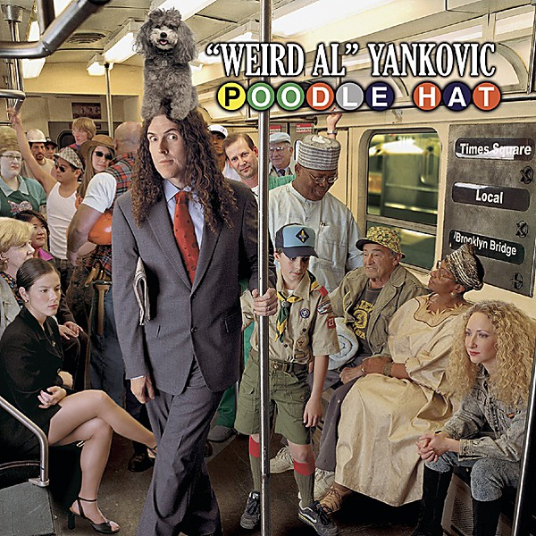

# Poodle Hat

By **“Weird Al” Yankovic**

## Album Data

- **Catalog:** Beets
- **Format:** Digital, Album
- **Album:** Poodle Hat
- **Artist:** “weird Al” Yankovic
- **Albumartist:** “Weird Al” Yankovic
- **Genre:** Comedy
- **MusicBrainz Album Artist ID:** [7746d775-9550-4360-b8d5-c37bd448ce01](https://musicbrainz.org/artist/7746d775-9550-4360-b8d5-c37bd448ce01)
- **MusicBrainz Album ID:** [e6448e12-c5df-48d7-b0fd-1c632c08cfc3](https://musicbrainz.org/release/e6448e12-c5df-48d7-b0fd-1c632c08cfc3)
- **MusicBrainz Release Group ID:** [b89956ff-8ad4-3a21-b8b8-c3c064530855](https://musicbrainz.org/release-group/b89956ff-8ad4-3a21-b8b8-c3c064530855)
- **Year:** 2003
- **Catalog #:** 
- **Label:** Volcano Records
- **Total Tracks:** 12

## Album Tracks

### Track 01 - The Saga Begins

- **Artist:** “Weird Al” Yankovic
- **Format:** MP3
- **Genre:** Humor
- **Length:** 5:28
- **MusicBrainz Track ID:** [66c86643-4c21-41db-bd41-cf08891af69a](https://musicbrainz.org/recording/66c86643-4c21-41db-bd41-cf08891af69a)
- **Title:** The Saga Begins
- **Track:** 01
- **Year:** 2017

### Track 02 - My Baby’s in Love With Eddie Vedder

- **Artist:** “Weird Al” Yankovic
- **Format:** MP3
- **Genre:** Pop
- **Length:** 3:26
- **MusicBrainz Track ID:** [56bc3840-7841-4374-b6db-cc1deae625e5](https://musicbrainz.org/recording/56bc3840-7841-4374-b6db-cc1deae625e5)
- **Title:** My Baby’s in Love With Eddie Vedder
- **Track:** 02
- **Year:** 2017

### Track 03 - Pretty Fly for a Rabbi

- **Artist:** “Weird Al” Yankovic
- **Format:** MP3
- **Genre:** Humor
- **Length:** 3:02
- **MusicBrainz Track ID:** [5a4b6a30-16ed-41c2-8b98-9b181cfb7010](https://musicbrainz.org/recording/5a4b6a30-16ed-41c2-8b98-9b181cfb7010)
- **Title:** Pretty Fly for a Rabbi
- **Track:** 03
- **Year:** 2017

### Track 04 - The Weird Al Show Theme

- **Artist:** “Weird Al” Yankovic
- **Format:** MP3
- **Genre:** Indie Pop
- **Length:** 1:13
- **MusicBrainz Track ID:** [55b1e7f3-e94c-4cd8-86e9-d940e18d4334](https://musicbrainz.org/recording/55b1e7f3-e94c-4cd8-86e9-d940e18d4334)
- **Title:** The Weird Al Show Theme
- **Track:** 04
- **Year:** 2017

### Track 05 - Jerry Springer

- **Artist:** “Weird Al” Yankovic
- **Format:** MP3
- **Genre:** Indie Pop
- **Length:** 2:46
- **MusicBrainz Track ID:** [8b2a841d-34a6-4397-9231-11eeefdf65f4](https://musicbrainz.org/recording/8b2a841d-34a6-4397-9231-11eeefdf65f4)
- **Title:** Jerry Springer
- **Track:** 05
- **Year:** 2017

### Track 06 - Germs

- **Artist:** “Weird Al” Yankovic
- **Format:** MP3
- **Genre:** Rock
- **Length:** 4:38
- **MusicBrainz Track ID:** [a3283062-d486-40a2-9057-3a5991873401](https://musicbrainz.org/recording/a3283062-d486-40a2-9057-3a5991873401)
- **Title:** Germs
- **Track:** 06
- **Year:** 2017

### Track 07 - Polka Power!

- **Artist:** “Weird Al” Yankovic
- **Format:** MP3
- **Genre:** Humor
- **Length:** 4:21
- **MusicBrainz Track ID:** [7636ed01-32b3-47f1-ab5e-ca4d50f5df17](https://musicbrainz.org/recording/7636ed01-32b3-47f1-ab5e-ca4d50f5df17)
- **Title:** Polka Power!
- **Track:** 07
- **Year:** 2017

### Track 08 - Your Horoscope for Today

- **Artist:** “Weird Al” Yankovic
- **Format:** MP3
- **Genre:** Ska
- **Length:** 3:58
- **MusicBrainz Track ID:** [ff2c95f7-03ac-496f-89a6-252ba432287b](https://musicbrainz.org/recording/ff2c95f7-03ac-496f-89a6-252ba432287b)
- **Title:** Your Horoscope for Today
- **Track:** 08
- **Year:** 2017

### Track 09 - It’s All About the Pentiums

- **Artist:** “Weird Al” Yankovic
- **Format:** MP3
- **Genre:** Pop
- **Length:** 3:34
- **MusicBrainz Track ID:** [23c36878-0ffd-4fc4-b52e-00104bf3b0d7](https://musicbrainz.org/recording/23c36878-0ffd-4fc4-b52e-00104bf3b0d7)
- **Title:** It’s All About the Pentiums
- **Track:** 09
- **Year:** 2017

### Track 10 - Truck Drivin’ Song

- **Artist:** “Weird Al” Yankovic
- **Format:** MP3
- **Genre:** Pop
- **Length:** 2:27
- **MusicBrainz Track ID:** [a7418dab-7283-4aaf-a984-a067bf8c4fd6](https://musicbrainz.org/recording/a7418dab-7283-4aaf-a984-a067bf8c4fd6)
- **Title:** Truck Drivin’ Song
- **Track:** 10
- **Year:** 2017

### Track 11 - Grapefruit Diet

- **Artist:** “Weird Al” Yankovic
- **Format:** MP3
- **Genre:** Swing
- **Length:** 3:30
- **MusicBrainz Track ID:** [9af59051-d57c-4bfa-a4c0-09a3e07a7839](https://musicbrainz.org/recording/9af59051-d57c-4bfa-a4c0-09a3e07a7839)
- **Title:** Grapefruit Diet
- **Track:** 11
- **Year:** 2017

### Track 12 - Albuquerque

- **Artist:** “Weird Al” Yankovic
- **Format:** MP3
- **Genre:** Comedy Rock
- **Length:** 11:22
- **MusicBrainz Track ID:** [3f2ea3f9-ed83-4b5a-bf54-0779a19495f1](https://musicbrainz.org/recording/3f2ea3f9-ed83-4b5a-bf54-0779a19495f1)
- **Title:** Albuquerque
- **Track:** 12
- **Year:** 2017

## See also

- [Dare to Be Stupid](Dare_to_Be_Stupid.md)
- [Running With Scissors](Running_With_Scissors.md)
