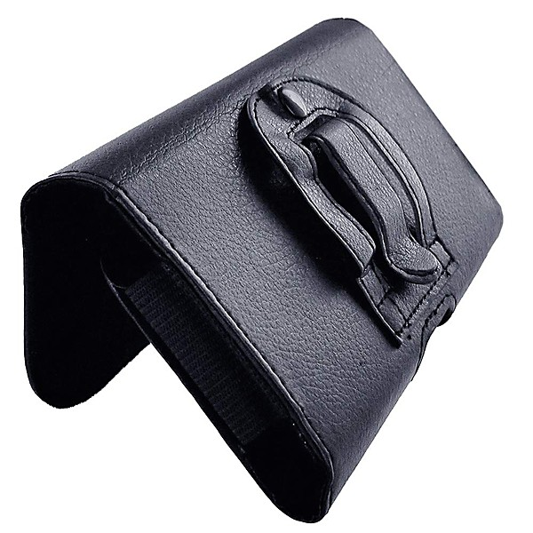

# 恍惚の世界 (you, baby)

By **池玲子 (Ike Reiko)**

## Album Data

- **Catalog:** Beets
- **Format:** Digital, Album
- **Album:** 恍惚の世界 (you, baby)
- **Artist:** 池玲子 (ike Reiko)
- **Albumartist:** 池玲子 (Ike Reiko)
- **Genre:** Pop
- **MusicBrainz Album Artist ID:** 
- **MusicBrainz Album ID:** 
- **MusicBrainz Release Group ID:** 
- **Year:** 2017
- **Catalog #:** 
- **Label:** 
- **Total Tracks:** 12

## Album Tracks

### Track 01 - 女はそれをがまんできない (The Woman Cannot Help It)

- **Artist:** 池玲子 (Ike Reiko)
- **Format:** ALAC
- **Genre:** Pop
- **Length:** 3:19
- **MusicBrainz Track ID:** 
- **Title:** 女はそれをがまんできない (The Woman Cannot Help It)
- **Track:** 01
- **Year:** 2017

### Track 02 - よこはま たそがれ (It Is This Twilight)

- **Artist:** 池玲子 (Ike Reiko)
- **Format:** ALAC
- **Genre:** Pop
- **Length:** 2:45
- **MusicBrainz Track ID:** 
- **Title:** よこはま たそがれ (It Is This Twilight)
- **Track:** 02
- **Year:** 2017

### Track 03 - めまい (Vertigo)

- **Artist:** 池玲子 (Ike Reiko)
- **Format:** ALAC
- **Genre:** Pop
- **Length:** 2:35
- **MusicBrainz Track ID:** 
- **Title:** めまい (Vertigo)
- **Track:** 03
- **Year:** 2017

### Track 04 - 雨がやんだら (It Stops The Rain)

- **Artist:** 池玲子 (Ike Reiko)
- **Format:** ALAC
- **Genre:** Pop
- **Length:** 3:02
- **MusicBrainz Track ID:** 
- **Title:** 雨がやんだら (It Stops The Rain)
- **Track:** 04
- **Year:** 2017

### Track 05 - 夜明けのスキャット (Dawn Scat)

- **Artist:** 池玲子 (Ike Reiko)
- **Format:** ALAC
- **Genre:** Pop
- **Length:** 3:02
- **MusicBrainz Track ID:** 
- **Title:** 夜明けのスキャット (Dawn Scat)
- **Track:** 05
- **Year:** 2017

### Track 06 - さすらいのギター (Wandering Guitar)

- **Artist:** 池玲子 (Ike Reiko)
- **Format:** ALAC
- **Genre:** Pop
- **Length:** 2:39
- **MusicBrainz Track ID:** 
- **Title:** さすらいのギター (Wandering Guitar)
- **Track:** 06
- **Year:** 2017

### Track 07 - 私という女 (I'm A Woman Named)

- **Artist:** 池玲子 (Ike Reiko)
- **Format:** ALAC
- **Genre:** Pop
- **Length:** 3:08
- **MusicBrainz Track ID:** 
- **Title:** 私という女 (I'm A Woman Named)
- **Track:** 07
- **Year:** 2017

### Track 08 - 雨の日のブルース (Rainy Day Blues)

- **Artist:** 池玲子 (Ike Reiko)
- **Format:** ALAC
- **Genre:** Pop
- **Length:** 2:38
- **MusicBrainz Track ID:** 
- **Title:** 雨の日のブルース (Rainy Day Blues)
- **Track:** 08
- **Year:** 2017

### Track 09 - 恋の奴隷 (Love Slave)

- **Artist:** 池玲子 (Ike Reiko)
- **Format:** ALAC
- **Genre:** Pop
- **Length:** 2:54
- **MusicBrainz Track ID:** 
- **Title:** 恋の奴隷 (Love Slave)
- **Track:** 09
- **Year:** 2017

### Track 10 - 経験 (Experience)

- **Artist:** 池玲子 (Ike Reiko)
- **Format:** ALAC
- **Genre:** Pop
- **Length:** 2:43
- **MusicBrainz Track ID:** 
- **Title:** 経験 (Experience)
- **Track:** 10
- **Year:** 2017

### Track 11 - 天使になれない (Angel)

- **Artist:** 池玲子 (Ike Reiko)
- **Format:** ALAC
- **Genre:** Pop
- **Length:** 2:47
- **MusicBrainz Track ID:** 
- **Title:** 天使になれない (Angel)
- **Track:** 11
- **Year:** 2017

### Track 12 - 愛のきずな (Chords Of Love)

- **Artist:** 池玲子 (Ike Reiko)
- **Format:** ALAC
- **Genre:** Pop
- **Length:** 3:20
- **MusicBrainz Track ID:** 
- **Title:** 愛のきずな (Chords Of Love)
- **Track:** 12
- **Year:** 2017

