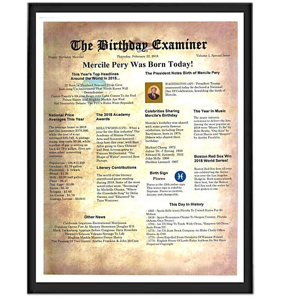

# Tales From The Brothers Gibb / A History In Song ( 1967-1990 ) (Disc 1)

By Bee Gees

## Album Data

- Catalog #: 843 911-2
- Label: Polydor
- Format: CD
- Tracks: 16
- Released: 
- Discs: 1
- Box Set: 
- Length: 1:07:06
- Genre: 60s | 70s | 80s | Australian Pop | Disco | Movie Songs | Pop | Rock | Soft Rock
- Songwriter: 
- Producer: 
- Musician: 

## See also

- ["Tales From The Brothers Gibb, A History In Song 1967 -1990, Disc 4of4"](Tales_From_The_Brothers_Gibb__A_History_In_Song_1967_-1990__Disc_4of4.md)
- [Tales From The Brothers Gibb Cd 2](Tales_From_The_Brothers_Gibb_Cd_2.md)
- [Tales From The Brothers Gibb Disc 1](Tales_From_The_Brothers_Gibb_Disc_1.md)
