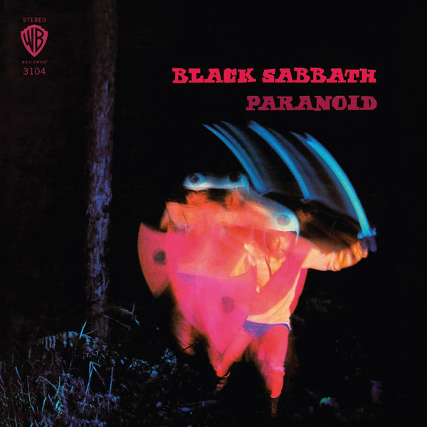

# Paranoid - 1987

By Black Sabbath

## Album Data

- Catalog #: 3104-2
- Label: Warner Bros. Records Inc.
- Format: CD
- Tracks: 8
- Released: 
- Discs: 1
- Box Set: 
- Length: 42:06
- Genre: Heavy Metal | Rock | Rock: Heavy Metal
- Songwriter: 
- Producer: 
- Musician: 

## See also

- 
- [Beets: Black Sabbath](../../Beets/Black_Sabbath/Black_Sabbath.md)
- [Beets: Dazed and Confused Soundtrack](../../Beets/Black_Sabbath/Dazed_and_Confused_Soundtrack.md)
- [Beets: Master of Reality](../../Beets/Black_Sabbath/Master_of_Reality.md)
- [Beets: Masters of Reality](../../Beets/Black_Sabbath/Masters_of_Reality.md)
- [Beets: We Sold Our Soul For Rock 'N' Roll](../../Beets/Black_Sabbath/We_Sold_Our_Soul_For_Rock_N_Roll.md)
- [Roon: Black Sabbath (2014 Remaster)](../../Roon/Black_Sabbath/Black_Sabbath_2014_Remaster.md)
- [Roon: Master of Reality (2014 Remaster)](../../Roon/Black_Sabbath/Master_of_Reality_2014_Remaster.md)
- [Roon: Paranoid (2014 Remaster)](../../Roon/Black_Sabbath/Paranoid_2014_Remaster.md)
- [Roon: Sabbath Bloody Sabbath (2014 Remaster)](../../Roon/Black_Sabbath/Sabbath_Bloody_Sabbath_2014_Remaster.md)
- [Roon: The Ultimate Collection (2016 Remaster)](../../Roon/Black_Sabbath/The_Ultimate_Collection_2016_Remaster.md)
- [Roon: Vol. 4 (2021 Remaster)](../../Roon/Black_Sabbath/Vol_4_2021_Remaster.md)
- [Vinyl: ](../../Vinyl/Black_Sabbath/Black_Sabbath_index.md)
- [Vinyl: Black Sabbath](../../Vinyl/Black_Sabbath/Black_Sabbath.md)
- [Vinyl: Master Of Reality](../../Vinyl/Black_Sabbath/Master_Of_Reality.md)
- [Vinyl: Paranoid](../../Vinyl/Black_Sabbath/Paranoid.md)
