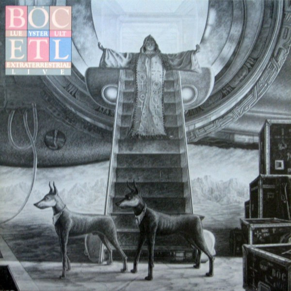

# Extraterrestrial Live

By Blue Öyster Cult

## Album Data

- Catalog #: 82796 96408 2
- Label: Columbia
- Format: CD
- Tracks: 13
- Released: 
- Discs: 1
- Box Set: 
- Length: 1:17:43
- Genre: Hard Rock | Rock
- Songwriter: 
- Producer: 
- Musician: 

## See also

- [Agents Of Fortune](Agents_Of_Fortune.md)
- [Blue Öyster Cult](Blue_Öyster_Cult.md)
- [Club Ninja](Club_Ninja.md)
- [Imaginos](Imaginos.md)
- [Radios Appear](Radios_Appear-_The_Best_Of_Broadcasts.md)
- [Rarities](Rarities.md)
- [Secret Treaties](Secret_Treaties.md)
- [Some Enchanted Evening](Some_Enchanted_Evening.md)
- [Spectres](Spectres.md)
- [The Columbia Albums Collection (Disc 10)](The_Columbia_Albums_Collection_Disc_10.md)
- [The Columbia Albums Collection (Disc 12)](The_Columbia_Albums_Collection_Disc_12.md)
- [The Columbia Albums Collection (Disc 4)](The_Columbia_Albums_Collection_Disc_4.md)
- [The Columbia Albums Collection (Disc 8)](The_Columbia_Albums_Collection_Disc_8.md)
- [The Columbia Albums Collection (Disc 9)](The_Columbia_Albums_Collection_Disc_9.md)
- [Tyranny & Mutation](Tyranny_and_Mutation.md)
