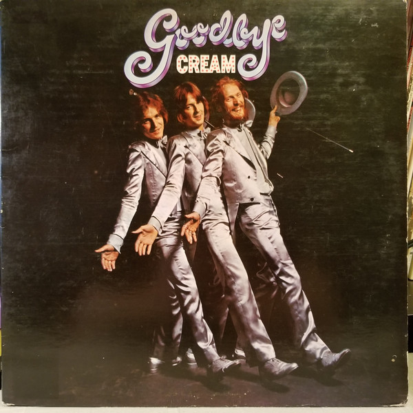

# Goodbye [1998 Re-Master]

By Cream

## Album Data

- Catalog #: 531815-2
- Label: Polydor International Music B.V.
- Format: CD
- Tracks: 6
- Released: 
- Discs: 1
- Box Set: 
- Length: 30:39
- Genre: Blues / rock | Blues-Rock | Classic Rock | Rock
- Songwriter: 
- Producer: 
- Musician: 

## See also

- 
- [Beets: Disraeli Gears](../../Beets/Cream/Disraeli_Gears.md)
- [Beets: Fresh Cream](../../Beets/Cream/Fresh_Cream.md)
- [Beets: Goodbye](../../Beets/Cream/Goodbye.md)
- [Beets: Wheels of Fire](../../Beets/Cream/Wheels_of_Fire.md)
- [Roon: Disraeli Gears](../../Roon/Cream/Disraeli_Gears.md)
- [Roon: Wheels Of Fire](../../Roon/Cream/Wheels_Of_Fire.md)
- [Vinyl: ](../../Vinyl/Cream/Cream.md)
- [Vinyl: Disraeli Gears](../../Vinyl/Cream/Disraeli_Gears.md)
- [Vinyl: Wheels Of Fire](../../Vinyl/Cream/Wheels_Of_Fire.md)
