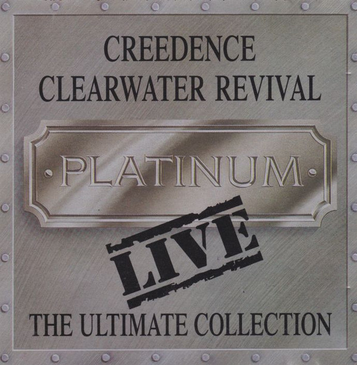

# Ultimate ( Greatest Hits & All-Time Classics ) (Disc 2)

By Creedence Clearwater Revival

## Album Data

- Catalog #: 0888072341623
- Label: Fantasy / Concord Music Group, Inc. / Universal Music Group International
- Format: CD
- Tracks: 20
- Released: 
- Discs: 1
- Box Set: 
- Length: 1:11:38
- Genre: 60s | 70s | American Rock | Classic Rock | Oldies
- Songwriter: 
- Producer: 
- Musician: 

## See also

- [Ultimate ( Greatest Hits & All-Time Classics ) (Disc 1)](Ultimate__Greatest_Hits_and_All-Time_Classics__Disc_1.md)
