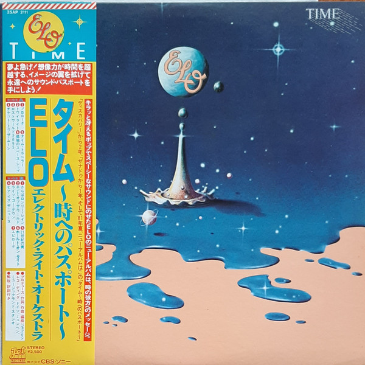

# Time

By Electric Light Orchestra

## Album Data

- Catalog #: EPC 501906 2
- Label: Sony/EMI/Epic/Legacy
- Format: CD
- Tracks: 16
- Released: 
- Discs: 1
- Box Set: 
- Length: 54:27
- Genre: Pop | Pop Rock | Pop/Rock | Progressive Rock | Rock | Soft Rock
- Songwriter: 
- Producer: 
- Musician: 

## See also

- [A New World Record](A_New_World_Record.md)
- [Balance Of Power](Balance_Of_Power.md)
- [Discovery](Discovery.md)
- [Eldorado](Eldorado.md)
- [Elo Ii](Elo_Ii.md)
- [Face The Music](Face_The_Music.md)
- [No Answer](No_Answer.md)
- [On The Third Day](On_The_Third_Day.md)
- [Out Of The Blue](Out_Of_The_Blue.md)
- [Secret Messages](Secret_Messages.md)
- [Alone In The Universe](../Jeff_Lynne/Alone_In_The_Universe.md)
