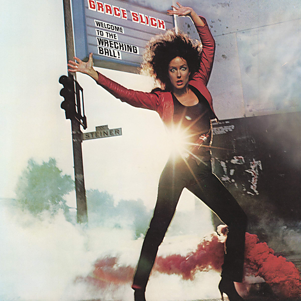

# Welcome To The Wrecking Ball!/Software (Two Lp's On One Cd)

By Grace Slick

## Album Data

- Catalog #: PIPCD 029
- Label: BGO Records (UK IMPORT CD)
- Format: CD
- Tracks: 19
- Released: 
- Discs: 1
- Box Set: 
- Length: 1:15:46
- Genre: 80's Pop/Rock | Female Vocal | Psychedelic Rock | Rock
- Songwriter: 
- Producer: 
- Musician: 

## See also

- [Dreams](Dreams.md)
- [Manhole](Manhole.md)
- [After Bathing At Baxter's](../Jefferson_Airplane/After_Bathing_At_Baxters.md)
- [Bark](../Jefferson_Airplane/Bark.md)
- [Early Flight Thirty Seconds Over Winterland](../Jefferson_Airplane/Early_Flight_Thirty_Seconds_Over_Winterland.md)
- [Long John Silver](../Jefferson_Airplane/Long_John_Silver.md)
- [Original Album Classics (Disc 1)](../Jefferson_Airplane/Original_Album_Classics_Disc_1.md)
- [Baron Von Tollbooth and the Chrome Nun](../Paul_Kantner_and_Grace_Slick/Baron_Von_Tollbooth_and_The_Chrome_Nun.md)
- [Sunfighter](../Paul_Kantner_and_Grace_Slick/Sunfighter.md)
