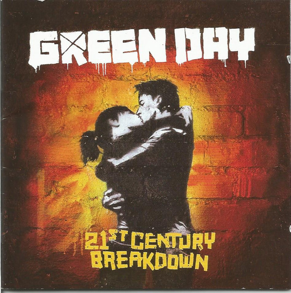

# 21st Century Breakdown

By Green Day

## Album Data

- Catalog #: 356
- Label: Warner/Reprise
- Format: CD
- Tracks: 18
- Released: 
- Discs: 1
- Box Set: 
- Length: 1:09:09
- Genre: Adult Alternative Pop/Rock | Alternative Pop/Rock | Alternative Rock | Pop Punk | Pop-Punk | Punk | Punk Revival | Punk Rock | Punk-Pop | Rock
- Songwriter: 
- Producer: 
- Musician: 

## See also

- 
- [Beets: 21st Century Breakdown (Amazon MP3 Exclusive) [Explicit]](../../Beets/Green_Day/21st_Century_Breakdown_Amazon_MP3_Exclusive_[Explicit].md)
- [Beets: 21st Century Breakdown](../../Beets/Green_Day/21st_Century_Breakdown.md)
- [Beets: American Idiot](../../Beets/Green_Day/American_Idiot.md)
- [Beets: Dookie](../../Beets/Green_Day/Dookie.md)
- [Beets: Revolution Radio](../../Beets/Green_Day/Revolution_Radio.md)
- [Roon: 21st Century Breakdown (Édition Studio Masters)](../../Roon/Green_Day/21st_Century_Breakdown_Édition_Studio_Masters.md)
- [Roon: American Idiot](../../Roon/Green_Day/American_Idiot.md)
- [Roon: Revolution Radio](../../Roon/Green_Day/Revolution_Radio.md)
- [Vinyl: American Idiot](../../Vinyl/Green_Day/American_Idiot.md)
- [Vinyl: ](../../Vinyl/Green_Day/Green_Day.md)
- [Vinyl: Revolution Radio](../../Vinyl/Green_Day/Revolution_Radio.md)
