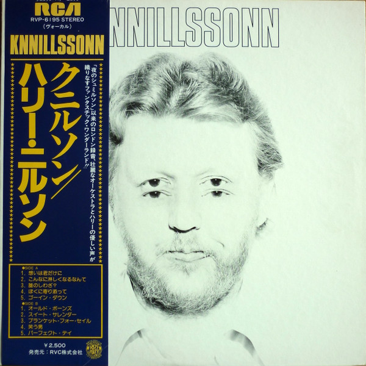

# Knnillsson

By Harry Nilsson

## Album Data

- Catalog #: 88697915502-14
- Label: RCA Legacy
- Format: CD
- Tracks: 16
- Released: 
- Discs: 1
- Box Set: 
- Length: 59:56
- Genre: Popular
- Songwriter: 
- Producer: 
- Musician: 

## See also

- [Aerial Ballet](Aerial_Ballet.md)
- [Aerial Pandemonium Ballet](Aerial_Pandemonium_Ballet.md)
- [A Little Touch Of Schmilsson In The Night](A_Little_Touch_Of_Schmilsson_In_The_Night.md)
- [Duit On Mon Dei](Duit_On_Mon_Dei.md)
- [Harry](Harry.md)
- [Nilsson Schmilsson](Nilsson_Schmilsson.md)
- [Nilsson Sessions 1967-1968](Nilsson_Sessions_1967-1968.md)
- [Nilsson Sessions 1968-1971](Nilsson_Sessions_1968-1971.md)
- [Nilsson Sessions 1971-1974](Nilsson_Sessions_1971-1974.md)
- [Pandemonium Shadow Show](Pandemonium_Shadow_Show.md)
- [Pussy Cats](Pussy_Cats.md)
- [Sandman](Sandman.md)
- [Son Of Schmilsson](Son_Of_Schmilsson.md)
- [...That's The Way It Is](Thats_The_Way_It_Is.md)
- [The Point!](The_Point!.md)
- [Nilsson Sings Newman (Remastered + Expanded)](Nilsson_Sings_Newman_Remastered_+_Expanded.md)
