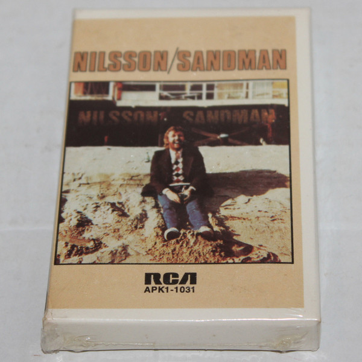

# Sandman

By Harry Nilsson

## Album Data

- Catalog #: 88697915502-12
- Label: RCA Legacy
- Format: CD
- Tracks: 10
- Released: 
- Discs: 1
- Box Set: 
- Length: 39:44
- Genre: Popular
- Songwriter: 
- Producer: 
- Musician: 

## See also

- [Aerial Ballet](Aerial_Ballet.md)
- [Aerial Pandemonium Ballet](Aerial_Pandemonium_Ballet.md)
- [A Little Touch Of Schmilsson In The Night](A_Little_Touch_Of_Schmilsson_In_The_Night.md)
- [Duit On Mon Dei](Duit_On_Mon_Dei.md)
- [Harry](Harry.md)
- [Knnillsson](Knnillsson.md)
- [Nilsson Schmilsson](Nilsson_Schmilsson.md)
- [Nilsson Sessions 1967-1968](Nilsson_Sessions_1967-1968.md)
- [Nilsson Sessions 1968-1971](Nilsson_Sessions_1968-1971.md)
- [Nilsson Sessions 1971-1974](Nilsson_Sessions_1971-1974.md)
- [Pandemonium Shadow Show](Pandemonium_Shadow_Show.md)
- [Pussy Cats](Pussy_Cats.md)
- [Son Of Schmilsson](Son_Of_Schmilsson.md)
- [...That's The Way It Is](Thats_The_Way_It_Is.md)
- [The Point!](The_Point!.md)
- [Nilsson Sings Newman (Remastered + Expanded)](Nilsson_Sings_Newman_Remastered_+_Expanded.md)
- [Beets: Aerial Ballet [stereo - mono]](../../Beets/Harry_Nilsson/Aerial_Ballet_[stereo_-_mono].md)
- [Beets: Aerial Pandemonium Ballet](../../Beets/Harry_Nilsson/Aerial_Pandemonium_Ballet.md)
- [Beets: A Little Touch Of Schmilsson In The Night](../../Beets/Harry_Nilsson/A_Little_Touch_Of_Schmilsson_In_The_Night.md)
- [Beets: Duit on Mon Dei](../../Beets/Harry_Nilsson/Duit_on_Mon_Dei.md)
- [Beets: Flash Harry](../../Beets/Harry_Nilsson/Flash_Harry.md)
- [Beets: Harry](../../Beets/Harry_Nilsson/Harry.md)
- [Beets: Harry Nilsson - Anthology - Personal Best - CD1](../../Beets/Harry_Nilsson/Harry_Nilsson_-_Anthology_-_Personal_Best_-_CD1.md)
- [Beets: KNNILLSSONN](../../Beets/Harry_Nilsson/KNNILLSSONN.md)
- [Beets: Nilsson Schmilsson](../../Beets/Harry_Nilsson/Nilsson_Schmilsson.md)
- [Beets: Nilsson Sessions 1967–1968](../../Beets/Harry_Nilsson/Nilsson_Sessions_1967–1968.md)
- [Beets: Nilsson Sessions 1968-1971](../../Beets/Harry_Nilsson/Nilsson_Sessions_1968-1971.md)
- [Beets: Nilsson Sessions 1971–1974](../../Beets/Harry_Nilsson/Nilsson_Sessions_1971–1974.md)
- [Beets: Nilsson Sings Newman](../../Beets/Harry_Nilsson/Nilsson_Sings_Newman.md)
- [Beets: Pandemonium Shadow Show](../../Beets/Harry_Nilsson/Pandemonium_Shadow_Show.md)
- [Beets: Pussy Cats](../../Beets/Harry_Nilsson/Pussy_Cats.md)
- [Beets: Sandman](../../Beets/Harry_Nilsson/Sandman.md)
- [Beets: Son of Schmilsson](../../Beets/Harry_Nilsson/Son_of_Schmilsson.md)
- [Beets: Son Of Schmilsson](../../Beets/Harry_Nilsson/Son_Of_Schmilsson.md)
- [Beets: ...That's The Way It Is](../../Beets/Harry_Nilsson/Thats_The_Way_It_Is.md)
- [Beets: The Point!](../../Beets/Harry_Nilsson/The_Point!.md)
- [Roon: Aerial Pandemonium Ballet](../../Roon/Harry_Nilsson/Aerial_Pandemonium_Ballet.md)
- [Roon: A Little Touch of Schmilsson in the Night](../../Roon/Harry_Nilsson/A_Little_Touch_of_Schmilsson_in_the_Night.md)
- [Roon: Duit On Mon Dei](../../Roon/Harry_Nilsson/Duit_On_Mon_Dei.md)
- [Roon: Flash Harry](../../Roon/Harry_Nilsson/Flash_Harry.md)
- [Roon: Harry](../../Roon/Harry_Nilsson/Harry.md)
- [Roon: Knnillssonn](../../Roon/Harry_Nilsson/Knnillssonn.md)
- [Roon: Nilsson Schmilsson](../../Roon/Harry_Nilsson/Nilsson_Schmilsson.md)
- [Roon: Nilsson Sings Newman](../../Roon/Harry_Nilsson/Nilsson_Sings_Newman.md)
- [Roon: Pandemonium Shadow Show](../../Roon/Harry_Nilsson/Pandemonium_Shadow_Show.md)
- [Roon: Popeye (Music From The Motion Picture / The Deluxe Edition)](../../Roon/Harry_Nilsson/Popeye_Music_From_The_Motion_Picture_-_The_Deluxe_Edition.md)
- [Roon: Pussy Cats](../../Roon/Harry_Nilsson/Pussy_Cats.md)
- [Roon: Sandman](../../Roon/Harry_Nilsson/Sandman.md)
- [Roon: Son Of Schmilsson](../../Roon/Harry_Nilsson/Son_Of_Schmilsson.md)
- [Roon: Spotlight On Nilsson](../../Roon/Harry_Nilsson/Spotlight_On_Nilsson.md)
- [Roon: That's the Way It Is](../../Roon/Harry_Nilsson/Thats_the_Way_It_Is.md)
- [Roon: The Point!](../../Roon/Harry_Nilsson/The_Point!.md)
- [Vinyl: Everybody's Talkin'](../../Vinyl/Harry_Nilsson/Everybodys_Talkin.md)
- [Vinyl: ](../../Vinyl/Harry_Nilsson/Harry_Nilsson.md)
- [Vinyl: Nilsson Schmilsson](../../Vinyl/Harry_Nilsson/Nilsson_Schmilsson.md)
- [Vinyl: Son Of Schmilsson](../../Vinyl/Harry_Nilsson/Son_Of_Schmilsson.md)
