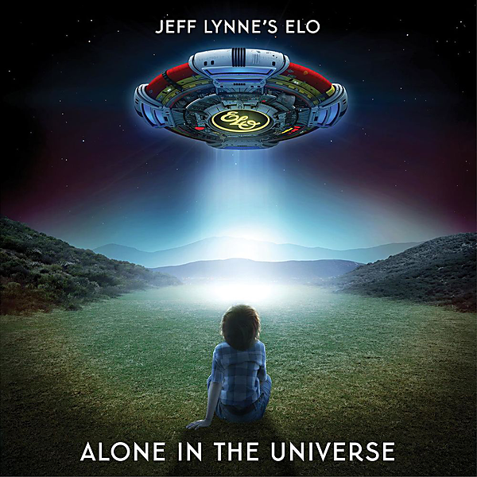

# Alone In The Universe

By Jeff Lynne's ELO

## Album Data

- Catalog #: 888751646421
- Label: Sony Music
- Format: CD
- Tracks: 12
- Released: 
- Discs: 1
- Box Set: 
- Length: 37:12
- Genre: Pop
- Songwriter: 
- Producer: 
- Musician: 

## See also

- [Armchair Theatre](Armchair_Theatre.md)
- [A New World Record](../Electric_Light_Orchestra/A_New_World_Record.md)
- [Balance Of Power](../Electric_Light_Orchestra/Balance_Of_Power.md)
- [Discovery](../Electric_Light_Orchestra/Discovery.md)
- [Elo Ii](../Electric_Light_Orchestra/Elo_Ii.md)
- [Eldorado](../Electric_Light_Orchestra/Eldorado.md)
- [Face The Music](../Electric_Light_Orchestra/Face_The_Music.md)
- [No Answer](../Electric_Light_Orchestra/No_Answer.md)
- [On The Third Day](../Electric_Light_Orchestra/On_The_Third_Day.md)
- [Out Of The Blue](../Electric_Light_Orchestra/Out_Of_The_Blue.md)
- [Secret Messages](../Electric_Light_Orchestra/Secret_Messages.md)
- [Time](../Electric_Light_Orchestra/Time.md)
