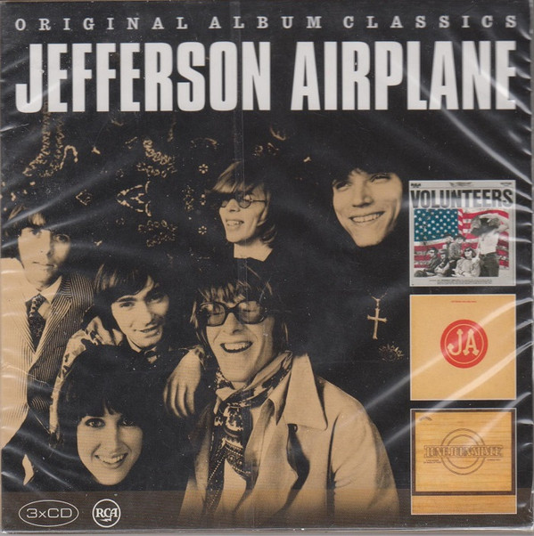

# Original Album Classics (Disc 1)

By Jefferson Airplane

## Album Data

- Catalog #: LC 00316
- Label: RCA
- Format: CD
- Tracks: 15
- Released: 
- Discs: 1
- Box Set: 
- Length: 1:09:55
- Genre: Classic Rock | Psychedelic Rock | Rock
- Songwriter: 
- Producer: 
- Musician: 

## See also

- [After Bathing At Baxter's](After_Bathing_At_Baxters.md)
- [Bark](Bark.md)
- [Early Flight Thirty Seconds Over Winterland](Early_Flight_Thirty_Seconds_Over_Winterland.md)
- [Long John Silver](Long_John_Silver.md)
