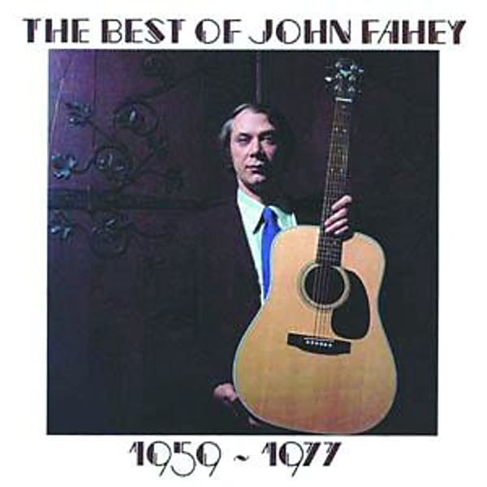

# The Best Of John Fahey 1959-1977

By John Fahey

## Album Data

- Catalog #: 
- Label: 
- Format: CD
- Tracks: 18
- Released: 
- Discs: 1
- Box Set: 
- Length: 1:18:44
- Genre: Acoustic
- Songwriter: 
- Producer: 
- Musician: 

## See also

- 
- [Beets: God, Time and Causality](../../Beets/John_Fahey/God__Time_and_Causality.md)
- [Beets: The Best of John Fahey 1959–1977](../../Beets/John_Fahey/The_Best_of_John_Fahey_1959–1977.md)
- [Beets: Zabriskie Point](../../Beets/John_Fahey/Zabriskie_Point.md)
