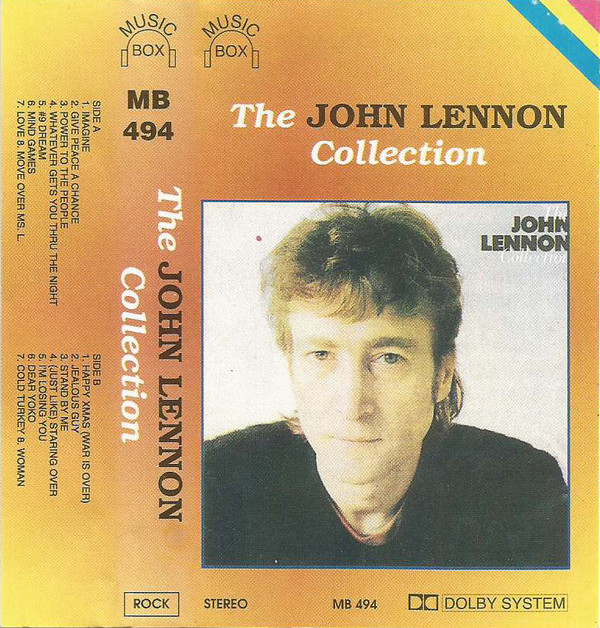

# The John Lennon Collection

By "Lennon, John"

## Album Data

- Catalog #: CDP 591516
- Label: 
- Format: CD
- Tracks: 19
- Released: 
- Discs: 1
- Box Set: 
- Length: 1:11:19
- Genre: Populair
- Songwriter: 
- Producer: 
- Musician: 

## See also

- [Plastic Ono Band](Plastic_Ono_Band.md)
- [Beets: Imagine](../../Beets/John_Lennon/Imagine.md)
- [Beets: John Lennon Box Set](../../Beets/John_Lennon/John_Lennon_Box_Set.md)
- [Beets: John Lennon/Plastic Ono Band](../../Beets/John_Lennon/John_Lennon-Plastic_Ono_Band.md)
- [Beets: Mind Games](../../Beets/John_Lennon/Mind_Games.md)
- [Beets: Rock ’n’ Roll](../../Beets/John_Lennon/Rock_’n’_Roll.md)
- [Beets: Some Time In New York City](../../Beets/John_Lennon/Some_Time_In_New_York_City.md)
- [Beets: The John Lennon Collection](../../Beets/John_Lennon/The_John_Lennon_Collection.md)
- [Beets: Walls and Bridges](../../Beets/John_Lennon/Walls_and_Bridges.md)
- [Roon: Double Fantasy](../../Roon/John_Lennon/Double_Fantasy.md)
- [Roon: Double Fantasy Stripped Down (Stripped Down)](../../Roon/John_Lennon/Double_Fantasy_Stripped_Down_Stripped_Down.md)
- [Roon: GIMME SOME TRUTH. (Deluxe)](../../Roon/John_Lennon/GIMME_SOME_TRUTH_Deluxe.md)
- [Roon: HERO.](../../Roon/John_Lennon/HERO.md)
- [Roon: Imagine - The Ultimate Collection (The Ultimate Collection)](../../Roon/John_Lennon/Imagine_-_The_Ultimate_Collection_The_Ultimate_Collection.md)
- [Roon: Mind Games](../../Roon/John_Lennon/Mind_Games.md)
- [Roon: Plastic Ono Band (The Ultimate Collection)](../../Roon/John_Lennon/Plastic_Ono_Band_The_Ultimate_Collection.md)
- [Roon: Walls And Bridges](../../Roon/John_Lennon/Walls_And_Bridges.md)
- [Vinyl: Imagine](../../Vinyl/John_Lennon/Imagine.md)
- [Vinyl: ](../../Vinyl/John_Lennon/John_Lennon.md)
- [Vinyl: Walls And Bridges](../../Vinyl/John_Lennon/Walls_And_Bridges.md)
