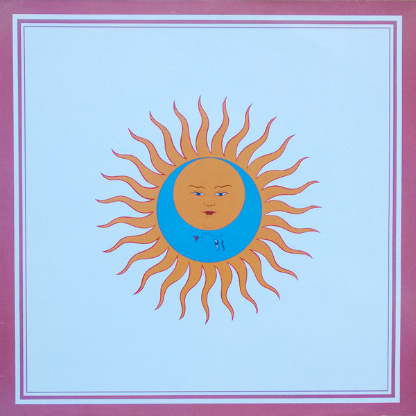

# Larks' Tongues In Aspic (40th Anniversary Edition)

By King Crimson

## Album Data

- Catalog #: KCSP5
- Label: Panegyric
- Format: CD
- Tracks: 9
- Released: 
- Discs: 1
- Box Set: 
- Length: 1:07:57
- Genre: Progressive Rock | Rock
- Songwriter: 
- Producer: 
- Musician: 

## See also

- [In The Court Of The Crimson King - An Observation By King Crimson (Disc 1)](In_The_Court_Of_The_Crimson_King_-_An_Observation_By_King_Crimson_Disc_1.md)
- [Lizard](Lizard.md)
- ["On (And Off) the Road](On_And_Off_the_Road-_Studio__Live__Audio_and_Audio-Visual_1981-1984_Disc_1.md)
