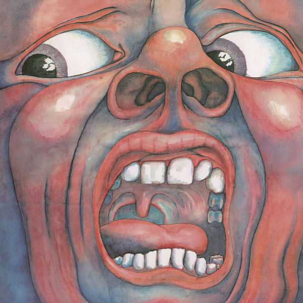

# "On (And Off) the Road: Studio, Live, Audio & Audio-Visual 1981-1984 (Disc 1)"

By King Crimson

## Album Data

- Catalog #: KCSP8
- Label: Panegyric
- Format: CD
- Tracks: 11
- Released: 
- Discs: 1
- Box Set: 
- Length: 53:58
- Genre: Progessive Rock | Rock
- Songwriter: 
- Producer: 
- Musician: 

## See also

- [In The Court Of The Crimson King - An Observation By King Crimson (Disc 1)](In_The_Court_Of_The_Crimson_King_-_An_Observation_By_King_Crimson_Disc_1.md)
- [Larks' Tongues In Aspic (40th Anniversary Edition)](Larks_Tongues_In_Aspic_40th_Anniversary_Edition.md)
- [Lizard](Lizard.md)
