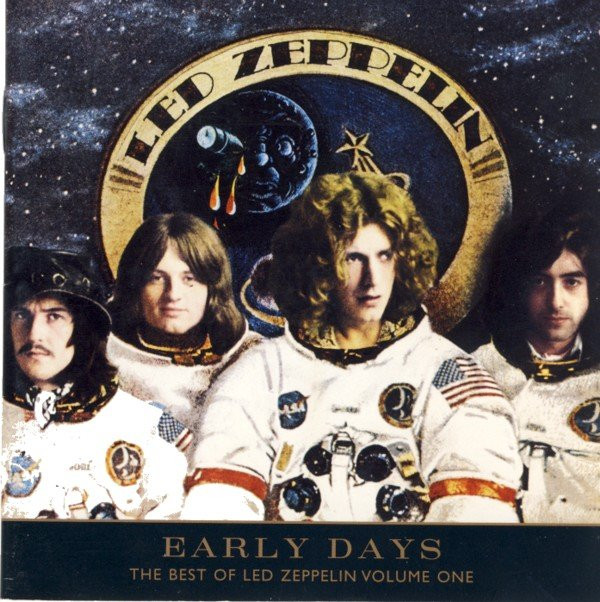

# Early Days - The Best Of Led Zeppelin Vol. 1

By Led Zeppelin

## Album Data

- Catalog #: 7567-83268-2
- Label: Atlantic
- Format: CD
- Tracks: 14
- Released: 
- Discs: 1
- Box Set: 
- Length: 1:17:27
- Genre: Arena Rock | Blues-Rock | British Blues | British Metal | Hard Rock | Heavy Metal | Rock
- Songwriter: 
- Producer: 
- Musician: 

## See also

- [How The West Was Won (Disc 1)](How_The_West_Was_Won_Disc_1.md)
- [How The West Was Won (Disc 2)](How_The_West_Was_Won_Disc_2.md)
- [Physical Graffiti (Disc 1) (Disc 1)](Physical_Graffiti_Disc_1_Disc_1.md)
- [The Complete Bbc Sessions (Disc 1)](The_Complete_Bbc_Sessions_Disc_1.md)
- [The Complete Bbc Sessions (Disc 2)](The_Complete_Bbc_Sessions_Disc_2.md)
- [The Complete Bbc Sessions (Disc 3)](The_Complete_Bbc_Sessions_Disc_3.md)
- [Beets: BBC Sessions [Live] [Disc 1]](../../Beets/Led_Zeppelin/BBC_Sessions_[Live]_[Disc_1].md)
- [Beets: BBC Sessions [Live] [Disc 2]](../../Beets/Led_Zeppelin/BBC_Sessions_[Live]_[Disc_2].md)
- [Beets: Houses of the Holy](../../Beets/Led_Zeppelin/Houses_of_the_Holy.md)
- [Beets: How the West Was Won](../../Beets/Led_Zeppelin/How_the_West_Was_Won.md)
- [Beets: Led Zeppelin II](../../Beets/Led_Zeppelin/Led_Zeppelin_II.md)
- [Beets: Physical Graffiti](../../Beets/Led_Zeppelin/Physical_Graffiti.md)
- [Beets: The Complete BBC Sessions](../../Beets/Led_Zeppelin/The_Complete_BBC_Sessions.md)
- [Roon: Houses Of The Holy (HD Remastered Edition) (Remaster)](../../Roon/Led_Zeppelin/Houses_Of_The_Holy_HD_Remastered_Edition_Remaster.md)
- [Roon: Led Zeppelin (HD Remastered Edition) (Remaster)](../../Roon/Led_Zeppelin/Led_Zeppelin_HD_Remastered_Edition_Remaster.md)
- [Roon: Led Zeppelin II (HD Remastered Deluxe Edition) (Deluxe Edition)](../../Roon/Led_Zeppelin/Led_Zeppelin_II_HD_Remastered_Deluxe_Edition_Deluxe_Edition.md)
- [Roon: Led Zeppelin III (HD Remastered Edition) (Remaster)](../../Roon/Led_Zeppelin/Led_Zeppelin_III_HD_Remastered_Edition_Remaster.md)
- [Roon: Led Zeppelin IV (HD Remastered Deluxe Edition) (Deluxe Edition)](../../Roon/Led_Zeppelin/Led_Zeppelin_IV_HD_Remastered_Deluxe_Edition_Deluxe_Edition.md)
- [Roon: Physical Graffiti (HD Remastered Deluxe Edition) (Deluxe Edition)](../../Roon/Led_Zeppelin/Physical_Graffiti_HD_Remastered_Deluxe_Edition_Deluxe_Edition.md)
- [Vinyl: Houses Of The Holy](../../Vinyl/Led_Zeppelin/Houses_Of_The_Holy.md)
- [Vinyl: Led Zeppelin III](../../Vinyl/Led_Zeppelin/Led_Zeppelin_III.md)
- [Vinyl: Led Zeppelin II](../../Vinyl/Led_Zeppelin/Led_Zeppelin_II.md)
- [Vinyl: ](../../Vinyl/Led_Zeppelin/Led_Zeppelin_index.md)
- [Vinyl: Led Zeppelin](../../Vinyl/Led_Zeppelin/Led_Zeppelin.md)
- [Vinyl: Physical Graffiti](../../Vinyl/Led_Zeppelin/Physical_Graffiti.md)
- [Vinyl: Untitled](../../Vinyl/Led_Zeppelin/Untitled.md)
- [Vinyl: Whole Lotta Love](../../Vinyl/Led_Zeppelin/Whole_Lotta_Love.md)
