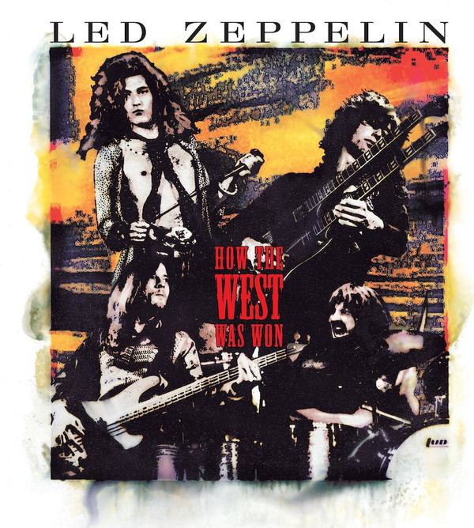

# How The West Was Won (Disc 2)

By Led Zeppelin

## Album Data

- Catalog #: 83587-2
- Label: Atlantic Records
- Format: CD
- Tracks: 4
- Released: 
- Discs: 1
- Box Set: 
- Length: 53:08
- Genre: Blues | Blues / rock | Blues Rock | Classic Rock | compilation | Hard Rock | Rock
- Songwriter: 
- Producer: 
- Musician: 

## See also

- [Early Days - The Best Of Led Zeppelin Vol. 1](Early_Days_-_The_Best_Of_Led_Zeppelin_Vol_1.md)
- [How The West Was Won (Disc 1)](How_The_West_Was_Won_Disc_1.md)
- [Physical Graffiti (Disc 1) (Disc 1)](Physical_Graffiti_Disc_1_Disc_1.md)
- [The Complete Bbc Sessions (Disc 1)](The_Complete_Bbc_Sessions_Disc_1.md)
- [The Complete Bbc Sessions (Disc 2)](The_Complete_Bbc_Sessions_Disc_2.md)
- [The Complete Bbc Sessions (Disc 3)](The_Complete_Bbc_Sessions_Disc_3.md)
