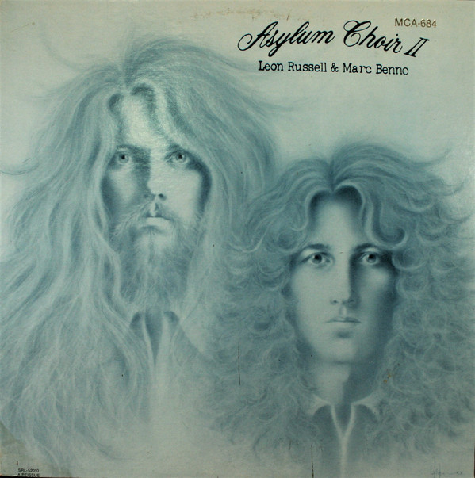

# Asylum Choir II

By Leon Russel & Marc Benno

## Album Data

- Catalog #: 
- Label: 
- Format: CD
- Tracks: 16
- Released: 
- Discs: 1
- Box Set: 
- Length: 47:57
- Genre: Rock
- Songwriter: 
- Producer: 
- Musician: 

## See also

- [Leon Russell](Leon_Russell.md)
- [Beets: Anything Can Happen](../../Beets/Leon_Russell/Anything_Can_Happen.md)
- [Beets: Carney](../../Beets/Leon_Russell/Carney.md)
- [Beets: Hank Wilson, Vol. 3](../../Beets/Leon_Russell/Hank_Wilson__Vol_3.md)
- [Beets: Leon Russell](../../Beets/Leon_Russell/Leon_Russell.md)
- [Roon: Asylum Choir II (Bonus Track Version)](../../Roon/Leon_Russell/Asylum_Choir_II_Bonus_Track_Version.md)
- [Roon: Carney](../../Roon/Leon_Russell/Carney.md)
- [Roon: Leon Live (Live)](../../Roon/Leon_Russell/Leon_Live_Live.md)
- [Roon: Leon Russell And The Shelter People (Remastered 2013)](../../Roon/Leon_Russell/Leon_Russell_And_The_Shelter_People_Remastered_2013.md)
- [Roon: Leon Russell](../../Roon/Leon_Russell/Leon_Russell.md)
- [Roon: Live At Gilley's (Live)](../../Roon/Leon_Russell/Live_At_Gilleys_Live.md)
- [Roon: Looking Back](../../Roon/Leon_Russell/Looking_Back.md)
- [Roon: The Live Album (Live)](../../Roon/Leon_Russell/The_Live_Album_Live.md)
- [Roon: Will O' The Wisp](../../Roon/Leon_Russell/Will_O_The_Wisp.md)
- [Vinyl: Carney](../../Vinyl/Leon_Russell/Carney.md)
- [Vinyl: Hank Wilson's Back Vol. I](../../Vinyl/Leon_Russell/Hank_Wilsons_Back_Vol_I.md)
- [Vinyl: ](../../Vinyl/Leon_Russell/Leon_Russell_index.md)
- [Vinyl: Leon Russell](../../Vinyl/Leon_Russell/Leon_Russell.md)
